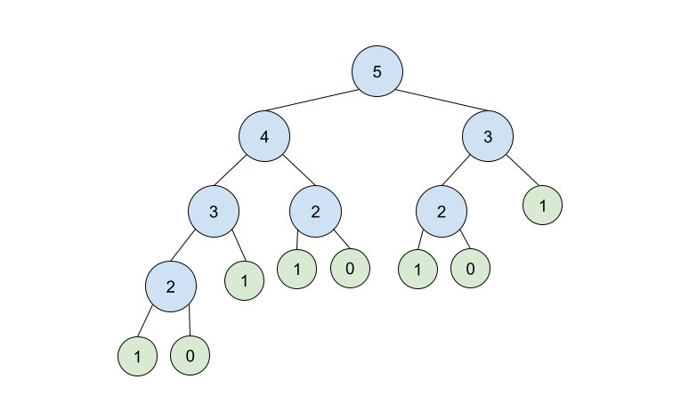
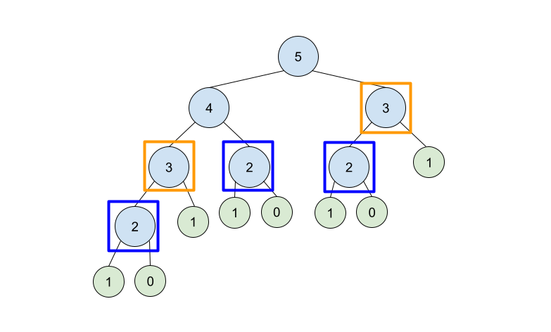

## Fibonacci Sequence

The Fibonacci Sequence is a series of numbers where the next number is found in the series by adding up the two numbers before it. Here is a list of some of the numbers in the Fibonacci Sequence:

0, 1, 1, 2, 3, 5, 8, 13, 21, 34, ...

For this series, the first two numbers are always 0 and 1. From there we can find the next number by adding the previous two values. For example:

- the third number in the series, 1, is found by adding 0 + 1, the first and second numbers.
- the fourth number in the series, 2, is found by adding 1 + 1, the second and third numbers.
- the fifth number in the series, 3, is found by adding 2 + 1, the third and fourth numbers.
- and so on ...

## Recursive Solution

Based on the pattern described above, we know that we can find the `nth` number in the Fibonacci Sequence by adding the previous two values. We can express this as: `F(n) = F(n-1) + F(n-2)`.

```go
func fib(n int) int {
    // first two numbers in the sequence are 0 and 1, so we can return those values
    if n <= 1 {
        return n
    }
    return fib(n-1) + fib(n-2)
}
```





```go
func fib(n int) int {
    var table []int
    // first two numbers in the sequence are 0 and 1
    table = append(table, 0, 1)

    for i := 2; i < n+1; i++ {
        table = append(table, table[i-1]+table[i-2])
    }

    return table[n]
```
