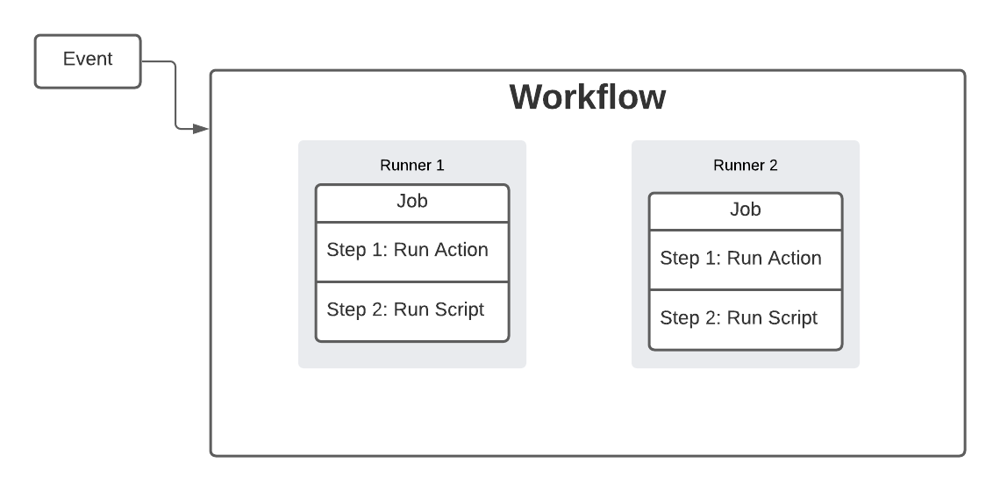

GitHub Actions is a fantastic CI/CD platform that allows you to set up custom workflows to do a variety of tasks, anything from running unit tests anytime there is a pull request to building your web application and deploying that application to your hosting service.

If you are not familiar with CI/CD, this is a method to allow you to frequently deliver software by introducing automation into your development process. The main concepts for CI/CD are: continuous integration, continuous delivery, and continuous deployment. As an example, let's say you are working on an npm package and every time there is a pull request there is a setup of steps that you complete while reviewing the code: running unit tests, linting, updating documentation, etc. Then once the pull request is approved and merged, you then manually release a new version of the package and publish that package to the npm registry.

Instead of doing these steps manually each time, you could set up a CI/CD process to automate these steps for you, and this is where GitHub Actions come into play. GitHub actions can be used to create workflows to accomplish these tasks, and much more since they are integrated with the various events that are available in GitHub.

Before we dive deeper into setting up and using your first GitHub Action workflow, we will go over some of the concepts and components that make up GitHub Actions.

## GitHub Actions Concepts

In order to get started with GitHub Actions, the first thing you need to define is a workflow. A workflow is a configurable YAML file where you specify what you want the workflow to do and what you want to trigger that workflow. The trigger for your workflow will be some type of event that occurs. This can be some event in GitHub, such as opening a pull request or issue, a manual trigger, a POST request to an API, or even triggering the workflow on a schedule. Some events include:

- create: branch or tag created
- issues: opened, closed, assigned, edited, etc.
- pull_request: opened, closed, ready_for_review, etc.
- project: project board created, updated, etc.
- many more...

You can read more about the available events here: [Events](https://docs.github.com/en/actions/using-workflows/events-that-trigger-workflows), and more about the various ways to trigger a workflow here: [Triggers](https://docs.github.com/en/actions/using-workflows/triggering-a-workflow).

Inside the workflow file, you define the jobs that you want to run. Jobs can be run in sequential order or in parallel. This job will run in its own virtual machine, or container, and this job is made up of various steps. These steps are the scripts or actions that will run when that job is running. You can read more about these various concepts here: [Concepts](https://docs.github.com/en/actions/learn-github-actions/understanding-github-actions).

## Actions

In your workflow, each step is either a shell command that you write like `npm install ...`, or an external action, which is a packaged, reusable flow that is like an external module or library. These actions allow you to complete tasks without having to write the code yourself. Some example actions are:

- checking out a GitHub repository
- posting a message to Slack
- building a docker image and pushing to a docker registry
- scanning your source code or docker image
- deploying your code to another service, like Heroku, AWS, etc.

You can find actions on the [GitHub Marketplace](https://github.com/marketplace?type=actions).

## Benefits

There are a number of CI/CD tools available that you can use, so you might be wondering why you should consider using GitHub Actions? Some of the benefits include:

- ease of setup: everything is managed by GitHub and there is very little to setup when compared to other tools like Jenkins
- native: GitHub Actions get access to almost any event that is possible in GitHub, and since the workflow files are committed with your repository, they can be version controlled, reused, shared, and forked. You can also do things like tie your workflows to your branch protection.
- marketplace: there is a large number of available actions already available, and you can easily create and add your own
- cost: for public repositories and self-hosted runners, GitHub Actions usage is free, and for private repositories you will get a certain amount of usage for free per month.

These are only a small subset of the benefits for using GitHub Actions.

## Summary

Now that we have discussed the benefits of using GitHub Actions, this brings part 1 of our tutorial to an end. In part 2, we will focus on setting up our first GitHub workflow and dive into the workflow configuration file. I hope you found this article helpful. Please feel free to post any questions or comments below.
