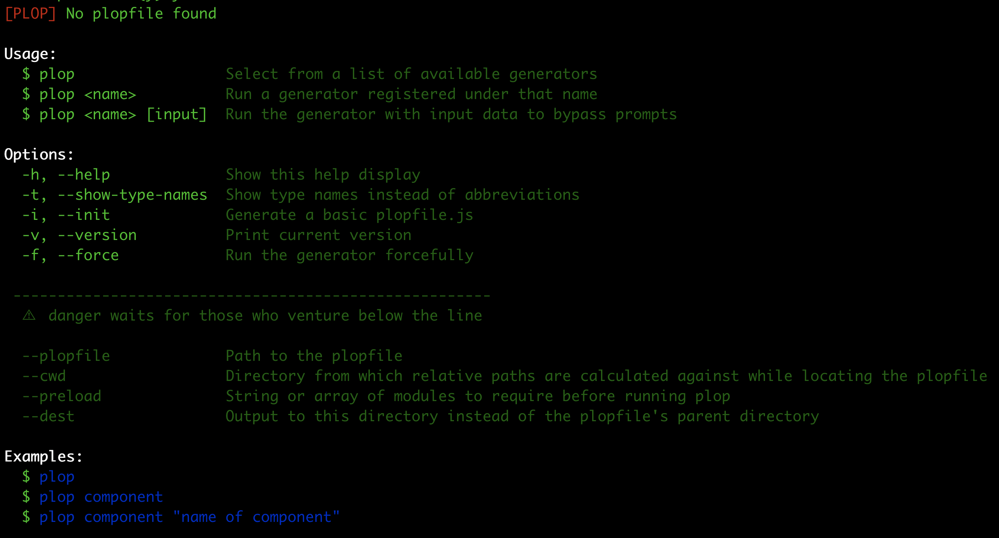

In one of my recent developer bytes articles, I discussed with you some of the benefits of the micro-generator framework tool [Plop](https://github.com/plopjs/plop) and how I used this tool in my day to day. In this article I want to expand on the example the example I shared in the last article. So, in this tutorial we will be creating a Plop generator that will create a Vue component in TypeScript, and we will be going over the basics to create your own generators.

## Code

You can find all of the code for this tutorial located here on [GitHub](https://github.com/swestoverblog/plop-example-tutorial-blog-post).

## Requirements

In order to follow along with this tutorial, you will need to have access to [Nodejs](https://nodejs.org/en/) and [npm](https://www.npmjs.com/), or [yarn](https://yarnpkg.com/).

I prefer to use `yarn` as my package manager, and will be using the command in my examples, however you can follow along by running the same `npm` commands.

*Note:* In this tutorial we will not be creating a full Vuejs application and will be solely focused on the setup and usage of Plop to create files, with the end goal of being able to take this knowledge and apply it to your existing or future projects.

## Project Setup

The first thing you will need to do is setup a new project directory:

```bash
mkdir plop-example
```

After you create the directory, you will want to run the following command from within the project directory:

```bash
npm init -y
```

This will create a `package.json` file for your project with some default values. Lastly, we will need to add `plop` as a dev dependency to our project.

```bash
# yarn
yarn add plop -DE

# npm
npm install plop -DE
```

This should add `plop` to your `devDependencies` section in the `package.json` file.

## Running Plop

Since we installed Plop locally in our project instead of as a global dependency, if we try to run the `plop` command from our project directory, you will likely see an error message similar to this: `bash: plop: command not found`. To avoid having to run the following command `./node_modules/plop/bin/plop.js` every time we want to execute `plop`, we can update the `scripts` section in our `package.json` file to allow us to execute `plop`. To do this, update your `package.json` file to have the a `scripts` section:

```json
{
  ...,
  "scripts": {
    ...,
    "plop": "plop"
  },
  ...
}
```

Now you should be able to run plop with the following command:

```bash
# yarn
yarn plop

# npm
npm run plop
```



## Create Plop Config

In order to use Plop, we need to provide a configuration file that will tell Plop which prompts and actions to run when running a particular generator. We can do this by creating a `plopfile.js` file in the root of our project. Create a new file called `plopfile.js` and add the following:

```javascript
module.exports = function (plop) {
  plop.setActionType('createComponentName', function (answers) {
    if (answers.filename === '') {
      throw 'filename is required';
    }
    let componentName = '';
    answers.filename.split('-').forEach((str) => {
      componentName += str.charAt(0).toUpperCase() + str.slice(1);
    });
    answers.componentName = componentName;
    return 'success status message';
  });

  plop.setGenerator('component', {
    description: 'Basic Vue component using Typescript',
    prompts: [
      {
        type: 'input',
        name: 'filename',
        message: 'filename: ',
      },
    ],
    actions: [
      {
        type: 'createComponentName',
      },
      {
        type: 'addMany',
        destination: 'src/components/{{filename}}',
        templateFiles: 'plop_templates/component/*.hbs',
        base: 'plop_templates/component',
      },
    ],
  });
};
```

In the code above, we did the following:

- exported a function that will take plop as an argument which will allow us to use the [main methods](https://plopjs.com/documentation/#main-methods) of the Plop instance
- created a generator called `component` by calling the `setGenerator` method
- created a custom action called `createComponentName` by calling the `setActionType` method

### Generator

A generator is a core component in Plop that is used telling Plop which prompts and actions will be ran when you run a particular generator. When you run the `plop` command from your project directory, or any sub directories, a list of generators will be displayed for you to pick from. If you only have one generator defined, Plop will default to using that generator.

### Actions

Actions are the steps that will be ran after Plop has gathered all of the required information from the defined prompts. The `actions` field takes an array of [actionConfigs](https://plopjs.com/documentation/#interface-actionconfig). Plop has many [built in actions](https://plopjs.com/documentation/#built-in-actions) that you can use, and you have the option to define your own. In our config we defined a custom action called `createComponentName` and we used a built in action called `addMany`.

The `addMany` action is used when you want to create multiple files. You can use this action by providing the following configuration:

- `type` - set to `addMany`
- `destination` - a relative file path from the root of the project to where we want the new files to be placed (directories will automatically be created if they don't exist)
- `templateFiles` - a glob pattern that matches multiple template files to be added
- `base` - the section of the path that should be excluded when adding files to the `destination` folder

### Custom Actions

In order to use custom actions, you need to define them by using the `setActionType` method. This method expects two arguments, the first is the name of the custom action and the second is a function that will be ran when this action is invoked. This function will receive three arguments:

- `answers` - answers to the generator prompts
- `config` - the object in the "actions" array for the generator
- `plop` - the plop api for the plopfile where this action is being run
