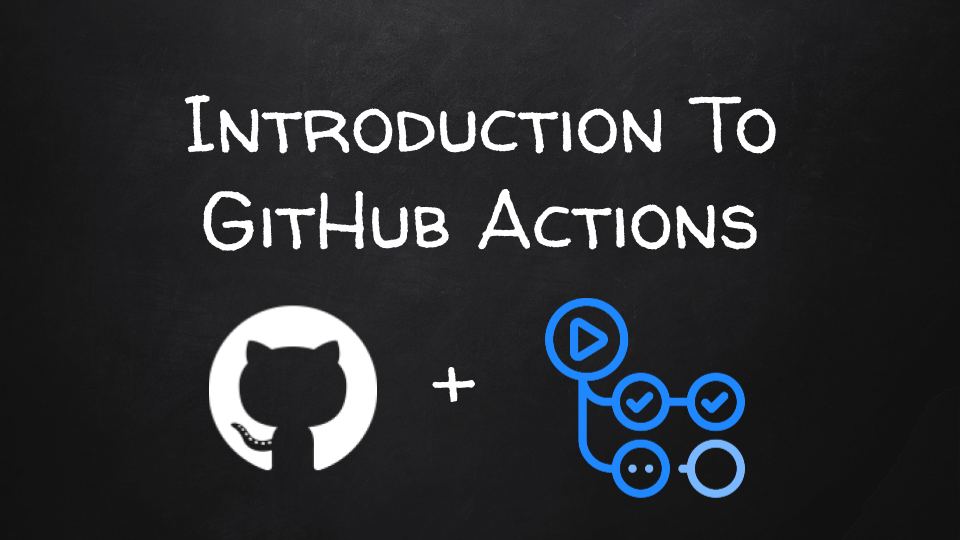

*Update:* I have released a video that contents all of the content for the course as a single video. You can watch the video on YouTube here: <a href="https://youtu.be/n4u27KJhEB4" target="_blank">Introduction To GitHub Actions - Full Course</a>.

Today I am happy to announce that I will be releasing a brand new mini course on an introduction to GitHub Actions that you will be able to watch for free on YouTube. Over the next two weeks, there will be a new video available to watch each day with the first video being available tomorrow!

You will be able to watch all of the videos here <a href="https://youtube.com/playlist?list=PLmcXe0-sfoSig2tvPV6FOLFb9O5ruP_mG" target="_blank">Introduction To GitHub Actions Playlist</a>.

<iframe width="560" height="315" src="https://www.youtube.com/embed/videoseries?list=PLmcXe0-sfoSig2tvPV6FOLFb9O5ruP_mG" title="YouTube video player" frameborder="0" allow="accelerometer; autoplay; clipboard-write; encrypted-media; gyroscope; picture-in-picture" allowfullscreen></iframe>
 

In this course, you will learn the following:

- GitHub Workflows and Actions
- The workflow files and basic syntax
- GitHub Actions Marketplace
- Creating Some Example Workflows like:
  - pull request review to lint, test, and build code
  - publish a GitHub NPM package
  - integration testing
  - tagging on GitHub

You can also find the code for the course on GitHub here: <a href="https://github.com/devshareacademy/github-actions-basics-course" target="_blank">Introduction To GitHub Actions Course Files</a>

I hope you enjoy the new course! Please feel free to post any questions or comments below.
