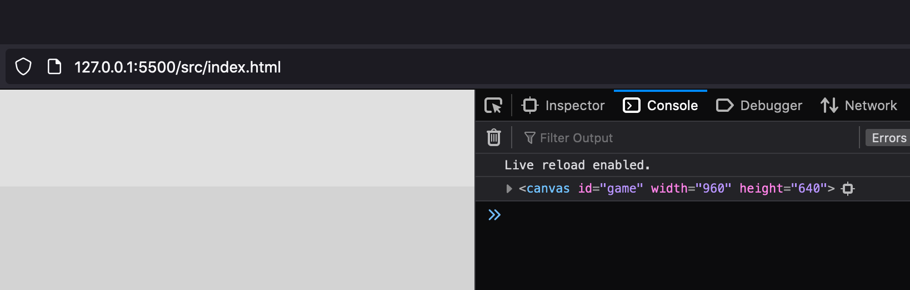
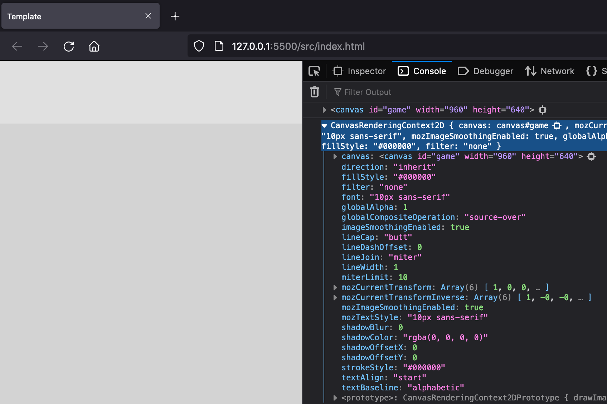
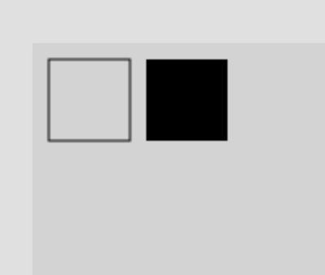
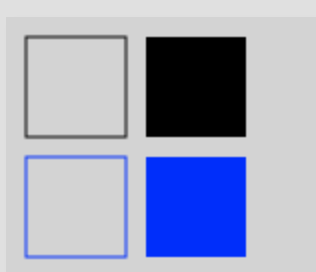
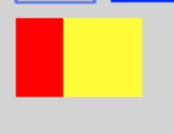
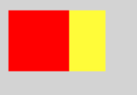

In this part of the series, we will learn how we can get a reference to our HTML Canvas element with JavaScript, and then use that reference to start to draw on the canvas element. To follow along with this article, you will need to have completed the basic project setup. You can find more details on how to setup your development environment here: TODO add link

You can find the code for the basic project setup here on GitHub: TODO add link

You can find the completed source code for this article here on GitHub: TODO add link

## Canvas Basics

Before we can start drawing and rendering content to our `<canvas>` element, we will need to get a refernce to this element with JavaScript. To do this, we can use the `getElementById` method on the `Document` object to find an `Element` object that has an `id` property that matches the provided argument that is passed to the method. If no matching element is found, then the method will return `null`.

In our project template, we gave our `canvas` element an id of `game`, so we can pass this id to the `getElementById` method. To do this, replace all of the code in the `src/js/main.js` file with the following code:

```javascript
const canvas = document.getElementById('game');
console.log(canvas);
```

In the code above, we are getting a reference to the `<canvas>` element and we are storing this reference in a variable called `canvas`. Finally, we logged this value to the developer console.

Now, if you launch your local web server and open the developer console, you should see a console log message that has details about the `<canvas>` element.



Now that we have a reference to the `<canvas>` element, we need to get the canvas drawing context for this element. The drawing context is the actual object that enables us to draw on the `<canvas>` elements using the [Canvas API](https://developer.mozilla.org/en-US/docs/Web/API/Canvas_API). The drawing context object exposes a number of different methods and properties that allow us draw shapes, images, text, and much more on the `<canvas>` elements.

To get a reference to the drawing context, we can use the `HTMLCanvasElement.getContext()` method. This method accepts two parameters, the first is the `contextType`, which allows us to specify the type of drawing context we would like to use with our canvas element. There are a few different types, but for now we will only be focusing on the `2d` type. The second parameter, `contextAttributes`, is optional and allows you to set a few attributes on the drawing context that is returned.

To do this, add the following code to the bottom of the `main.js` file:

```javascript
const ctx = canvas.getContext('2d');
console.log(ctx);
```

In the code above, we called the `getContext` method on our `canvas` element reference to get a [CanvasRenderingContext2D](https://developer.mozilla.org/en-US/docs/Web/API/CanvasRenderingContext2D) object. We then stored the `CanvasRenderingContext2D` object in a variable called `ctx`. Finally, we logged this value to the developer console.

If you go back to your web browser and view the developer console, you should see a message with details about our `ctx` object.



If you inspect the `ctx` object, you will see there is a large number of properties and methods on this object, and all of these can be utilized for when we draw to the canvas element.

## Drawing on the canvas

So now that we have our canvas rendering context object, we can start to use this object to draw to our canvas element. To do this this, add the following code to the `main.js` file:

```javascript
// draw squares
ctx.strokeRect(10, 10, 50, 50);
ctx.fillRect(70, 10, 50, 50);
```

If you save your code changes and go to your web browser, you should see two squares appear on the canvas element.



In the code above, we used two methods on the `CanvasRenderingContext2D` object: `strokeRect` and `fillRect`.

### `strokeRect`

The `strokeRect` method will draw a rectangle shape to the canvas using the current context object properties. This method has four parameters: `x`, `y`, `width`, and `height`. The first two parameters, `x` and `y` are used to define the coordinates of where we will start to draw the rectangle, and the last two parameters, `width` and `height` are used to define the size of the rectangle that will be drawn.

A good way to think of the `strokeRect` method is to imagine you are drawing a rectangle on a piece of paper. You place the pencil on the paper at a starting point and then draw the outline of the rectangle and stop there without filling in the rectangle with any color.

In the code above, we specificied `50` for both the `width` and `height` arguments, which resulted in us drawing a square shape.

When we draw onto the canvas element, the top left corner of the canvas element is considered coordinate (0, 0) and as `x` increases in value, the further to the right we move, and as `y` increases in value, the further down we move.


### `fillRect`

The `fillRect` method will draw and fill in a rectangle shape to the canvas using the current context object properties. This method has the same four parameters as `strokeRect` and functions in a similar manner. A good way to think of the `fillRect` method is if you imagine you have already drawn a rectangle on a piece of paper, you will now fill in that rectangle shape with your pencil.

## Adding Color

By default, the `CanvasRenderingContext2D` object has the `fillStyle` and `strokeStyle` properties set to `#000000`, which is `black`. These two properties are used to determine which color should be used when we draw to the canvas. When we used the `strokeRect` and `fillRect` methods, both of these methods will use the shared properties on the `ctx` object, which is why our two rectangles are `black`.

In order to draw with a different color, we can set these properties to a different value. To do this, add the following code to `main.js`:

```javascript
// draw squars that blue
ctx.strokeStyle = '#0000FF';
ctx.fillStyle = 'blue';
ctx.strokeRect(10, 70, 50, 50);
ctx.fillRect(70, 70, 50, 50);
```

If you save your code changes and go to your web browser, you should see two new squares appear on the canvas element.



In the code above, we set the `fillStyle` and `strokeStyle` properties set to `blue` (`#0000FF` is the Hex code version of blue). These two properties can accept any of the following:

* `color` - a string parsed as CSS color value
* `gradient` - a canvas gradient object, which is a linear or radial gradient
* `pattern` - a canvas pattern object that is a repeating image

After we set these two properties, we drew two new rectangle shapes, and since we updated the shared `ctx` object, both of these shapes are now drawn using `blue` instead of `black`.

## Drawing Order

So far in our examples, we have setup the positioning of our shapes to intentionaly not have them overlap. The reasoning for this is that when we draw to the canvas element, each pixel is updated individually. As an example, if you add the following code to the `main.js` file:

```javascript
ctx.fillStyle = 'red';
ctx.fillRect(10, 130, 50, 50);
ctx.fillStyle = 'yellow';
ctx.fillRect(40, 130, 50, 50);
```
and save your code and view the changes in your browser, you should see two new squares appear on the canvas element that are overlapping.



What is happening here, is when we call the first `fillRect` method, the code is executed and we draw the full red square shape to the canvas element. Then, when we call the second `fillRect` method, because some of the pixels are part of the first square, these pixels are now updated to have the color yellow. This results in our canvas looking like we have a small red rectangle next to the yellow square.

Since the code is synchronous, we will always draw to the canvas in the oder that we specify in our code. As an example, if you flip the order of the code around to be:

```javascript
ctx.fillStyle = 'yellow';
ctx.fillRect(40, 130, 50, 50);
ctx.fillStyle = 'red';
ctx.fillRect(10, 130, 50, 50);
```

you will see the opposite affect, even though we are drawing the two shapes in the exact positions as before.



## Wrap up

In this article, we learned about the basics of working with the HTML Canvas element and we saw how we can use the Canvas Context element to interact and draw on the HTML Canvas element.

You can find the completed source code for this section here on GitHub: [Project Setup](https://github.com/devshareacademy/html5-javascript-games/releases/tag/project_setup). If you run into any issues, please reach out via [GitHub Discussions](https://github.com/devshareacademy/html5-javascript-games/discussions).

In the next article of this series, we will learn about the canvas state and how we can use built in methods to save and revert changes to the state.
