Before we start learning about HTML5 Canvas and start writing any code, the first thing we need to do is setup a development environment that will allow us to easily edit our files, serve our static files on a local web server, and view our changes in real time as we make them.

For this series, we will be trying to keep things as simple as possible, so we will not be using things like `node`, `npm`, `webpack`, `vite`, etc. The tools are fantastic, and they can be used to make certain things easier and simpler, like bundling your source code, installing project dependencies, minifying your code, and much more. However, for this series we will only need two things:

* a web browser - for this series we will focus on [Google Chrome](https://www.google.com/chrome/downloads/), however you should be able to follow along with another browser.
* a code editor - for this series we will focus on [Visual Studio Code](https://code.visualstudio.com/), or VS Code, however you should be able to follow along with another editor of your choice. If you do choose another editor, you will need a way to run a local web server (more details on this below).

Before proceeding to the next section, you will need to have VS Code installed and running.

## Project Folder

All of the code that we write for this series will be contained in one folder. Before we start you will need to make a new folder somewhere on your computer. The folder name can be anything you like, but for the series we will refer to this folder as `html5-javascript-games`. Next, you will want to create a sub folder inside the `html5-javascript-games` folder, this new folder should be called `src`.

The `src` folder will be used to organize all of the code that we write for this series, while everything else outside this folder will be for things like editor configuration files, a `README` file, etc.

Now that you have created the basic project structure, you will need to open `html5-javascript-games` folder in `VS Code`.

To do this, open VS Code and in the menu, click on `File -> Open Folder` and then select the `html5-javascript-games` folder.

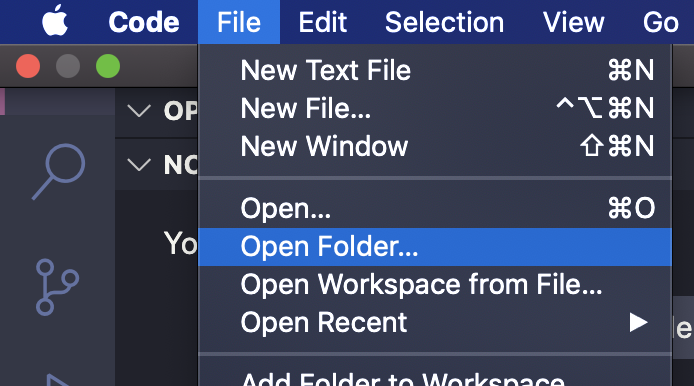

You can also click on `Open Folder` from the sidebar and then select the `html5-javascript-games` folder.

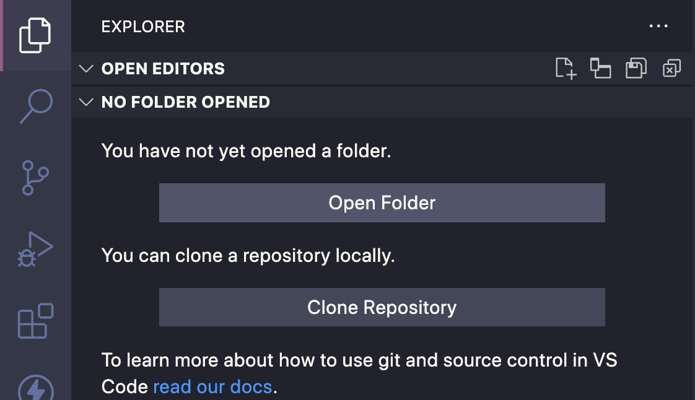

You should see the `src` folder in the sidebar:

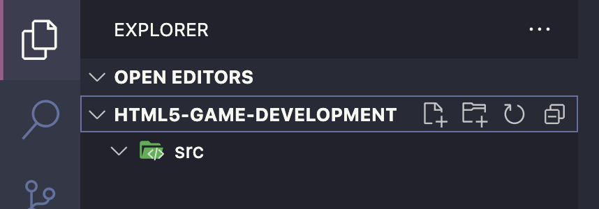

## Local Web Server

In order to run our games locally, we will need a local web server. The reason for this is that we will need the ability to load all kinds of resources for our games: images, audio, JSON data, JavaScript files, etc., and when you open a local `HTML` file in your web browser, the web browser will be using the `file://` protocol to load the file. When this happens, the security in the web browser is setup to prevent loading files from you local computer. When you use a local web server, our local `HTML` file, and the rest of our assets, will be loaded using the `http`, and the web browser security will allow us to load the files we need.

If you are interested in learning more, there is a great article on the [Chromium blog](https://blog.chromium.org/2008/12/security-in-depth-local-web-pages.html) that has more information.

For this series, we will be using a VS Code plugin called [LiveServer](https://marketplace.visualstudio.com/items?itemName=ritwickdey.LiveServer).

*Note:* If you are using another code editor, you will need to install and setup a local web server that you can use for hosting your code. There are many options out there, but we will not be covering how to install and setup these tools. Some examples include:

* [http-server](https://www.npmjs.com/package/http-server) for Node.js
* Pythons built in `http-server`
* [WAMP](https://www.wampserver.com/en/)
* [XAMPP](https://www.apachefriends.org/)
* [Brackets IDE](https://brackets.io/) has a built in web server

### Installing Live Server Plugin

In order to install the plugin, in the menu of VS Code, click on `View -> Extensions` and this should then open the Extensions sidebar.

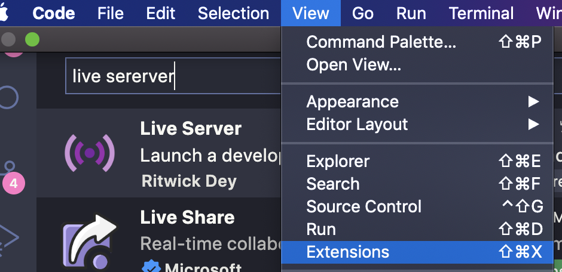

You can also click on the `Extensions` icon on the sidebar in VS Code.

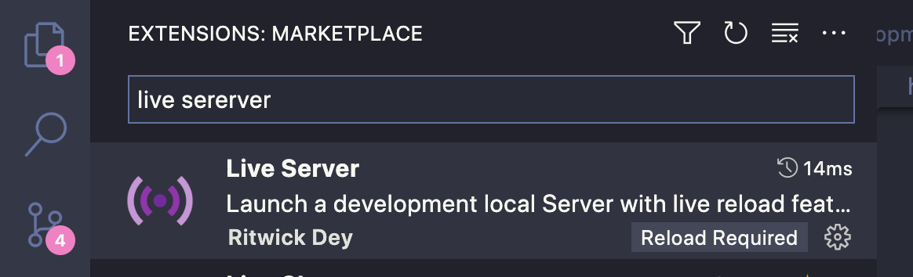

Once the Extensions panel is open, search for `Live Server`, and then click on the install button to have VS Code add this new plugin.

### Running the Live Server Plugin

Once the plugin is installed, there will be a new `Go Live` button at the footer bar of VS Code:

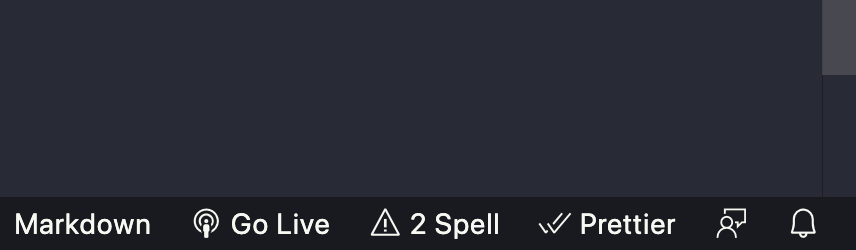

If you click on this button, the plugin will start the local web server, and open a new web page in your browser.

The plugin will default to using port `5500` on your computer, and will generally fallback to the next available port if that one is in use. The `Go Live` button at the footer of VS Code will change to show the port that the local web server is running on. If you click the button again, this will stop the local web server.

If the plugin did not automatically open your browser, you can visit [http://127.0.0.1:5500/](http://127.0.0.1:5500/) to view the local web server instance.

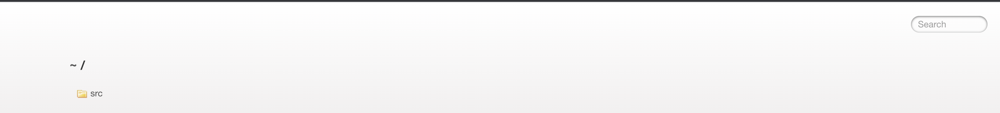

*Note:* you can also start and stop Live Server by using the Command Palette in VS Code. To access Live Server from the Command Palette, if you go to the menu in VS Code and click on `View -> Command Palette`, this will open a new drop down where you can enter text. If you type `Live Server`, you should see options to start and stop the server.

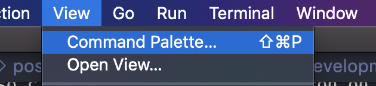

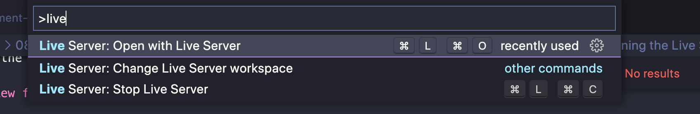

## Create index.html

For our web application, we will need to create an `index.html` file. This file will be the root of our application and is what will be served to the end user when they go to view our game. In the `src` folder, create a new file called `index.html` and add the following code to the file:

```html
<!DOCTYPE html>
<html>
  <head>
    <meta name="viewport" content="width=device-width, initial-scale=1.0" />
    <title>Template</title>
    <style>
      html,
      body {
        margin: 0px;
        height: 100vh;
        width: 100vw;
        overflow: hidden;
        background: #e0e0e0;
      }
      .container {
        display: flex;
        align-items: center;
        justify-content: center;
        width: 100%;
        height: 100%;
      }
      canvas {
        background: #d3d3d3;
        box-shadow: 5px 5px 5px darkgrey;
      }
    </style>
  </head>
  <body>
    <div class="container">
      <canvas id="game" width="960" height="640"></canvas>
    </div>
    <script type="module" src="js/main.js"></script>
  </body>
</html>
```

In the code above, we did the following:

* created a basic HTML page with the typical HTML tags that are needed for a web page
* added some basic styling to the web page using the `style` HTML tag
* set the users viewport by adding the `<meta>` HTML tag, which tells the web browser how to control the pages scaling and page dimensions
* created an HTML Canvas element with `<canvas>` HTML tag, and set the width and height dimensions on the element
* referenced a new JavaScript file called `main.js` that will be the main code entry point for our game

*Note:* in this series we will not be covering topics like `CSS`, `HTML`, and `JavaScript` basics, and we will be focusing on just creating games using JavaScript with HTML5 Canvas. You should be able to follow along if you don't have experience with `CSS` and `HTML`, but some experience with `JavaScript` is expected since we will not be going over the basics. However, I will try to keep these topics as beginner friendly as possible.

If you need to learn more about the basics in JavaScript, or if you need a refresher, please check out my free course on YouTube here: [JavaScript 101](https://www.youtube.com/playlist?list=PLmcXe0-sfoSgHQRKVWeJuIldauc9dL4rR).

## Create main.js

Before we test our web page, we will need to create the `main.js` file that is referenced in the `index.html` file. To do this, create a new folder in the `src` folder called `js`. In the `js` folder, create a new file called `main.js` and add the following code:

```javascript
console.log('hello world');
```

In the code above, we used the `console.log` method to log a message to the web browser developer console.

With the newly crated `main.js` file, we can test our project and make sure everything is working correctly. If you launch the local web server and visit [http://localhost:5500/src/index.html](http://localhost:5500/src/index.html) in your web browser, you should see the newly created web page, that has a basic canvas element.

If you open the developer console, you should see the `hello world` message that we logged.

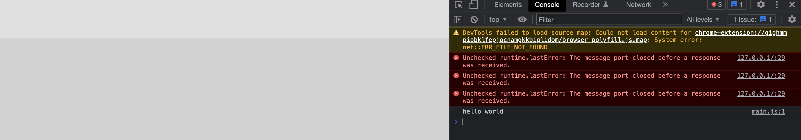

You can open the developer console by going to the menu in Google Chrome and then clicking on `View -> Developer -> Developer Tools`. In the sidebar that opens, click on the `Console` tab.

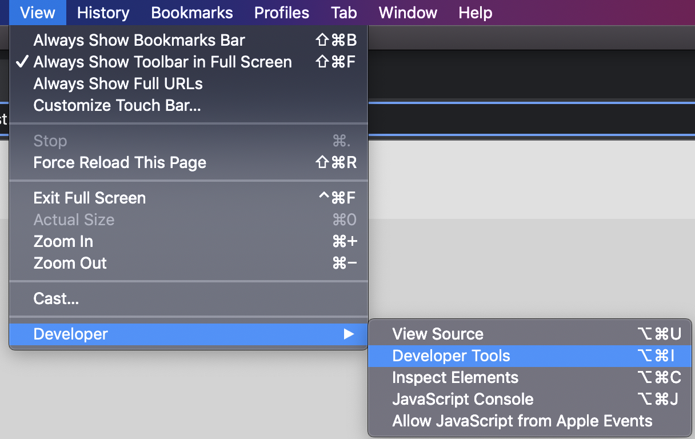

## Wrap up

Our basic project is now setup and we can now begin learning about the HTML Canvas element, and how we can use this element with JavaScript to create games! Your project should look like the following:

```markdown
  .
  ├── src               - contains all of the code for our project template
  │   ├── js
  │   │   ├── main.js   - the main entry point for our JavaScript code
  |   ├── index.html    - the root of our web application
```

You can find the completed source code for this section here on GitHub: [Project Setup](https://github.com/devshareacademy/html5-javascript-games/releases/tag/project_setup). If you run into any issues, please reach out via [GitHub Discussions](https://github.com/devshareacademy/html5-javascript-games/discussions).

In the next few articles in this series, we will covering some optional topics like: JavaScript Modules and enhancing the VS Code Intellisense with the `jsconfig.json` file. These articles are meant to provide supplementary information for this course and to provide a better developer experience.

If you would like to skip these articles and get started learning about the Canvas element, please start at part one (link coming soon...).
