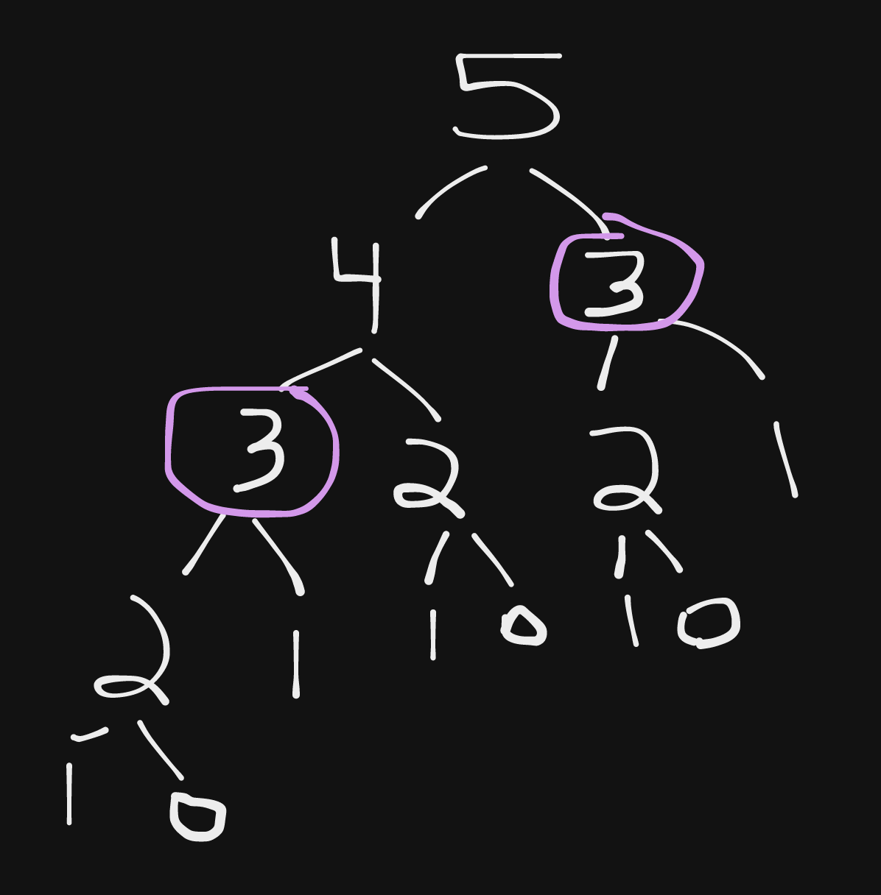

In this post, we will review LeetCode problem `Fibonacci Number`, and go over one possible solution.

## Problem Summary

Level: Easy
Title: 509. Fibonacci Number
Link: [https://leetcode.com/problems/fibonacci-number/](https://leetcode.com/problems/fibonacci-number/)

### Description

The Fibonacci numbers, commonly denoted `F(n)` form a sequence, called the Fibonacci sequence, such that each number is the sum of the two preceding ones, starting from 0 and 1. That is,

```
F(0) = 0, F(1) = 1
F(n) = F(n - 1) + F(n - 2), for n > 1.
```

Given `n`, calculate `F(n)`.

**Example 1:**

```
Input: n = 2
Output: 1
Explanation: F(2) = F(1) + F(0) = 1 + 0 = 1.
```

**Example 2:**

```
Input: n = 3
Output: 2
Explanation: F(3) = F(2) + F(1) = 1 + 1 = 2.
```

**Example 3:**

```
Input: n = 4
Output: 3
Explanation: F(4) = F(3) + F(2) = 2 + 1 = 3.
```

**Constraints:**

* `0 <= n <= 30`

## Solving The Problem

From the problem description, we can see that to calculate the `nth` number in the Fibonacci Sequence, we just need to take the sum of the previous two numbers, so as a example, we currently know that the sequence is like so: `0, 1, 1, 2, 3` based on the example inputs and outputs provided, and we can calculate the next number in the sequence by adding `3` and `2` together to get `5`.

Based on this, we can start to build out a recursive solution to this problem:

```typescript
function fib(n: number): number {
  if (n < 2) return n;
  return fib(n-1) + fib(n-2);
};
```

In the code above, we first check to see if `n` is less than `2` and if so, we just return `n` as the result since we know that `F(0)` is `0` and `F(1)` is `1`. If `n` is `2` or higher, we then recursively call `fib` to retrieve the previous two values.

This solution works, however if we are asked to find a large number in the sequence, we will see that our solution takes a long time to run. In order to make our solution more efficient, we can optimize it by using dynamic programming.

To optimize our solution, we need to see if there is any repetitive work that is being done. One way to do this, is to visualize the inputs we are passing to our `fib` function. As example, if `n` is `5`, we would end up calling the `fib` function with the following inputs:



## Solution

```typescript
function fib(n: number): number {
  const t = [0, 1];
  for (let i = 2; i <= n; i += 1) {
    t.push(t[i-1] + t[i-2]);
  }
  return t[n];
};
```
