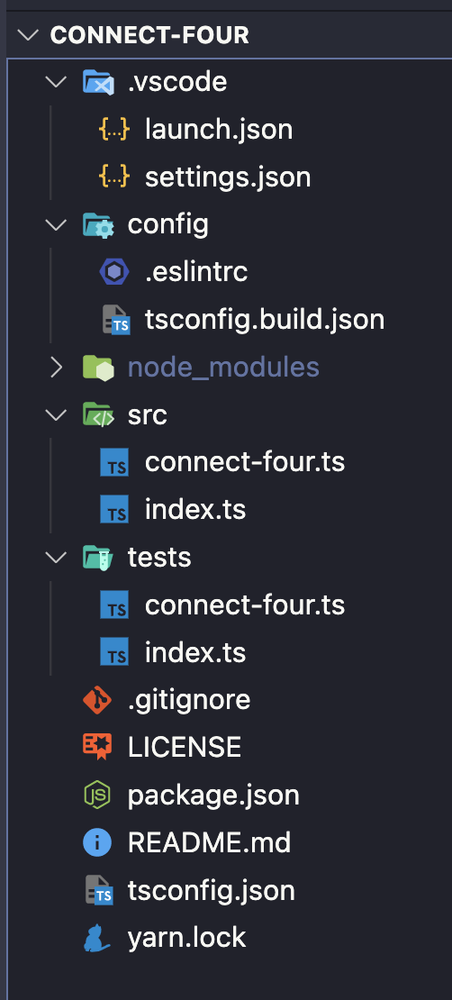
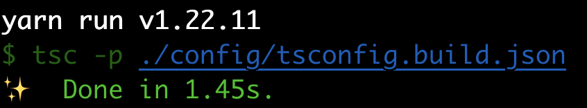

In this series, we will go over how to create a reusable TypeScript class that can be used to build the game Connect Four, and in future series we will see how we can use this library to create implementations of the Connect Four game for the CLI and the web. We will not be going over the basics of TypeScript, however you should be able to follow along if you are not familiar with TypeScript.

In order to follow along with this series, you will need the following:

* Access to a development environment that has [Node.js 16](https://nodejs.org/en/) installed.
* A code editor of your choice: Sublime, VSCode, Notepad, etc.
* Some familiarity with JavaScript. We will not be going over the basics of JavaScript in this series, but you should be able to still follow along.

## Series Code

You can find the code for the basic project setup here on GitHub: [Project Start](https://github.com/devshareacademy/connect-four/tree/project-start)

You can find the completed source code for this article here on GitHub: [Blog Post 1 Code](https://github.com/devshareacademy/connect-four/tree/blog-post-1)

Lastly, if you would just like to use a NPM package for this library, you can find that here: [NPM - @devshareacademy/connect-four](https://www.npmjs.com/package/@devshareacademy/connect-four).

## Connect Four

Before we start writing any code, we will do a quick review of the game Connect Four. Connect Four is a two player board game, where players take turns dropping different colored tokens into a 7 X 6 grid. The objective of the game is to be the first player to get your four tokens in a horizontal, vertical, or diagonal line.

To play the game, you drop one of your tokens into one of the columns at the top of the vertical grid, which will result in the token falling into the next open space in that column. Finally if the game board fills up, and no player managed to connect four tokens of their color, the game ends in a draw.


## Getting Started

We will be using the following [Connect Four Project Skeleton](https://github.com/devshareacademy/connect-four/releases/tag/project-skeleton) as a starting point for our library that we will be building. This project skeleton has the initial project structure for building a TypeScript NPM module and has the following support:

* Test setup to use [UVU](https://www.npmjs.com/package/uvu)
* Linting with [ESLint](https://eslint.org/)
* Project dependencies for compiling the TypeScript code

*Note:* You can also find the code for this project skeleton in a separate branch on GitHub here: [Project Skeleton](https://github.com/devshareacademy/connect-four/tree/project-skeleton).

Once you download the project skeleton, you will need to install the required development dependencies for the code base. This can be done by running one of the following commands:

```bash
# NPM Package Manager
npm install

# Yarn Package Manager (Only if you are using Yarn)
yarn install --frozen-lockfile
```

Once the project dependencies are installed, you should see a project structure like this:



Finally, to make sure everything is working properly, if you run one of the following commands:

```bash
# NPM Package Manager
npm run build

# Yarn Package Manager
yarn build
```

The project should compile and you should see a new folder called `dist`, which will have all of the compiled source code.



## Project Structure

In the project folder, there is a variety of files and folders. At a high level, here is a quick summary of what each folder and file is used for:

* **.vscode** - this folder contains configuration files for the VSCode editor, which will add auto linting and custom launch configurations for running tests (if you are not using VSCode, you can remove this folder from your project)
* **config** - this folder contains configuration files for ESLint and TSC (the TypeScript Compiler)
* **dist** - a dynamically generated folder which will contain the compiled source code of the finished library (generated when you run the build script)
* **node_modules** - a dynamically generated folder which contains the project developer dependencies when working on the library (generated when you run the install script)
* **src** - this folder will contain the core code for our library (currently contains a placeholder Class for the Connect Four library)
* **tests** - this folder will contain the custom tests for our library
* **.gitignore** - this file is used for telling [git](https://git-scm.com/) to ignore certain files in our project (mainly used for our project dependencies and dynamically generated files)
* **package.json** - a configuration file for npm that contains metadata about your project
* **tsconfig.json** - a configuration file for TSC
* **yarn.lock** - a configuration file that contains the exact tree structure of the project dependencies and their versions (helps with repeatable project builds)

For the most part, we will only be focusing on the files in the `src` and `tests` folders, which is where we will be writing our code. The other files are primarily configuration files to support using TypeScript, ESLint, and Node.js.

## Planning Our ConnectFour.ts Class

In the project `src` folder we have two files: `index.ts` and `connect-four.ts`. The `index.ts` file is going to be the main entrypoint file for our library. Its only purpose is to export out any code that we want to expose publicly in our library. The `connect-four.ts` file is going to be the main class for our library. This file is currently setup to export out a class called `ConnectFour`, and the `index.ts` file imports this class and exports the class as part of the library.

Currently, the `ConnectFour` class contains no source code and just a few high level comments on some of the requirements that will be needed for our library. Before we start writing our class, lets review some of the functionality that we will need.

To represent the game board of Connect Four, we can use a two dimensional array that will have the dimensions of 7 x 6. If you are not familiar with a two dimensional array, a 2D array is simply an array that contains another array. For example:

```typescript
const arr = [
  [1,2,3]
];
```

When we create this 2D array, we will initialize the inner arrays with `0`, which will represent an empty cell. To represent the players game pieces, we can use the values `1` and `2` to represent each player.

To play the game of Connect Four, players can do one of two things: either drop a game token into an empty column, or they can start a new game by removing all of the game tokens from the board. To represent these two actions, we will add two methods to our `ConnectFour` class: `makeMove` and `resetGame`.

Finally, for our game state we will need to keep track of a few different things and expose these values as properties on our class:

* the board state - needed so we can render out the current board and where the players game pieces are currently placed
* the current players turn - needed so we can render out which player should make the next move
* indicator if a player won the game
* indicator if a game is over - needed in case the game ends in a draw and there is no winner

Now that we have planned the initial requirements for our `ConnectFour` class, we can start writing some code!

## Class Constructor and Private Properties

To get started, the first thing we will do is add the properties we discussed above to our `ConnectFour` class. To do this, replace the code in the `connect-four.ts` file with the following:

```typescript
/* Represents the two player identifiers for the Connect Four game. */
export enum Player {
  ONE = 'ONE',
  TWO = 'TWO',
}

/* Represents the possible values of a cell in the Connect Four board. */
export type CellRange =
  | 0 // empty cell
  | 1 // player one game piece
  | 2; // player two game piece

/**
 * Represents the game of Connect Four, where players attempt to get four checkers in a row -
 * horizontally, vertically, or diagonally. The first player to do so wins.
 */
export default class ConnectFour {
  /* an internal representation of the Connect Four Board */
  #board: CellRange[][] = [];
  /* used for tracking for which player will place the next game piece */
  #playersTurn: Player = Player.ONE;
  /* used for tracking for if the game is over, either from the board being filled or a player getting a Connect Four */
  #isGameOver = false;
  /* used for tracking if a player wins the game */
  #gameWinner: undefined | Player;

  constructor() {}
}
```

In the code above we did the following:

* Created a new [`enum`](https://www.typescriptlang.org/docs/handbook/enums.html) called `Player` to represent the two players in our game. This `enum` will be used throughout the `ConnectFour` class.
* Created a new [`type`](https://www.typescriptlang.org/docs/handbook/2/everyday-types.html) called `CellRange` to represent the possible values a cell in our Connect Four board can have.
* Created four new [private](https://developer.mozilla.org/en-US/docs/Web/JavaScript/Reference/Classes/Private_class_fields) fields on the `ConnectFour` class. As of ES2022, you can now create private fields on a class in JavaScript by prefixing the field with the `#` sign. By doing this, JavaScript will ensure these properties are only accessible internally to the class the fields were added to.

Since the properties we are added are private, we will need a way to expose those values to anyone that is using this class. We can do this by creating a `getter` for these fields. In JavaScript, a `getter` is when you use the `get` keyword to bind an object property to a function that will be called when that property is looked up. As an example:

```typescript
get playersTurn(): Player {
  return this.#playersTurn;
}
```

If we reference the `.playersTurn` property, this will call a function that just returns the value of our private field `#playersTurn`. To create a `getter` for each of our private fields, we will need to add the following code to the `ConnectFour` class below the constructor:

```typescript
get board(): CellRange[][] {
  return JSON.parse(JSON.stringify(this.#board)) as CellRange[][];
}

get playersTurn(): Player {
  return this.#playersTurn;
}

get isGameOver(): boolean {
  return this.#isGameOver;
}

get gameWinner(): undefined | Player {
  return this.#gameWinner;
}
```

For most part, all of our `getters` are just returning the value for the private property that is being referenced. However, in the `board getter` we are first stringifying the array and then parsing that string to return an array. We are doing this because in JavaScript, an Array is a [reference](https://www.freecodecamp.org/news/primitive-vs-reference-data-types-in-javascript/) data type, when means if we just return the `#board`, the values in the `#board` array can be modified outside the `ConnectFour` class instance.

## Initial Class Methods

With the `getters` setup for our class, we will next add the initial methods for our `ConnectFour` class. To do this, add the following code below the `getters` in the `connect-four.ts` file:

```typescript
/**
 * Allows player to reset the game state, and start a brand new game.
 */
public resetGame(): void {
  // TODO
}

/**
 * Allows the current player to make a move by providing the column they would like to drop their game piece into.
 */
public makeMove(col: number): void {
  // TODO
}
```

In the code above, we added two public methods to our class: `makeMove` and `resetGame`. The `makeMove` method will expect the column that the player wants to to drop their game piece into, and the `resetGame` will take no arguments. For the time being, these two methods will have no code and we will leave a `TODO` comment in each method.

## Wrap Up

In this article, we reviewed the rules and game play of the game Connect Four and we started to build out the initial `ConnectFour` class  by adding the properties and methods that will be needed.

You can find the completed source code for this article here on GitHub: [Blog Post 1 Code](https://github.com/devshareacademy/connect-four/tree/blog-post-1). If you run into any issues, please reach out via [GitHub Discussions](https://github.com/devshareacademy/connect-four/discussions).

In the next article of this series, we will start to add the game logic for when a players places a game piece into a column.
