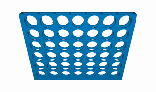

In this series, we will go over how to create a reusable TypeScript class that can be used to build the game Connect Four, and in future series we will see how we can use this library to create implementations of the Connect Four game for the CLI and the web. We will not be going over the basics of TypeScript, however you should be able to follow along if you are not familiar with TypeScript.

In order to follow along with this series, you will need the following:

* Access to a development environment that has [Node.js 16](https://nodejs.org/en/) installed.
* A code editor of your choice: Sublime, VSCode, Notepad, etc.
* Some familiarity with JavaScript. We will not be going over the basics of JavaScript in this series, but you should be able to still follow along.

## Series Code

You can find the code for the basic project setup here on GitHub: TODO add link.

You can find the completed source code for this article here on GitHub: TODO add link

Lastly, if you would just like to use a NPM package for this library, you can find that here: [NPM - @devshareacademy/connect-four](https://www.npmjs.com/package/@devshareacademy/connect-four).

## Connect Four

Before we start writing any code, we will do a quick review of the game Connect Four. Connect Four is a two player board game, where players take turns dropping different colored tokens into a 7 X 6 grid. The objective of the game is to be the first player to get your four tokens in a horizontal, vertical, or diagonal line.

To play the game, you drop one of your tokens into one of the columns at the top of the vertical grid, which result in the token falling into the next open space in that column. Finally if the game board fills up, and no player managed to connect four tokens of their color, the game ends in a draw.



## Getting Started

We will be using the following [Connect Four Project Skeleton](https://github.com/devshareacademy/connect-four/releases/tag/project-skeleton) as a starting point for our library that we will be building. This project skeleton has the initial project structure for building a TypeScript NPM module and has the following support:

* Test setup to use [UVU](https://www.npmjs.com/package/uvu)
* Linting with [ESLint](https://eslint.org/)
* Project dependencies for compiling the TypeScript code

*Note:* You can also find the code for this project skeleton in a separate branch on GitHub here: [Project Skeleton](https://github.com/devshareacademy/connect-four/tree/project-skeleton).

Once you download the project skeleton, you will need to install the required development dependencies for the code base. This can be done by running one of the following commands:

```bash
# NPM Package Manager
npm install

# Yarn Package Manager (Only if you are using Yarn)
yarn install --frozen-lockfile
```

Once the project dependencies are installed, you should see a project structure like this:


Finally, to make sure everything is working properly, if you run one of the following commands:

```bash
# NPM Package Manager
npm run build

# Yarn Package Manager
yarn build
```

The project should compile you should see a new folder called `dist`.


## Planning Our ConnectFour.ts Class

TODO

## Wrap up

In this article, we learned about the basics of working with the HTML Canvas element and we saw how we can use the Canvas Context element to interact and draw on the HTML Canvas element.

You can find the completed source code for this section here on GitHub: [Project Setup](https://github.com/devshareacademy/html5-javascript-games/releases/tag/project_setup). If you run into any issues, please reach out via [GitHub Discussions](https://github.com/devshareacademy/html5-javascript-games/discussions).

In the next article of this series, we will learn about the canvas state and how we can use built in methods to save and revert changes to the state.
