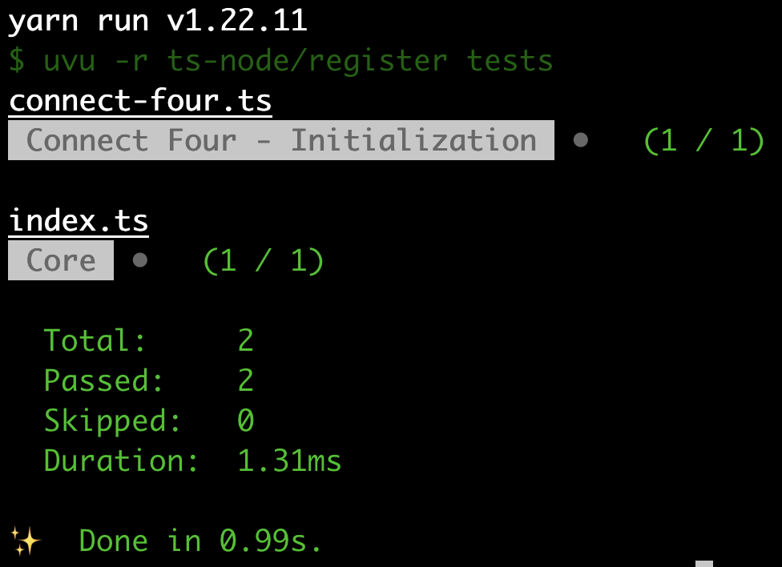
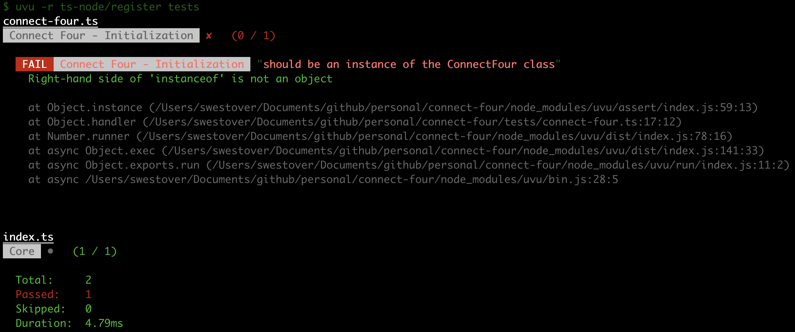
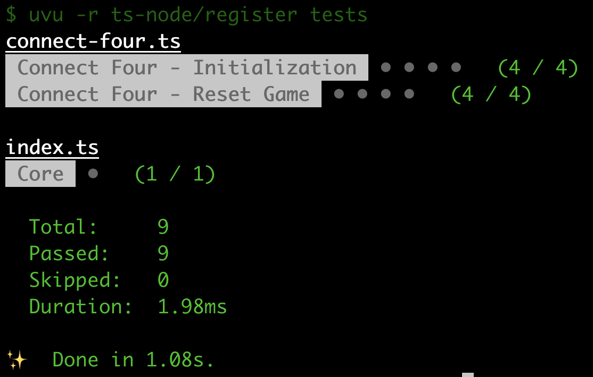

In this series, we will go over how to create a reusable TypeScript class that can be used to build the game Connect Four, and in a future series we will see how we can use this library to create implementations of the Connect Four game for the CLI and the web.

Previously, in [part 1](/post/2023/01/build-a-connect-four-library-in-typescript-part-1/), we reviewed the rules and game play of the game Connect Four and we started to build out the initial `ConnectFour` class by adding the properties and methods that will be needed.

In part 2 of this series, we are going to add the game initialization logic, the ability to reset the game state, and then take a look at how we can test our code using the [uvu](https://github.com/lukeed/uvu) framework.

## Series Links

You can find links to all of the posts in this series here:

* [Part 1](/post/2023/01/build-a-connect-four-library-in-typescript-part-1/)
* [Part 2](/post/2023/01/build-a-connect-four-library-in-typescript-part-2/)
* [Part 3](/post/2023/01/build-a-connect-four-library-in-typescript-part-3/)
* [Part 4](/post/2023/02/build-a-connect-four-library-in-typescript-part-4/)
* [Part 5](/post/2023/02/build-a-connect-four-library-in-typescript-part-5/)

## Series Code

You can find the code for the end of part 1 here: [Blog Post 1 Code](https://github.com/devshareacademy/connect-four/tree/blog-post-1)

You can find the completed source code for this article here on GitHub: [Blog Post 2 Code](https://github.com/devshareacademy/connect-four/tree/blog-post-2)

Lastly, if you would just like to use a NPM package for this library, you can find that here: [NPM - @devshareacademy/connect-four](https://www.npmjs.com/package/@devshareacademy/connect-four).

## Game Initialization And Reset Game State

When we create a new instance of the `ConnectFour` class, we are currently not doing anything in our `constructor` for our class. We need to add in logic to setup the initial state of the game. This includes:

* initializing the game board with empty values
* setting the current players turn
* resetting and information on who won the game

In order to initialize the game board with empty values, we will need to know how many columns and rows should be contained in our board, and then use those values to create our 2D array.

To do all of this, we can replace the `constructor` code in the `connect-four.ts` file with the following:

```typescript
constructor() {
  this.#isGameOver = false;
  this.#gameWinner = undefined;
  this.#playersTurn = Player.ONE;
  this.#initializeGrid();
}
```

Then, at the top of the `connect-four.ts` file, add the following code:

```typescript
const NUMBER_OF_ROWS = 6;
const NUMBER_OF_COLS = 7;
```

Finally, below the `makeMove` method in the `connect-four.ts` file, add the following code:

```typescript
/**
 * Initializes the internal 2D array that represents the Connect Four board with Zeros, which represent empty spaces.
 */
#initializeGrid(): void {
  // reset grid back to an empty state
  this.#board = [];

  // populate the rows and cols for the grid
  for (let i = 0; i < NUMBER_OF_ROWS; i += 1) {
    const row: CellRange[] = [];
    for (let j = 0; j < NUMBER_OF_COLS; j += 1) {
      row.push(0);
    }
    this.#board.push(row);
  }
}
```

In the code above, the first thing we did was in the `constructor` we set our internal properties to the initial values that we want for our Connect Four game. We then called a brand new private method, `initializeGrid`, which will be used to populate our 2D array with `0`'s. Next, we created two new variables to track the number of columns and rows that will be used for our Connect Four game, and we set these values to 7 and 6.

Lastly, we created the new private method `initializeGrid`. In this method, we first reset the state of our `#board` property back to an empty array. We then created two `for` loops with one of them nested in order to populate the game board. This was done so we could create a 2D array that would be of size 6 x 7, which will represent the board of Connect Four.

## Reset Game State

Previously when we planned the functionality for the `ConnectFour` class, we wanted to have the ability to reset the game state at any point. When this happens, we want the users to be able to start a new Connect Four game without have to create a new instance of the `ConnectFour` class. This will involve doing the same steps that are listed above in the class `constructor`.

Since we will be redoing the same logic, this is a good chance to refactor the code in class `constructor` and move this code to a brand new method. To refactor the code, we will create a new private method called `#initializeGame` and this method will just contain the same code our `constructor` had.

In the `connect-four.ts` file, add the following code below the `#initializeGrid` method:

```typescript
/**
 * Initializes the internal game state back to the a fresh instance of a Connect Four game, where the board is empty
 * and we are waiting for the first player to make a move.
 */
#initializeGame(): void {
  this.#initializeGrid();
  this.#isGameOver = false;
  this.#gameWinner = undefined;
  this.#playersTurn = Player.ONE;
}
```

Then, in the class `constructor`, replace the code with the following:

```typescript
constructor() {
  this.#initializeGame();
}
```

Finally, now that we have our new internal method, we can update the `resetGame` method to call the `#initializeGame` method. In the `connect-four.ts` file, update the `resetGame` to have the following code:

```typescript
public resetGame(): void {
  this.#initializeGame();
}
```

## Testing Our Code

Before we start building out the logic for allowing a player to place a game piece, we are going to talk about how we can test the code we are writing. As part of the initial project skeleton, the project was setup to support tests written with [uvu](https://github.com/lukeed/uvu), and there is a folder called `tests` that has a few files with some sample tests. Currently, the `tests/index.ts` file has a simple test for making sure the `ConnectFour` class is exported, and the `tests/connect-four.ts` file has a test for creating an instance of our `ConnectFour` class.

In order to test the code we are creating, we will be adding new tests to these files, which will help test the functionality. We will not be doing a deep dive into the `uvu` test framework, but we will discuss some of the key concepts of that framework shortly. To run the tests, you can run one of the following commands, which will have the `uvu` cli run our tests:

```bash
# NPM Package Manager
npm run test

# Yarn Package Manager
yarn test
```

You should see the following output:



The output is just a summary of the number of tests that ran and an overall summary if the tests passed, or failed.

So now that we know how to run the tests, lets review the existing code in the `tests/connect-four.ts` file:

```typescript
let connectFour: ConnectFour;

/* Connect Four - Game Initialization Tests */
function setupInitializationTests(): void {
  const connectFourInitializationSuite = uvu.suite('Connect Four - Initialization');

  connectFourInitializationSuite.before.each(() => {
    connectFour = new ConnectFour();
  });

  connectFourInitializationSuite('should be an instance of the ConnectFour class', () => {
    assert.instance(connectFour, ConnectFour);
  });

  connectFourInitializationSuite.run();
}

setupInitializationTests();
```

In the code above, we created a function called `setupInitializationTests`, which is just a helper function to group our code that is related to the functionality that we want to test. This makes it easier to run one particular set of tests, and helps with code readability. In the `setupInitializationTests` function, we first create a test `suite`, which is just a way to group tests together. To create a `suite`, we call the `uvu.suite` method and provide a name of our `suite`. This name will match the output summary that is shown when you run the tests.

After we created the `suite`, we then called the `before.each` method on our `suite` instance, `connectFourInitializationSuite`, which allows us to register a callback function that will be invoked before each test in our `suite`. This callback is useful for setting up any variables that we need for our tests, and for grouping code together that is common across all tests. In the code above, we are creating a new instance of our `ConnectFour` class before each test. This will help ensure we are testing each instance in isolation, instead of reusing the same `ConnectFour` instance in each test.

We then created our first test by invoking our `suite` instance, and we passed two arguments: the name of the test and a callback function that will contain the logic for the test we are writing. In our current test, we are using `assert.instance` to validate that our `connectFour` variable is an instance of the `ConnectFour` class.

Finally, for the tests to actually run, we need to call the `run` method on our test `suite`.

Currently, our single test is setup to pass. In order to see what a test failure looks like, we can change the following line: `assert.instance(connectFour, ConnectFour);` to `assert.instance(connectFour, 'string');`. If you save your code and run the test script again, you should see output similar to this:



In the test summary output, we will see that the name of our test suite is shown, `Connect Four - Initialization`, followed by the name of the test that failed, `should be an instance of the ConnectFour class`. This will help you identify the tests that are failing so you can debug that test.

There was a lot of information presented here, however in summary the main things to take away from this section are:

* suites - are a way to group our tests
* tests - are an individual function that will test some type of functionality, these are added to `suites`
* in order to run the tests in an uvu suite, you need to call the `run` method on that `suite`, otherwise no tests will run

## Adding New Tests

So now that we have reviewed our existing tests, we will now add some new tests to validate our game initialization logic. In the `tests/connect-four.ts` file, replace all of the code in with the following code:

```typescript
import * as uvu from 'uvu';
import * as assert from 'uvu/assert';
import { ConnectFour } from '../src';
import { Player } from '../src/connect-four';

let connectFour: ConnectFour;

/* Connect Four - Game Initialization Tests */
function setupInitializationTests(): void {
  const connectFourInitializationSuite = uvu.suite('Connect Four - Initialization');

  connectFourInitializationSuite.before.each(() => {
    connectFour = new ConnectFour();
  });

  connectFourInitializationSuite('should initialize the game state with an empty board', () => {
    // check that the board is initialized with empty values
    const isBoardEmpty = connectFour.board.every((row) => row.every((cell) => cell === 0));
    assert.equal(isBoardEmpty, true);
  });

  connectFourInitializationSuite('should initialize the game with no winner', () => {
    const winner = connectFour.gameWinner;
    assert.type(winner, 'undefined');
    assert.equal(winner, undefined);
  });

  connectFourInitializationSuite('should initialize the game and the game should not be over', () => {
    const isGameOver = connectFour.isGameOver;
    assert.type(isGameOver, 'boolean');
    assert.equal(isGameOver, false);
  });

  connectFourInitializationSuite('should initialize the game and wait for the first players input', () => {
    const currentPlayersTurn = connectFour.playersTurn;
    assert.type(currentPlayersTurn, 'string');
    assert.equal(currentPlayersTurn, Player.ONE);
  });

  connectFourInitializationSuite.run();
}

/* Connect Four - Reset Game Tests */
function setupResetGameTests(): void {
  const connectFourResetGameSuite = uvu.suite('Connect Four - Reset Game');

  connectFourResetGameSuite.before.each(() => {
    connectFour = new ConnectFour();
    connectFour.makeMove(0);
    connectFour.resetGame();
  });

  connectFourResetGameSuite('should reset the game state with an empty board', () => {
    // check that the board is initialized with empty values
    const isBoardEmpty = connectFour.board.every((row) => row.every((cell) => cell === 0));
    assert.equal(isBoardEmpty, true);
  });

  connectFourResetGameSuite('should reset the game state with no winner', () => {
    const winner = connectFour.gameWinner;
    assert.type(winner, 'undefined');
    assert.equal(winner, undefined);
  });

  connectFourResetGameSuite('should reset the game state and the game should not be over', () => {
    const isGameOver = connectFour.isGameOver;
    assert.type(isGameOver, 'boolean');
    assert.equal(isGameOver, false);
  });

  connectFourResetGameSuite('should reset the game state and wait for the first players input', () => {
    const currentPlayersTurn = connectFour.playersTurn;
    assert.type(currentPlayersTurn, 'string');
    assert.equal(currentPlayersTurn, Player.ONE);
  });

  connectFourResetGameSuite.run();
}

setupInitializationTests();
setupResetGameTests();
```

The code above should look similar to the code that was there previously. The main difference is that we have now added multiple tests to our `Connect Four - Initialization` test suite and we created a new test suite called `Connect Four - Reset Game`, which will contain the tests for our reset game logic. In summary, we added tests to validate that each of our class properties are being set correctly, and we added logic to validate that our game board is being initialized with `0's`, instead of just being an empty array.

In the code above, we referenced some new tests assertions, so lets review those now:

* `assert.type` is used for validating the type of a variable, and this can be done by passing the variable and the type you are expecting that variable to be. This function uses `typeof` to validate the types.
* `assert.equal` is used for validating that the two provided arguments are deeply equal, and this function uses [dequal](https://github.com/lukeed/dequal) to perform this validation.

If you save your code and re-run the tests, you should see that they are all passing.



## Wrap Up

In this article, we reviewed the rules and game play of the game Connect Four and we started to build out the initial `ConnectFour` class by adding the properties and methods that will be needed.

You can find the completed source code for this article here on GitHub: [Blog Post 2 Code](https://github.com/devshareacademy/connect-four/tree/blog-post-2).

If you run into any issues, please reach out via [GitHub Discussions](https://github.com/devshareacademy/connect-four/discussions), or leave a comment down below.

In [part 3](/post/2023/01/build-a-connect-four-library-in-typescript-part-3/) of this series, we will start adding in the logic for allowing players to drop a game piece into a column.
