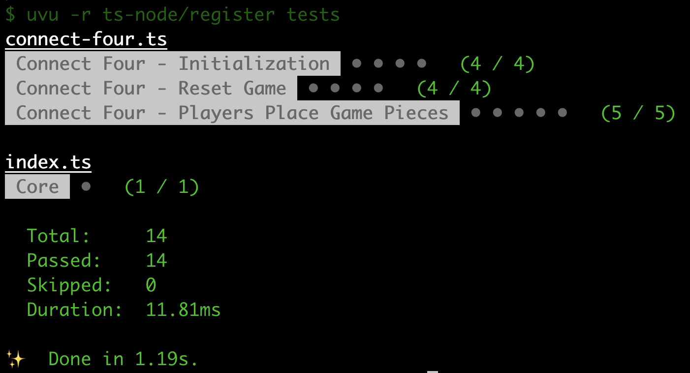

In this series, we will go over how to create a reusable TypeScript class that can be used to build the game Connect Four, and in a future series we will see how we can use this library to create implementations of the Connect Four game for the CLI and the web.

Previously, in [part 2](/post/2023/01/build-a-connect-four-library-in-typescript-part-2/), we added the initial game initialization logic, the ability to reset the game state, and we then learned how we could test our code using the uvu framework.

In this part of the series, we are going to start adding in the game logic for allowing players to place their game pieces in a column on the Connect Four board.

## Series Links

You can find links to all of the posts in this series here:

* [Part 1](/post/2023/01/build-a-connect-four-library-in-typescript-part-1/)
* [Part 2](/post/2023/01/build-a-connect-four-library-in-typescript-part-2/)
* [Part 3](/post/2023/01/build-a-connect-four-library-in-typescript-part-3/)
* [Part 4](/post/2023/02/build-a-connect-four-library-in-typescript-part-4/)
* [Part 5](/post/2023/02/build-a-connect-four-library-in-typescript-part-5/)

## Series Code

You can find the code for the end of part 2 here: [Blog Post 2 Code](https://github.com/devshareacademy/connect-four/tree/blog-post-2)

You can find the completed source code for this article here on GitHub: [Blog Post 3 Code](https://github.com/devshareacademy/connect-four/tree/blog-post-3)

Lastly, if you would just like to use a NPM package for this library, you can find that here: [NPM - @devshareacademy/connect-four](https://www.npmjs.com/package/@devshareacademy/connect-four).

## Making A Move

Previously, we created a method called `makeMove` that will allow players to place a game piece into a single column, and we left a `TODO` to add in the code that belongs here. Before we jump into the code, lets review the what we will need to do in this method.

For this method, we will want to allow the player to pass in the index of the column that they would like to drop their game piece into, and we will want to return the column and row of where the game piece landed. By adding this return value, it will allow us to easily show where a new game piece was added to the board state.

When a user provides a column index, we will want to do the following:

* Validate that the provided index is a valid number for the number of columns in our game, any number from 0 to 6, since we have 7 columns and our array index starts at 0.
* Validate that the game is not already over.
* Validate that the column we are trying to place the game piece into is not already full.

After we validate that the move is valid, we will need to find the first empty row so we will know where the game piece will land when the player drops the piece into a column. Once we know the row, we can update the internal board state to have a `1`, or `2` depending on the current players turn. After updating the board state, we will need to check to see if the game is over, by validating if the board is full, or if a player got a Connect Four.

Lastly, we will want to update the current players turn if the game is not over and then return the column and row for where game piece was placed.

Now that we have reviewed the game logic that we want in this method, lets start to add some code.

## Validating A Players Move

When we go to validate a players move, if the move is invalid we are going to throw an `Error` with a custom message. To keep track of these error messages, we will create a new `enum` called `ConnectFourError`. To do this, add the following code at the top of the `connect-four.ts` file with the other types:

```typescript
export enum ConnectFourError {
  INVALID_MOVE = 'Column is already filled, please provide a different column.',
  INVALID_COLUMN = 'Invalid column specified. Please provide a valid column number.',
  INVALID_MOVE_GAME_IS_OVER = 'Game has already ended, please reset the game.',
}
```

Next, in the `makeMove` method, replace the `TODO` comment with the following code:

```typescript
// check for validate board space
if (col < 0 || col > NUMBER_OF_COLS) {
  throw new Error(ConnectFourError.INVALID_COLUMN);
}

// validate that the game is not already done
if (this.#isGameOver) {
  throw new Error(ConnectFourError.INVALID_MOVE_GAME_IS_OVER);
}

// validate that the space is not already taken
if (this.board[0][col] !== 0) {
  throw new Error(ConnectFourError.INVALID_MOVE);
}
```

In the code above, we are performing the three validations we listed above for when a player makes a move. If any of the checks fail, we throw an `Error` and use one of the `ConnectFourError` values we provided. One thing to note is in the check for validating if a column is full, we are only checking if the top most row is not empty since we fill the board from the bottom row up.

## Update Board State

Now that we have added the initial checks for if the move is valid, we need to add the remaining game logic to the `makeMove` method. To do this, add the following code below the code you just added:

```typescript
// update the state of the board to include the players selected space
let row = 0;
for (let i = NUMBER_OF_ROWS - 1; i >= 0; i -= 1) {
  if (this.#board[i][col] === 0) {
    if (this.#playersTurn === Player.ONE) {
      this.#board[i][col] = 1;
    } else {
      this.#board[i][col] = 2;
    }
    row = i;
    break;
  }
}

// check if the game is finished
// TODO

const coordinate: Coordinate = {
  col,
  row,
};
if (this.#isGameOver) return coordinate;

// update the current players turn
if (this.#playersTurn === Player.ONE) {
  this.#playersTurn = Player.TWO;
} else {
  this.#playersTurn = Player.ONE;
}
return coordinate;
```

In the code above, we are doing the following:

* We created a new variable called `row`, which will be used for tracking which row the game piece will be placed at.
* We are determining the first empty row from the bottom of the board, by looping through our rows backwards. In each iteration of the loop, we are checking to see if the cell for that row and column combination is empty. If the cell is empty, we update that cells value to match which players turn it is, and we break out of our `for` loop. If the cell is not empty, we let the loop continue to the next iteration.
* We added a `TODO` comment for checking if the game is finished.
* We then created a new variable called `coordinate` and we referenced a new `type` that we have not created yet. The `Coordinate` will be a simple object that contains the row and column of where the game piece was placed.
* We then update the current players turn if the game is not over, and return the `coordinate` variable.

Since, we referenced a new `type` called `Coordinate`, lets add that to the top of our `connect-four.ts` file:

```typescript
export type Coordinate = {
  col: number;
  row: number;
};
```

Finally, we need to update the return value of our `makeMove` method to show we are not returning a `Coordinate` object. To do this, replace the following line of code:

```typescript
public makeMove(col: number): void {
```

with the following:

```typescript
public makeMove(col: number): Coordinate {
```

## Testing Our Changes

Now that we have most of the logic in place for our `makeMove` method, we can start to test our changes. To do this, we will add a new `suite` of tests to our `tests/connect-four.ts` file. For our tests, we will want to test for the following functionality:

* When a player makes a move, the method should return the column and row values as part of an object for where the game piece was placed on our board.
* When the first player makes a move, the board state should have a `1` in the column where the game piece was placed and it should now be the next players turn.
* When the second player makes a move, the board state should have a `2` in the column where the game piece was placed and it should be player ones turn again.
* If an invalid column is provided, we should get an `Error` and the game state should not be modified.
* If a column is already filled, then we should also get an `Error` and the game state should not be modified.

To add these test cases, add the following code to the `tests/connect-four.ts` file, below our other functions:

```typescript
/* Connect Four - Players Place Game Pieces Tests */
function setupPlaceGamePieceTests(): void {
  const connectFourPlayersInputSuite = uvu.suite('Connect Four - Players Place Game Pieces');

  connectFourPlayersInputSuite.before.each(() => {
    connectFour = new ConnectFour();
  });

  connectFourPlayersInputSuite('should return the coordinate of the cell where the game piece was placed', () => {
    const makeMoveResponse = connectFour.makeMove(4);
    assert.equal(makeMoveResponse, {
      col: 4,
      row: 5,
    });
  });

  connectFourPlayersInputSuite('should allow first player to place a game piece and update the game state', () => {
    connectFour.makeMove(0);

    const currentPlayersTurn = connectFour.playersTurn;
    assert.type(currentPlayersTurn, 'string');
    assert.equal(currentPlayersTurn, Player.TWO);

    const isGameOver = connectFour.isGameOver;
    assert.type(isGameOver, 'boolean');
    assert.equal(isGameOver, false);

    const winner = connectFour.gameWinner;
    assert.type(winner, 'undefined');
    assert.equal(winner, undefined);

    const boardState = [
      [0, 0, 0, 0, 0, 0, 0],
      [0, 0, 0, 0, 0, 0, 0],
      [0, 0, 0, 0, 0, 0, 0],
      [0, 0, 0, 0, 0, 0, 0],
      [0, 0, 0, 0, 0, 0, 0],
      [1, 0, 0, 0, 0, 0, 0],
    ];
    assert.equal(boardState, connectFour.board);
  });

  connectFourPlayersInputSuite('should allow second player to place a game piece and update the game state', () => {
    connectFour.makeMove(0);
    connectFour.makeMove(0);

    const currentPlayersTurn = connectFour.playersTurn;
    assert.type(currentPlayersTurn, 'string');
    assert.equal(currentPlayersTurn, Player.ONE);

    const isGameOver = connectFour.isGameOver;
    assert.type(isGameOver, 'boolean');
    assert.equal(isGameOver, false);

    const winner = connectFour.gameWinner;
    assert.type(winner, 'undefined');
    assert.equal(winner, undefined);

    const boardState = [
      [0, 0, 0, 0, 0, 0, 0],
      [0, 0, 0, 0, 0, 0, 0],
      [0, 0, 0, 0, 0, 0, 0],
      [0, 0, 0, 0, 0, 0, 0],
      [2, 0, 0, 0, 0, 0, 0],
      [1, 0, 0, 0, 0, 0, 0],
    ];
    assert.equal(boardState, connectFour.board);
  });

  connectFourPlayersInputSuite(
    'should throw an error if an invalid column is provided and not modify the game state',
    () => {
      assert.throws(() => connectFour.makeMove(-1), /Invalid column specified/);

      const currentPlayersTurn = connectFour.playersTurn;
      assert.type(currentPlayersTurn, 'string');
      assert.equal(currentPlayersTurn, Player.ONE);

      const isGameOver = connectFour.isGameOver;
      assert.type(isGameOver, 'boolean');
      assert.equal(isGameOver, false);

      const winner = connectFour.gameWinner;
      assert.type(winner, 'undefined');
      assert.equal(winner, undefined);

      const boardState = [
        [0, 0, 0, 0, 0, 0, 0],
        [0, 0, 0, 0, 0, 0, 0],
        [0, 0, 0, 0, 0, 0, 0],
        [0, 0, 0, 0, 0, 0, 0],
        [0, 0, 0, 0, 0, 0, 0],
        [0, 0, 0, 0, 0, 0, 0],
      ];
      assert.equal(boardState, connectFour.board);
    },
  );

  connectFourPlayersInputSuite(
    'should throw an error if a column is already filled and not modify the game state',
    () => {
      connectFour.makeMove(0);
      connectFour.makeMove(0);
      connectFour.makeMove(0);
      connectFour.makeMove(0);
      connectFour.makeMove(0);
      connectFour.makeMove(0);

      assert.throws(() => connectFour.makeMove(0), /Column is already filled/);

      const currentPlayersTurn = connectFour.playersTurn;
      assert.type(currentPlayersTurn, 'string');
      assert.equal(currentPlayersTurn, Player.ONE);

      const isGameOver = connectFour.isGameOver;
      assert.type(isGameOver, 'boolean');
      assert.equal(isGameOver, false);

      const winner = connectFour.gameWinner;
      assert.type(winner, 'undefined');
      assert.equal(winner, undefined);

      const boardState = [
        [2, 0, 0, 0, 0, 0, 0],
        [1, 0, 0, 0, 0, 0, 0],
        [2, 0, 0, 0, 0, 0, 0],
        [1, 0, 0, 0, 0, 0, 0],
        [2, 0, 0, 0, 0, 0, 0],
        [1, 0, 0, 0, 0, 0, 0],
      ];
      assert.equal(boardState, connectFour.board);
    },
  );

  connectFourPlayersInputSuite.run();
}
```

Then, at the bottom of the file, add the following line of code to invoke our new `function`:

```typescript
setupPlaceGamePieceTests();
```

The code above should look similar to the other tests that we have added to our Connect Four library. In the tests above, we are using one new `assert` method called `throws`, which is used for validating that when a particular piece of code runs, an `Error` is thrown. This method allows you to provide a Regex Expression, `RegExp`, to match against the `Error` message that is received.

As an example: `assert.throws(() => connectFour.makeMove(0), /Column is already filled/);`, in this line of code we are asserting that when the `connectFour.makeMove(0)` code is executed, an `Error` will be thrown and the message property on that error will contain the string: `Column is already filled`.

Besides the `assert.throws`, we are just using the `assert.equal` and `assert.type` methods to validate our internal board state for each test. In each test, we are checking the following values to make sure the game state is what we expect it to be:

* the current players turn
* if the game is not over
* if there is no game winner
* if the values in the board are equal to the players game pieces that were placed

To make sure all of our tests are passing, you can run the test script in the `package.json` file by running on of the following commands:

```bash
# NPM Package Manager
npm run test

# Yarn Package Manager
yarn test
```

Once the tests run, you should see an output summary similar to this:



## Checking For Game End

With our logic in place for placing game tokens on the board, the last part of the functionality we need to add is checking for if the game is over. In the game of Connect Four, we know the game is over if one of the two following things occur: either the board is completely filled and no player got a Connect Four, or a single player got a Connect Four.

For now, we won't do a deep dive into checking if a player has won the game, and instead we will focus on adding a new internal method that will check if the board is full. To do this, add the following code to the `src/connect-four.ts` file:

```typescript
/**
 * Checks if the last played game piece resulted in a player winning the game by getting four in a row,
 * either in a column, row, or diagonal. If after the last piece is placed and there are no remaining game
 * spots left, the game ends in a draw and the game is considered over.
 */
#checkForGameEnd(row: number, col: number): void {
  // see if a player won based off of last piece that placed
  // TODO
  const didPlayerWin = false;

  const anyOpenSpots = this.#board[0].some((cell) => {
    return cell === 0;
  });

  if (!anyOpenSpots || didPlayerWin) {
    this.#isGameOver = true;
  }
}
```

Then, in the `makeMove` method, replace the `TODO` with a call to this new method. Replace the following code:

```typescript
// check if the game is finished
// TODO
```

with the following:

```typescript
// check if the game is finished
this.#checkForGameEnd(row, col);
```

In the code above, we did the following:

* First, created a new private method called `checkForGameEnd`. This method has two parameters, the column and row that a game piece was placed at.
* In this new method, we added a `TODO` for checking if a player has won the game and we created a new variable `didPlayerWin` to store this value. For now, we have set this value to always be `false`.
* We then added a check to see if any of the cells in the top row of the board are empty by using the `.some` method on the array, and we checked if each cell was equal to `0`. If any of the cells in that row are equal to `0`, then we will return early from that loop.
* At the end of this method, we determined if the game was over by check if the player won the game, or if the top row is filled.
* Finally, we updated our `makeMove` method to call the new `checkForGameEnd` method.

To make sure we didn't break anything, if you run the tests again, we should still see that all of them pass.

## Wrap Up

We have started working on the logic for checking if the game is over, however we need to still add the logic for if the player has won.

In this article, we added the logic for allowing the player to place a game piece in a column, logic for validating this move, and we started adding the logic for if the game is over.

You can find the completed source code for this article here on GitHub: [Blog Post 3 Code](https://github.com/devshareacademy/connect-four/tree/blog-post-3).

If you run into any issues, please reach out via [GitHub Discussions](https://github.com/devshareacademy/connect-four/discussions), or leave a comment down below.

In [part 4](/post/2023/02/build-a-connect-four-library-in-typescript-part-4/) of this series, we will add the logic for checking if a player has won the game by getting a Connect Four.
