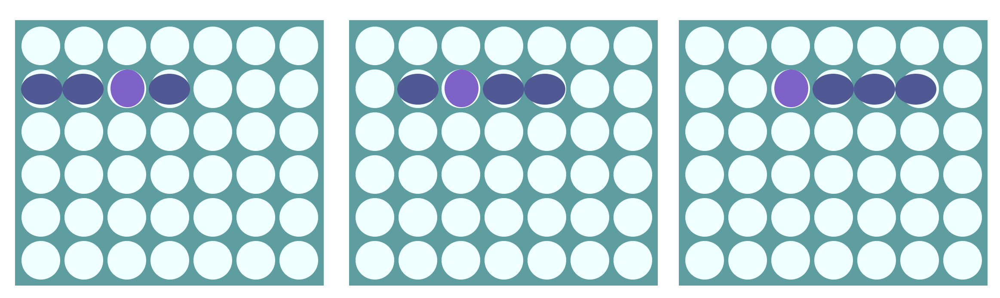
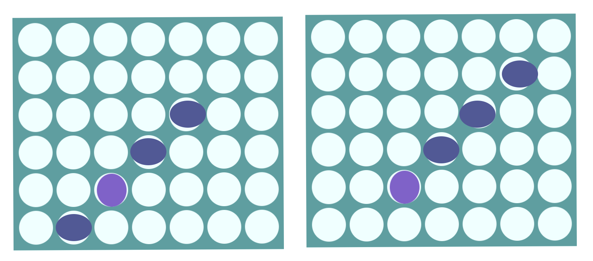
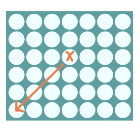
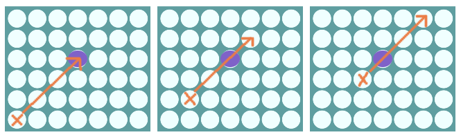
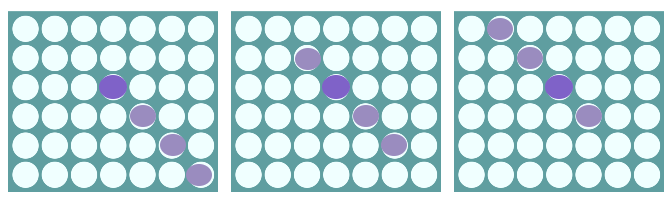
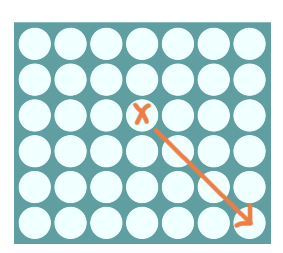
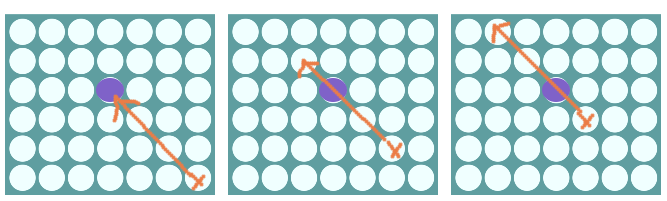

In this series, we will go over how to create a reusable TypeScript class that can be used to build the game Connect Four, and in a future series we will see how we can use this library to create implementations of the Connect Four game for the CLI and the web.

Previously, in [part 3](/post/2023/01/build-a-connect-four-library-in-typescript-part-3/), we added the logic for allowing the player to place a game piece in a column, logic for validating this move, and we started adding the logic for if the game is over.

In this part of the series, we are going to work on adding in the logic for checking if a player has won by getting a Connect Four.

## Series Code

You can find the code for the end of part 3 here: [Blog Post 2 Code](https://github.com/devshareacademy/connect-four/tree/blog-post-3)

You can find the completed source code for this article here on GitHub: [Blog Post 3 Code](https://github.com/devshareacademy/connect-four/tree/blog-post-4)

Lastly, if you would just like to use a NPM package for this library, you can find that here: [NPM - @devshareacademy/connect-four](https://www.npmjs.com/package/@devshareacademy/connect-four).

## Checking If A Player Won

In order to know if a player has won the game after playing their last game piece, we will need to check for one of the four possible win conditions for Connect Four:

* Getting four consecutive game pieces in a single row
* Getting four consecutive game pieces in a single column
* Getting four consecutive game pieces diagonally, in a forward slash
* Getting four consecutive game pieces diagonally, in a backward slash


For each of these win conditions, when a game piece is placed, we will need to check for the possible win segments that correspond to that game piece. For example, if we place a game piece in the 3rd column and the game piece landed in the 2nd from the top row, we would need to check the following combinations for a possible win:


For now, we won't go into detail on how we will perform each of these checks, but instead we will create placeholder private methods in our `ConnectFour` class, and we will cover each of these checks shortly. To do this, add the following code to `src/connect-four.ts` file:

```typescript
/**
 * Checks to see if the last played game piece resulted in four in a row in the provided row.
 * Checks the possible winning combinations for the given row based on where the game piece was played.
 *
 * Example:
 * If the piece was played in column 2, we would need to check the following combinations for a win
 * since column 2 is included in these combinations for a row.
 *  - [0,1,2,3]
 *  - [1,2,3,4]
 *  - [2,3,4,5]
 */
#isHorizontalWin(lastPiecePlayedRow: number, minCol: number, maxCol: number): boolean {
  return false;
}

/**
 * Checks to see if the last played game piece resulted in four in a row in the provided column.
 * When we check for a win in column, we only need to check the current cell and the three cells
 * below that one since there will be no game pieces above the current piece. This means there
 * could only be one possible winning combination for the column.
 *
 * We also only need to check for a win if this is at least the fourth game piece added to this column,
 * since four pieces are required for a win.
 */
#isVerticalWin(row: number, col: number): boolean {
  return false;
}

/**
 * Checks to see if the last played game piece resulted in four in a row in a forward diagonal.
 * Checks the possible winning combinations for the given row and column based on where the game piece was played.
 *
 * Example:
 * If the piece was played in column 3 row 3, we would need to check the following combinations for a win
 * since column 3 row 3 is included in each combination:
 *  - [{col: 1, row: 5}, {col: 2, row: 4}, {col: 3, row: 3}, {col: 4, row: 2}]
 *  - [{col: 2, row: 4}, {col: 3, row: 3}, {col: 4, row: 2}, {col: 5, row: 1}]
 *  - [{col: 3, row: 4}, {col: 4, row: 2}, {col: 5, row: 1}, {col: 6, row: 0}]
 */
#isForwardSlashWin(row: number, col: number, minCol: number, maxRow: number): boolean {
  return false;
}

/**
 * Checks to see if the last played game piece resulted in four in a row in a backward diagonal.
 * Checks the possible winning combinations for the given row and column based on where the game piece was played.
 *
 * Example:
 * If the piece was played in column 3 row 3, we would need to check the following combinations for a win
 * since column 3 row 3 is included in each combination:
 *  - [{col: 5, row: 5}, {col: 4, row: 4}, {col: 3, row: 3}, {col: 2, row: 2}]
 *  - [{col: 4, row: 4}, {col: 3, row: 3}, {col: 2, row: 2}, {col: 1, row: 1}]
 *  - [{col: 3, row: 3}, {col: 2, row: 2}, {col: 1, row: 1}, {col: 0, row: 0}]
 */
#isBackwardSlashWin(row: number, col: number, maxCol: number, maxRow: number): boolean {
  return false;
}
```

In the code above, we created four new `private` methods on our `ConnectFour` class and we added some comments on what each of these four methods should be doing:

* `#isBackwardSlashWin`
* `#isForwardSlashWin`
* `#isVerticalWin`
* `#isHorizontalWin`

In each of these new methods, we are just returning `false` for the time being.

Now that we have the four methods that we will need for checking if a player has won the game, we will need to call these methods in our existing `#checkForGameEnd` method. In the `#checkForGameEnd` method, replace the following line of code:

```typescript
const didPlayerWin = false;
```

with the following code:

```typescript
const didPlayerWin =
  this.#isHorizontalWin(row, 0, 0) ||
  this.#isVerticalWin(row, col) ||
  this.#isForwardSlashWin(row, col, 0, 0) ||
  this.#isBackwardSlashWin(row, col, 0, 0);
```

In the code above, we just updated the `didPlayerWin` variable value to no longer be hard coded to `false` and instead make this value be `true` if any of the new private methods return `true`. For the time being, we had called each of these methods with the `row` and `col` values of where the game piece was placed, and we passed `0` for the remaining arguments.

Next, we will start to add the logic for each of these possible win conditions.

## Checking For A Vertical Win

To check for a win in a column, we just need to take the location of where the last game piece was played and validate that the 3 game pieces below that one match the one that was played. The reason we only need to check this one combination is due to how the game of Connect Four is played, since when a game piece is dropped into a column, we know that the row the game piece lands in is the highest row in that column at that time.


Also, since we know that we require at least four game pieces in one column, if the game piece lands in one of the bottom 3 rows, we automatically know that the player did not get a vertical win from the last game piece that was played.


To perform this check, replace all of the code in the `#isVerticalWin` method with the following code:

```typescript
if (row > 2) return false;
const cells = [
  this.#board[row][col],
  this.#board[row + 1][col],
  this.#board[row + 2][col],
  this.#board[row + 3][col],
];
const isWin = this.#doAllCellsMatch(cells, this.#board[row][col]);
return isWin;
```

In the code above, we did the following:

* We added the check to make sure the game piece is in the top 3 rows of the game board, and if not we return `false` since it is not possible to have four game pieces in that column.
* We then grabbed a reference to the value of the last game piece that was played, and a reference to the 3 game pieces below that game piece and we passed those values to a new private method called `#doAllCellsMatch`, which will just validate that all of the provided game piece values match the game piece that was played.
* We then returned the `true` or `false` depending on the result of the new `#doAllCellsMatch` method.

Now, lets create the new `#doAllCellsMatch` private method. In the `src/connect-four.ts` file, add the following code to our `ConnectFour` class:

```typescript
/**
 * Checks to see if all cells in the provided array match the provided value. If so,
 * update the internal game state to have the appropriate winner value.
 */
#doAllCellsMatch(cells: number[], value: number): boolean {
  const isWin = cells.every((cell) => {
    return cell === value && cell !== 0;
  });
  if (isWin) {
    if (value === 1) {
      this.#gameWinner = Player.ONE;
    } else {
      this.#gameWinner = Player.TWO;
    }
    return true;
  }
  return false;
}
```

In the code above, we are simply checking if all of the provided game piece values are the same, and if they match the value of the game piece that was last played. If they all match, then we update the winner of the game by setting the `#gameWinner` property on our class.

## Checking For A Horizontal Win

To check for a win in a row, we will need to take the location of where the last game piece was played and validate all of the possible winning combinations that can be made from that location. As an example, in the image below if the player places a game piece in the third column, then we would need to check the following combinations to see if there is four in a row, since they all contain the third column:

* first, second, third, and fourth column
* second, third, fourth, and firth column
* third, fourth, fifth, and sixth column



Now, to figure out which combinations we need to check, we can use the column that the game piece was dropped into as a focal point. We know that based on this position, the columns we will need to check will be within 3 columns, since we only care about four game pieces being in a row. In the example above, since we dropped the game piece into the third column, then we know that we only need to check for winning combinations that contain columns 1 - 6. If the game piece was dropped into the fourth column, then we would need to check for winning combinations that contain columns 1 - 7.

To perform this check, replace all of the code in the `#isHorizontalWin` method with the following code:

```typescript
const row = lastPiecePlayedRow;
for (let col = minCol; col <= maxCol; col++) {
  const cells = [
    this.#board[row][col],
    this.#board[row][col + 1],
    this.#board[row][col + 2],
    this.#board[row][col + 3],
  ];
  const isWin = this.#doAllCellsMatch(cells, this.#board[row][col]);
  if (isWin) {
    return true;
  }
}
return false;
```

In the code above, we are creating the possible winning combinations by starting at the `minCol` value that is provided as an argument to our method, and we are grabbing a reference to the next three cells. From there, we are checking to see if that combination is a winning combination by passing the values to the `#doAllCellsMatch` method we created before. If the combination is not a win, then we check the next combination, and if we don't end up finding a winning combination, then we just return `false`.

Now, to find the minimum and maximum column values, we can use the `Math.min` and `Math.max` static methods. For the minimum column value, we want to take the index of the column that the game piece was placed at and subtract 3 from this value, and from there we will want to compare that value with `0`, and take the larger of the two values. The reason for this is so that we make sure our minimum column index stays within the bounds of our game board. As an example, if we place a game piece in the 2nd column, which would be index `1` in our board, then we know that minimum column index that we would check would be `0`, since that is the first column in the board.

To find the maximum column value, we will want to take the index of the column that the last game piece was placed and add 3 to this value, and from there we will want to compare this value with our maximum column index, and take the smaller of the two values. This will ensure our column checks will stay within the bounds of our game board.

In order to find these two values, we will create two utility functions that will calculate these values. To do this, create a new file in the `src` folder called `utils.ts` and add the following code to the file:

```typescript
export function min(num: number): number {
  return Math.max(num - 3, 0);
}

export function max(num: number, max: number): number {
  return Math.min(num + 3, max);
}
```

Then, in the `src/connect-four.ts` file, add the following code to the top of the `#checkForGameEnd` method:

```typescript
const minCol = min(col);
const maxCol = max(col, NUMBER_OF_COLS - 1);
```

Finally, we just need to pass these values to our `#isHorizontalWin` method. To do this, replace the following code:

```typescript
#this.#isHorizontalWin(row, 0, 0)
```

with:

```typescript
#this.#isHorizontalWin(row, minCol, maxCol)
```

With that final change, we have the logic in place for checking for a horizontal win. We will now discuss how we can check for our diagonal wins.

## Checking For A Diagonal Forward Slash Win

Similar to the logic for checking for a horizontal win, we will need to check all of the possible winning combinations that include the location where our game piece landed, and we will do this by using the position of our last placed game piece as a focal point. From this focal point, we know that the positions that we need to check will be within 3 columns and 3 rows of this focal point.

As an example, in the image below, if we placed a game piece in the 3rd column and it landed in the 2nd from the bottom row, then we would need to check two combinations.



Now, to figure out which combinations we need to check, we need to start at the location of where the game piece was placed and count up to 3 spaces away by moving 1 column to the left and 1 column down at a time. The location we land in will be the starting location of the combinations we need to check.



We will start from this location and compare that value with the next three cells in that diagonal. If that combination is not a win, then we will move up to the next possible cell and do the same check, and we will continue to do this until we get back to the cell that game piece was placed in, or if we get to a point where we will not have four cells in a sequence because we are too close to the edge of the game board.



Now, in order to figure out how far away the starting location is, we need to know how far away the current game pieces location is from the edge of the game board. As an example, in the image below we can see that from our game pieces location we are 2 columns from the left edge of the board and only 1 row from the bottom edge of the board. Due to this, our starting location for our combination check can be at max 1 location away.


Before we start adding our game logic to perform what we described above, we are going to maximum row value that will be used for checking the possible winning combinations. To find this value, we will take the index of the row of where our game piece was placed and add 3 to that value, and from there we will want to compare this value with our maximum row index, and take the smaller of the two values. This will be similar to what we did to find the maximum column value before. To do this in our code, we will want to update our `#checkForGameEnd` method to match the following code:

```typescript
const minCol = min(col);
const maxCol = max(col, NUMBER_OF_COLS - 1);
const maxRow = max(row, NUMBER_OF_ROWS - 1);

// see if a player won based off of last piece that placed
const didPlayerWin =
  this.#isHorizontalWin(row, minCol, maxCol) ||
  this.#isVerticalWin(row, col) ||
  this.#isForwardSlashWin(row, col, minCol, maxRow) ||
  this.#isBackwardSlashWin(row, col, maxCol, maxRow);
```

In the code above, we added the new `maxRow` variable that determines the maximum row value that can be used for our possible winning combination checks. Besides this, we also updated the `#isForwardSlashWin` and `#isBackwardSlashWin` method calls to use the proper arguments based on the `minCol`, `maxCol`, and `maxRow` values.

Finally, we can update the `#isForwardSlashWin` method to have the following code:

```typescript
//  need to determine a new max and min based on the diagonal
let maxDiagonalSpaces = Math.min(col - minCol, maxRow - row);
while (maxDiagonalSpaces >= 0) {
  const tempCol = col - maxDiagonalSpaces;
  const tempRow = row + maxDiagonalSpaces;
  if (tempRow > 2 && tempCol <= 3) {
    const cells = [
      this.#board[tempRow][tempCol],
      this.#board[tempRow - 1][tempCol + 1],
      this.#board[tempRow - 2][tempCol + 2],
      this.#board[tempRow - 3][tempCol + 3],
    ];
    const isWin = this.#doAllCellsMatch(cells, this.#board[row][col]);
    if (isWin) {
      return true;
    }
  }
  maxDiagonalSpaces--;
}
return false;
```

In the code above, we are doing the following:

* First, we are calculating the furthest number of spaces away we can use for determining the possible winning combinations, and we are storing that value in a variable called `maxDiagonalSpaces`. To find this value, we are taking our maximum row and minium column values and we are comparing those values to the row and column of the game piece that was placed to find how far away from the game board we are. We then take the minimum of these two values since this will limit the number of spaces we can check.
* Once we have this value, we then use that value to determine our start location for the possible winning combination check by taking our current column index and subtracting that value from it, that way we are moving to the left. We then take the current row index and add that value to it to determine how far down we need to move in our board.
* With both of these values, we then grab a reference to that cell and compare that value with the next 3 cells in the diagonal row. If all of the cells match, then we have a win and we can return `true` early. Otherwise, we subtract 1 from `maxDiagonalSpaces` variable and check the next possible winning combination.
* Finally, we return `false` if we do not find any winning combinations.

## Checking For A Diagonal Backward Slash Win

The last game logic we need to add for checking for a win is the logic for checking for a diagonal win in the other direction. For the most part, this logic is very similar to the logic we added for the forward slash diagonal win check.



The main difference is when we go to find the starting location for our checks, we move to the right. As an example, in the image below if we placed our game piece in the 4th column and it landed in the 3rd row from the top, we would move 1 column to the right and 1 row down, and do this 3 times.



This would result in our starting location for our winning combination check. We would then just iterate through the sequences until we are back at the original row and column indexes, or until we no longer have a sequence of four if we ware to close to the game board edge.



To perform this check, add the following code to the `#isBackwardSlashWin` method:

```typescript
//  need to determine a new max and min based on the diagonal
let maxDiagonalSpaces = Math.min(maxCol - col, maxRow - row);
while (maxDiagonalSpaces >= 0) {
  const tempCol = col + maxDiagonalSpaces;
  const tempRow = row + maxDiagonalSpaces;

  if (tempRow > 2 && tempCol >= 3) {
    const cells = [
      this.#board[tempRow][tempCol],
      this.#board[tempRow - 1][tempCol - 1],
      this.#board[tempRow - 2][tempCol - 2],
      this.#board[tempRow - 3][tempCol - 3],
    ];
    const isWin = this.#doAllCellsMatch(cells, this.#board[row][col]);
    if (isWin) {
      return true;
    }
  }
  maxDiagonalSpaces--;
}
return false;
```

This code is very similar to the code we added in the `#isForwardSlashWin` method. A few of the differences are:

* When we are finding the `maxDiagonalSpaces`, we are using the maximum column index since we need to know how far we are from the right side of the board.
* When we are finding the four cells that make up a combination, we are moving towards the upper left hand corner of the game board, which is why we are subtracting values from our `tempRow` and `tempCol` indexes.

With this game logic in place, we now have all of the logic for checking if a player won in place! If you save your game and run the tests, everything should be still passing. We will now add some new tests to our `tests/connect-four.ts` file to validate all of the logic that we have added.

## Updated Test

## Returning The Winning Cells

## Code Cleanup

Move the types into a new file...
