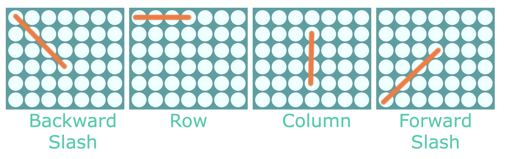
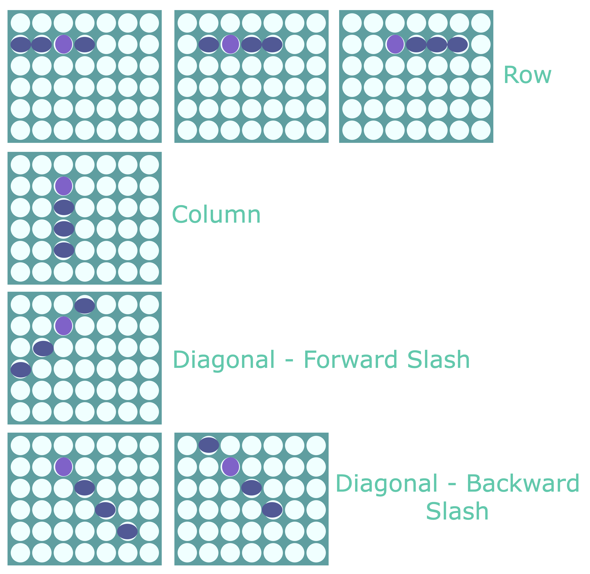
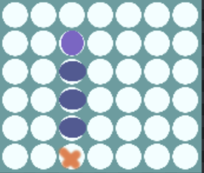
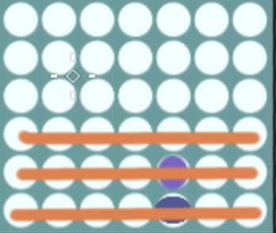

In this series, we will go over how to create a reusable TypeScript class that can be used to build the game Connect Four, and in a future series we will see how we can use this library to create implementations of the Connect Four game for the CLI and the web.

Previously, in [part 3](/post/2023/01/build-a-connect-four-library-in-typescript-part-3/), we added the logic for allowing the player to place a game piece in a column, logic for validating this move, and we started adding the logic for if the game is over.

In this part of the series, we are going to work on adding in the logic for checking if a player has won by getting a Connect Four.

## Series Code

You can find the code for the end of part 3 here: [Blog Post 2 Code](https://github.com/devshareacademy/connect-four/tree/blog-post-3)

You can find the completed source code for this article here on GitHub: [Blog Post 3 Code](https://github.com/devshareacademy/connect-four/tree/blog-post-4)

Lastly, if you would just like to use a NPM package for this library, you can find that here: [NPM - @devshareacademy/connect-four](https://www.npmjs.com/package/@devshareacademy/connect-four).

## Checking If A Player Won

In order to know if a player has won the game after playing their last game piece, we will need to check for one of the four possible win conditions for Connect Four:

* Getting four consecutive game pieces in a single row
* Getting four consecutive game pieces in a single column
* Getting four consecutive game pieces diagonally, in a forward slash
* Getting four consecutive game pieces diagonally, in a backward slash



For each of these win conditions, when a game piece is placed, we will need to check for the possible win segments that correspond to that game piece. For example, if we place a game piece in the 3rd column and the game piece landed in the 2nd from the top row, we would need to check the following combinations for a possible win:



For now, we won't go into detail on how we will perform each of these checks, but instead we will create placeholder private methods in our `ConnectFour` class, and we will cover each of these checks shortly. To do this, add the following code to `src/connect-four.ts` file:

```typescript
/**
 * Checks to see if the last played game piece resulted in four in a row in the provided row.
 * Checks the possible winning combinations for the given row based on where the game piece was played.
 *
 * Example:
 * If the piece was played in column 2, we would need to check the following combinations for a win
 * since column 2 is included in these combinations for a row.
 *  - [0,1,2,3]
 *  - [1,2,3,4]
 *  - [2,3,4,5]
 */
#isHorizontalWin(lastPiecePlayedRow: number, minCol: number, maxCol: number): boolean {
  return false;
}

/**
 * Checks to see if the last played game piece resulted in four in a row in the provided column.
 * When we check for a win in column, we only need to check the current cell and the three cells
 * below that one since there will be no game pieces above the current piece. This means there
 * could only be one possible winning combination for the column.
 *
 * We also only need to check for a win if this is at least the fourth game piece added to this column,
 * since four pieces are required for a win.
 */
#isVerticalWin(row: number, col: number): boolean {
  return false;
}

/**
 * Checks to see if the last played game piece resulted in four in a row in a forward diagonal.
 * Checks the possible winning combinations for the given row and column based on where the game piece was played.
 *
 * Example:
 * If the piece was played in column 3 row 3, we would need to check the following combinations for a win
 * since column 3 row 3 is included in each combination:
 *  - [{col: 1, row: 5}, {col: 2, row: 4}, {col: 3, row: 3}, {col: 4, row: 2}]
 *  - [{col: 2, row: 4}, {col: 3, row: 3}, {col: 4, row: 2}, {col: 5, row: 1}]
 *  - [{col: 3, row: 4}, {col: 4, row: 2}, {col: 5, row: 1}, {col: 6, row: 0}]
 */
#isForwardSlashWin(row: number, col: number, minCol: number, maxRow: number): boolean {
  return false;
}

/**
 * Checks to see if the last played game piece resulted in four in a row in a backward diagonal.
 * Checks the possible winning combinations for the given row and column based on where the game piece was played.
 *
 * Example:
 * If the piece was played in column 3 row 3, we would need to check the following combinations for a win
 * since column 3 row 3 is included in each combination:
 *  - [{col: 5, row: 5}, {col: 4, row: 4}, {col: 3, row: 3}, {col: 2, row: 2}]
 *  - [{col: 4, row: 4}, {col: 3, row: 3}, {col: 2, row: 2}, {col: 1, row: 1}]
 *  - [{col: 3, row: 3}, {col: 2, row: 2}, {col: 1, row: 1}, {col: 0, row: 0}]
 */
#isBackwardSlashWin(row: number, col: number, maxCol: number, maxRow: number): boolean {
  return false;
}
```

In the code above, we created four new `private` methods on our `ConnectFour` class and we added some comments on what each of these four methods should be doing:

* `#isBackwardSlashWin`
* `#isForwardSlashWin`
* `#isVerticalWin`
* `#isHorizontalWin`

In each of these new methods, we are just returning `false` for the time being.

Now that we have the four methods that we will need for checking if a player has won the game, we will need to call these methods in our existing `#checkForGameEnd` method. In the `#checkForGameEnd` method, replace the following line of code:

```typescript
const didPlayerWin = false;
```

with the following code:

```typescript
const didPlayerWin =
  this.#isHorizontalWin(row, 0, 0) ||
  this.#isVerticalWin(row, col) ||
  this.#isForwardSlashWin(row, col, 0, 0) ||
  this.#isBackwardSlashWin(row, col, 0, 0);
```

In the code above, we just updated the `didPlayerWin` variable value to no longer be hard coded to `false` and instead make this value be `true` if any of the new private methods return `true`. For the time being, we had called each of these methods with the `row` and `col` values of where the game piece was placed, and we passed `0` for the remaining arguments.

Next, we will start to add the logic for each of these possible win conditions.

## Checking For A Vertical Win

To check for a win in a column, we just need to take the location of where the last game piece was played and validate that the 3 game pieces below that one match the one that was played. The reason we only need to check this one combination is due to how the game of Connect Four is played, since when a game piece is dropped into a column, we know that the row the game piece lands in is the highest row in that column at that time.



Also, since we know that we require at least four game pieces in one column, if the game piece lands in one of the bottom 3 rows, we automatically know that the player did not get a vertical win from the last game piece that was played.



To perform this check, replace all of the code in the `#isVerticalWin` method with the following code:

```typescript
if (row > 2) return false;
const cells = [
  this.#board[row][col],
  this.#board[row + 1][col],
  this.#board[row + 2][col],
  this.#board[row + 3][col],
];
const isWin = this.#doAllCellsMatch(cells, this.#board[row][col]);
return isWin;
```

In the code above, we did the following:

* We added the check to make sure the game piece is in the top 3 rows of the game board, and if not we return `false` since it is not possible to have four game pieces in that column.
* We then grabbed a reference to the value of the last game piece that was played, and a reference to the 3 game pieces below that game piece and we passed those values to a new private method called `#doAllCellsMatch`, which will just validate that all of the provided game piece values match the game piece that was played.
* We then returned the `true` or `false` depending on the result of the new `#doAllCellsMatch` method.

Now, lets create the new `#doAllCellsMatch` private method. In the `src/connect-four.ts` file, add the following code to our `ConnectFour` class:

```typescript
/**
 * Checks to see if all cells in the provided array match the provided value. If so,
 * update the internal game state to have the appropriate winner value.
 */
#doAllCellsMatch(cells: number[], value: number): boolean {
  const isWin = cells.every((cell) => {
    return cell === value && cell !== 0;
  });
  if (isWin) {
    if (value === 1) {
      this.#gameWinner = Player.ONE;
    } else {
      this.#gameWinner = Player.TWO;
    }
    return true;
  }
  return false;
}
```

In the code above, we are simply checking if all of the provided game piece values are the same, and if they match the value of the game piece that was last played. If they all match, then we update the winner of the game by setting the `#gameWinner` property on our class.

### Adding Vertical Win Tests

## Checking For A Horizontal Win

## Checking For A Diagonal Forward Slash Win

## Checking For A Diagonal Backward Slash Win

## Returning The Winning Cells

## Code Cleanup

Move the types into a new file...
