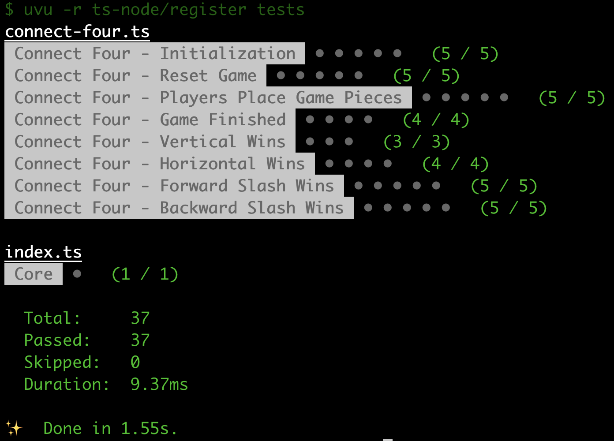

In this series, we will go over how to create a reusable TypeScript class that can be used to build the game Connect Four, and in a future series we will see how we can use this library to create implementations of the Connect Four game for the CLI and the web.

Previously, in [part 4](/post/2023/02/build-a-connect-four-library-in-typescript-part-4/), we finished updating the logic for checking if a player won the game by getting a Connect Four.

In this part of the series, we are going to work on updating our game logic to return the winning game cells, and we will do some code refactoring by moving our type definitions to a new file.

## Series Links

You can find links to all of the posts in this series here:

* [Part 1](/post/2023/01/build-a-connect-four-library-in-typescript-part-1/)
* [Part 2](/post/2023/01/build-a-connect-four-library-in-typescript-part-2/)
* [Part 3](/post/2023/01/build-a-connect-four-library-in-typescript-part-3/)
* [Part 4](/post/2023/02/build-a-connect-four-library-in-typescript-part-4/)
* [Part 5](/post/2023/02/build-a-connect-four-library-in-typescript-part-5/)

## Series Code

You can find the code for the end of part 4 here: [Blog Post 4 Code](https://github.com/devshareacademy/connect-four/tree/blog-post-4)

You can find the completed source code for this article here on GitHub: [Blog Post 5 Code](https://github.com/devshareacademy/connect-four/tree/blog-post-5)

Lastly, if you would just like to use a NPM package for this library, you can find that here: [NPM - @devshareacademy/connect-four](https://www.npmjs.com/package/@devshareacademy/connect-four).

## Code Refactoring

Before we start adding any more logic to our class, we are going to do some small refactoring to help keep our project a little more organized. As our project gets a bigger, its important to make sure we are not putting too much code in one file. So, we are going to take all of our `types` in our `src/connect-four.ts` file and move these definitions to a new file.

To do this, create a new folder called `types` under the `src` folder, and in this folder create a new file called `index.ts`. In the new file, `src/types/index.ts`, add the following code:

```typescript
/* Represents the two player identifiers for the Connect Four game. */
export enum Player {
  ONE = 'ONE',
  TWO = 'TWO',
}

/* Represents the possible values of a cell in the Connect Four board. */
export type CellRange =
  | 0 // empty cell
  | 1 // player one game piece
  | 2; // player two game piece

export enum ConnectFourError {
  INVALID_MOVE = 'Column is already filled, please provide a different column.',
  INVALID_COLUMN = 'Invalid column specified. Please provide a valid column number.',
  INVALID_MOVE_GAME_IS_OVER = 'Game has already ended, please reset the game.',
}

export type Coordinate = {
  col: number;
  row: number;
};
```

Then, back in the `src/connect-four.ts` file, go ahead and remove all of that code from the file. Next, we will need to fix the references to these `types` by adding a new `import` statement to the top of our `src/connect-four.ts` file:

```typescript
import { ConnectFourError, Player, CellRange, Coordinate } from './types';
```

Finally, before we can test our change, we will need to update our `import` statement in our `tests/connect-four.ts` file. Replace the following line:

```typescript
import { CellRange, Coordinate, Player } from '../src/connect-four';
```

with the following line:

```typescript
import { CellRange, Coordinate, Player } from '../src/types';
```

Now, if you go ahead and run the tests, we should see that everything is still passing!

You can run the tests by running one of the following commands:

```bash
# NPM Package Manager
npm run test

# Yarn Package Manager
yarn test
```

## Returning The Winning Cells

Now that we have moved our type definitions to a new file, we are going to update our Connect Four class to have a new property that will be used for tracking the winning coordinates that make up a Connect Four on our game board. By adding this new property, anyone that uses our library will be able to do things like show which game pieces where used in a winning Connect Four combination.

To add this functionality, we will need to add a new private property to our class called `#winningCells`. To do this, add the following code near the top of our `ConnectFour` class in the `src/connect-four.ts` file:

```typescript
/* used for tracking what cells make up a winning Connect Four combination */
#winningCells: Coordinate[] = [];
```

Since this is a private property, we will need to create a new `getter` that can be used to get this value. To do this, add the following code to the `ConnectFour` class:

```typescript
get winningCells(): Coordinate[] {
  return JSON.parse(JSON.stringify(this.#winningCells)) as Coordinate[];
}
```

Lastly, we will need to update all of our existing methods for checking for a player won the game to set this new property. In the `#isHorizontalWin` method of our class, replace the following code:

```typescript
if (isWin) {
  return true;
}
```

with the following code:

```typescript
if (isWin) {
  this.#winningCells = [
    { col, row },
    { col: col + 1, row },
    { col: col + 2, row },
    { col: col + 3, row },
  ];
  return true;
}
```

In the code above, we are just setting the value of the `#winningCells` property to be an array of objects that contain the column and row values of the cells that we checked in the `#isHorizontalWin` method.

Next, in the `#isVerticalWin` method, add the following code above the `return` statement:

```typescript
if (isWin) {
  this.#winningCells = [
    { col, row },
    { col, row + 1 },
    { col, row + 2 },
    { col, row + 3 },
  ];
  return true;
}
```

Then, in the `#isForwardSlashWin` method, replace the following code:

```typescript
if (isWin) {
  return true;
}
```

with the following code:

```typescript
if (isWin) {
  this.#winningCells = [
    { col: tempCol, row: tempRow },
    { col: tempCol + 1, row: tempRow - 1 },
    { col: tempCol + 2, row: tempRow - 2 },
    { col: tempCol + 3, row: tempRow - 3 },
  ];
  return true;
}
```

Next, in the `#isBackwardSlashWin` method, replace the following code:

```typescript
if (isWin) {
  return true;
}
```

with the following code:

```typescript
if (isWin) {
  this.#winningCells = [
    { col: tempCol, row: tempRow },
    { col: tempCol - 1, row: tempRow - 1 },
    { col: tempCol - 2, row: tempRow - 2 },
    { col: tempCol - 3, row: tempRow - 3 },
  ];
  return true;
}
```

With all of the methods tied to winning combinations, the last thing we need to do is make sure we reset the value of the `#winningCells` property when the user resets the game game state. To do this, we just need to add the following line of code to the `#initializeGame` method in our `ConnectFour` class:

```typescript
this.#winningCells = [];
```

## Updating Tests

With that last change in place, the last thing we need to do is add tests to validate our addition of the winning cells logic. To do this, we will update our existing tests to validate that we have the correct values for the `#winningCells` property, and we will add a few new tests to validate this property when the game instance is created and when the game state is reset.

To do this, replace all of the code in the `tests/connect-four.ts` file with the following code:



```typescript
import * as uvu from 'uvu';
import * as assert from 'uvu/assert';

import ConnectFour from '../src/connect-four';
import { Player, Coordinate, CellRange } from '../src/types';

type Data = {
  moves: number[];
  boardState: CellRange[][];
  winner: Player;
  winningCells: Coordinate[];
};

let connectFour: ConnectFour;

/* Connect Four - Game Initialization Tests */
function setupInitializationTests(): void {
  const connectFourInitializationSuite = uvu.suite('Connect Four - Initialization');

  connectFourInitializationSuite.before.each(() => {
    connectFour = new ConnectFour();
  });

  connectFourInitializationSuite('should initialize the game state with an empty board', () => {
    // check that the board is initialized with empty values
    const isBoardEmpty = connectFour.board.every((row) => row.every((cell) => cell === 0));
    assert.equal(isBoardEmpty, true);
  });

  connectFourInitializationSuite('should initialize the game with no winner', () => {
    const winner = connectFour.gameWinner;
    assert.type(winner, 'undefined');
    assert.equal(winner, undefined);
  });

  connectFourInitializationSuite('should initialize the game and the game should not be over', () => {
    const isGameOver = connectFour.isGameOver;
    assert.type(isGameOver, 'boolean');
    assert.equal(isGameOver, false);
  });

  connectFourInitializationSuite('should initialize the game and wait for the first players input', () => {
    const currentPlayersTurn = connectFour.playersTurn;
    assert.type(currentPlayersTurn, 'string');
    assert.equal(currentPlayersTurn, Player.ONE);
  });

  connectFourInitializationSuite('should initialize the game and there should be no winning cell combinations', () => {
    const winningCells = connectFour.winningCells;
    assert.type(winningCells, 'object');
    assert.equal(winningCells, []);
  });

  connectFourInitializationSuite.run();
}

/* Connect Four - Reset Game Tests */
function setupResetGameTests(): void {
  const connectFourResetGameSuite = uvu.suite('Connect Four - Reset Game');

  connectFourResetGameSuite.before.each(() => {
    connectFour = new ConnectFour();
    connectFour.makeMove(0);
    connectFour.resetGame();
  });

  connectFourResetGameSuite('should reset the game state with an empty board', () => {
    // check that the board is initialized with empty values
    const isBoardEmpty = connectFour.board.every((row) => row.every((cell) => cell === 0));
    assert.equal(isBoardEmpty, true);
  });

  connectFourResetGameSuite('should reset the game state with no winner', () => {
    const winner = connectFour.gameWinner;
    assert.type(winner, 'undefined');
    assert.equal(winner, undefined);
  });

  connectFourResetGameSuite('should reset the game state and the game should not be over', () => {
    const isGameOver = connectFour.isGameOver;
    assert.type(isGameOver, 'boolean');
    assert.equal(isGameOver, false);
  });

  connectFourResetGameSuite('should reset the game state and wait for the first players input', () => {
    const currentPlayersTurn = connectFour.playersTurn;
    assert.type(currentPlayersTurn, 'string');
    assert.equal(currentPlayersTurn, Player.ONE);
  });

  connectFourResetGameSuite('should reset the game state and there should be no winning cell combinations', () => {
    const winningCells = connectFour.winningCells;
    assert.type(winningCells, 'object');
    assert.equal(winningCells, []);
  });

  connectFourResetGameSuite.run();
}

/* Connect Four - Players Place Game Pieces Tests */
function setupPlaceGamePieceTests(): void {
  const connectFourPlayersInputSuite = uvu.suite('Connect Four - Players Place Game Pieces');

  connectFourPlayersInputSuite.before.each(() => {
    connectFour = new ConnectFour();
  });

  connectFourPlayersInputSuite('should return the coordinate of the cell where the game piece was placed', () => {
    const makeMoveResponse = connectFour.makeMove(4);
    assert.equal(makeMoveResponse, {
      col: 4,
      row: 5,
    });
  });

  connectFourPlayersInputSuite('should allow first player to place a game piece and update the game state', () => {
    connectFour.makeMove(0);

    const currentPlayersTurn = connectFour.playersTurn;
    assert.type(currentPlayersTurn, 'string');
    assert.equal(currentPlayersTurn, Player.TWO);

    const isGameOver = connectFour.isGameOver;
    assert.type(isGameOver, 'boolean');
    assert.equal(isGameOver, false);

    const winner = connectFour.gameWinner;
    assert.type(winner, 'undefined');
    assert.equal(winner, undefined);

    const winningCells = connectFour.winningCells;
    assert.type(winningCells, 'object');
    assert.equal(winningCells, []);

    const boardState = [
      [0, 0, 0, 0, 0, 0, 0],
      [0, 0, 0, 0, 0, 0, 0],
      [0, 0, 0, 0, 0, 0, 0],
      [0, 0, 0, 0, 0, 0, 0],
      [0, 0, 0, 0, 0, 0, 0],
      [1, 0, 0, 0, 0, 0, 0],
    ];
    assert.equal(boardState, connectFour.board);
  });

  connectFourPlayersInputSuite('should allow second player to place a game piece and update the game state', () => {
    connectFour.makeMove(0);
    connectFour.makeMove(0);

    const currentPlayersTurn = connectFour.playersTurn;
    assert.type(currentPlayersTurn, 'string');
    assert.equal(currentPlayersTurn, Player.ONE);

    const isGameOver = connectFour.isGameOver;
    assert.type(isGameOver, 'boolean');
    assert.equal(isGameOver, false);

    const winner = connectFour.gameWinner;
    assert.type(winner, 'undefined');
    assert.equal(winner, undefined);

    const winningCells = connectFour.winningCells;
    assert.type(winningCells, 'object');
    assert.equal(winningCells, []);

    const boardState = [
      [0, 0, 0, 0, 0, 0, 0],
      [0, 0, 0, 0, 0, 0, 0],
      [0, 0, 0, 0, 0, 0, 0],
      [0, 0, 0, 0, 0, 0, 0],
      [2, 0, 0, 0, 0, 0, 0],
      [1, 0, 0, 0, 0, 0, 0],
    ];
    assert.equal(boardState, connectFour.board);
  });

  connectFourPlayersInputSuite(
    'should throw an error if an invalid column is provided and not modify the game state',
    () => {
      assert.throws(() => connectFour.makeMove(-1), /Invalid column specified/);

      const currentPlayersTurn = connectFour.playersTurn;
      assert.type(currentPlayersTurn, 'string');
      assert.equal(currentPlayersTurn, Player.ONE);

      const isGameOver = connectFour.isGameOver;
      assert.type(isGameOver, 'boolean');
      assert.equal(isGameOver, false);

      const winner = connectFour.gameWinner;
      assert.type(winner, 'undefined');
      assert.equal(winner, undefined);

      const winningCells = connectFour.winningCells;
      assert.type(winningCells, 'object');
      assert.equal(winningCells, []);

      const boardState = [
        [0, 0, 0, 0, 0, 0, 0],
        [0, 0, 0, 0, 0, 0, 0],
        [0, 0, 0, 0, 0, 0, 0],
        [0, 0, 0, 0, 0, 0, 0],
        [0, 0, 0, 0, 0, 0, 0],
        [0, 0, 0, 0, 0, 0, 0],
      ];
      assert.equal(boardState, connectFour.board);
    },
  );

  connectFourPlayersInputSuite(
    'should throw an error if a column is already filled and not modify the game state',
    () => {
      connectFour.makeMove(0);
      connectFour.makeMove(0);
      connectFour.makeMove(0);
      connectFour.makeMove(0);
      connectFour.makeMove(0);
      connectFour.makeMove(0);

      assert.throws(() => connectFour.makeMove(0), /Column is already filled/);

      const currentPlayersTurn = connectFour.playersTurn;
      assert.type(currentPlayersTurn, 'string');
      assert.equal(currentPlayersTurn, Player.ONE);

      const isGameOver = connectFour.isGameOver;
      assert.type(isGameOver, 'boolean');
      assert.equal(isGameOver, false);

      const winner = connectFour.gameWinner;
      assert.type(winner, 'undefined');
      assert.equal(winner, undefined);

      const winningCells = connectFour.winningCells;
      assert.type(winningCells, 'object');
      assert.equal(winningCells, []);

      const boardState = [
        [2, 0, 0, 0, 0, 0, 0],
        [1, 0, 0, 0, 0, 0, 0],
        [2, 0, 0, 0, 0, 0, 0],
        [1, 0, 0, 0, 0, 0, 0],
        [2, 0, 0, 0, 0, 0, 0],
        [1, 0, 0, 0, 0, 0, 0],
      ];
      assert.equal(boardState, connectFour.board);
    },
  );

  connectFourPlayersInputSuite.run();
}

/* Connect Four - Game Finished Tests */
function setupGameOverTests(): void {
  const connectFourGameFinishedSuite = uvu.suite('Connect Four - Game Finished');

  connectFourGameFinishedSuite.before.each(() => {
    connectFour = new ConnectFour();
  });

  connectFourGameFinishedSuite(
    'should allow player one to win if valid moves are made by both players and player one provides a winning combination',
    () => {
      /*
        # # # # # # #
        # # # # # # #
        # # R # # # #
        # B R # # # #
        # B R # # # #
        # B R # # # #
      */
      const data: Data = {
        moves: [2, 1, 2, 1, 2, 1, 2],
        boardState: [
          [0, 0, 0, 0, 0, 0, 0],
          [0, 0, 0, 0, 0, 0, 0],
          [0, 0, 1, 0, 0, 0, 0],
          [0, 2, 1, 0, 0, 0, 0],
          [0, 2, 1, 0, 0, 0, 0],
          [0, 2, 1, 0, 0, 0, 0],
        ],
        winner: Player.ONE,
        winningCells: [
          { col: 2, row: 2 },
          { col: 2, row: 3 },
          { col: 2, row: 4 },
          { col: 2, row: 5 },
        ],
      };

      data.moves.forEach((move) => {
        connectFour.makeMove(move);
      });

      const isGameOver = connectFour.isGameOver;
      assert.type(isGameOver, 'boolean');
      assert.equal(isGameOver, true);

      const winner = connectFour.gameWinner;
      assert.type(winner, 'string');
      assert.equal(winner, data.winner);

      assert.equal(data.boardState, connectFour.board);

      const winningCells = connectFour.winningCells;
      assert.type(winningCells, 'object');
      assert.equal(winningCells, data.winningCells);
    },
  );

  connectFourGameFinishedSuite(
    'should allow player two to win if valid moves are made by both players and player two provides a winning combination',
    () => {
      /*
        # # # # # # #
        # # # # # # #
        # B # # # # #
        # B R # # # #
        # B R # # # #
        # B R R # # #
      */
      const data: Data = {
        moves: [2, 1, 2, 1, 2, 1, 3, 1],
        boardState: [
          [0, 0, 0, 0, 0, 0, 0],
          [0, 0, 0, 0, 0, 0, 0],
          [0, 2, 0, 0, 0, 0, 0],
          [0, 2, 1, 0, 0, 0, 0],
          [0, 2, 1, 0, 0, 0, 0],
          [0, 2, 1, 1, 0, 0, 0],
        ],
        winner: Player.TWO,
        winningCells: [
          { col: 1, row: 2 },
          { col: 1, row: 3 },
          { col: 1, row: 4 },
          { col: 1, row: 5 },
        ],
      };

      data.moves.forEach((move) => {
        connectFour.makeMove(move);
      });

      const isGameOver = connectFour.isGameOver;
      assert.type(isGameOver, 'boolean');
      assert.equal(isGameOver, true);

      const winner = connectFour.gameWinner;
      assert.type(winner, 'string');
      assert.equal(winner, data.winner);

      assert.equal(data.boardState, connectFour.board);

      const winningCells = connectFour.winningCells;
      assert.type(winningCells, 'object');
      assert.equal(winningCells, data.winningCells);
    },
  );

  connectFourGameFinishedSuite(
    'should end in a draw if the board is filled and no player provides a winning combination',
    () => {
      // fill first and second columns
      connectFour.makeMove(0);
      connectFour.makeMove(1);
      connectFour.makeMove(0);
      connectFour.makeMove(1);
      connectFour.makeMove(0);
      connectFour.makeMove(1);
      connectFour.makeMove(1);
      connectFour.makeMove(0);
      connectFour.makeMove(1);
      connectFour.makeMove(0);
      connectFour.makeMove(1);
      connectFour.makeMove(0);
      // fill third and fourth columns
      connectFour.makeMove(2);
      connectFour.makeMove(3);
      connectFour.makeMove(2);
      connectFour.makeMove(3);
      connectFour.makeMove(2);
      connectFour.makeMove(3);
      connectFour.makeMove(3);
      connectFour.makeMove(2);
      connectFour.makeMove(3);
      connectFour.makeMove(2);
      connectFour.makeMove(3);
      connectFour.makeMove(2);
      // fill fifth and six columns
      connectFour.makeMove(4);
      connectFour.makeMove(5);
      connectFour.makeMove(4);
      connectFour.makeMove(5);
      connectFour.makeMove(4);
      connectFour.makeMove(5);
      connectFour.makeMove(5);
      connectFour.makeMove(4);
      connectFour.makeMove(5);
      connectFour.makeMove(4);
      connectFour.makeMove(5);
      connectFour.makeMove(4);
      // fill the last column
      connectFour.makeMove(6);
      connectFour.makeMove(6);
      connectFour.makeMove(6);
      connectFour.makeMove(6);
      connectFour.makeMove(6);
      connectFour.makeMove(6);

      const isGameOver = connectFour.isGameOver;
      assert.type(isGameOver, 'boolean');
      assert.equal(isGameOver, true);

      const winner = connectFour.gameWinner;
      assert.type(winner, 'undefined');
      assert.equal(winner, undefined);

      const winningCells = connectFour.winningCells;
      assert.type(winningCells, 'object');
      assert.equal(winningCells, []);

      // TODO - validate the board state
    },
  );

  connectFourGameFinishedSuite('should throw an error if the game is over and a player tries to make a move', () => {
    /*
        # # # # # # #
        # # # # # # #
        # # R # # # #
        # B R # # # #
        # B R # # # #
        # B R # # # #
      */
    const data: Data = {
      moves: [2, 1, 2, 1, 2, 1, 2],
      boardState: [
        [0, 0, 0, 0, 0, 0, 0],
        [0, 0, 0, 0, 0, 0, 0],
        [0, 0, 1, 0, 0, 0, 0],
        [0, 2, 1, 0, 0, 0, 0],
        [0, 2, 1, 0, 0, 0, 0],
        [0, 2, 1, 0, 0, 0, 0],
      ],
      winner: Player.ONE,
      winningCells: [
        { col: 2, row: 2 },
        { col: 2, row: 3 },
        { col: 2, row: 4 },
        { col: 2, row: 5 },
      ],
    };

    data.moves.forEach((move) => {
      connectFour.makeMove(move);
    });

    assert.throws(() => connectFour.makeMove(0), /has already ended/);

    const currentPlayersTurn = connectFour.playersTurn;
    assert.type(currentPlayersTurn, 'string');
    assert.equal(currentPlayersTurn, Player.ONE);

    const isGameOver = connectFour.isGameOver;
    assert.type(isGameOver, 'boolean');
    assert.equal(isGameOver, true);

    const winner = connectFour.gameWinner;
    assert.type(winner, 'string');
    assert.equal(winner, data.winner);

    assert.equal(data.boardState, connectFour.board);

    const winningCells = connectFour.winningCells;
    assert.type(winningCells, 'object');
    assert.equal(winningCells, data.winningCells);
  });

  connectFourGameFinishedSuite.run();
}

/* Connect Four - Vertical Wins */
function setupVerticalWinTests(): void {
  const connectFourGameVerticalWinsSuite = uvu.suite('Connect Four - Vertical Wins');

  connectFourGameVerticalWinsSuite.before.each(() => {
    connectFour = new ConnectFour();
  });

  connectFourGameVerticalWinsSuite(
    'should allow player to win if last piece in a column forms four in a column',
    () => {
      /*
        B # # # # # #
        B # # # # # #
        B # # # # # #
        B R # # # # #
        R B R # # # #
        R B R R # # #
      */
      const data: Data = {
        moves: [0, 1, 0, 1, 1, 0, 2, 0, 2, 0, 3, 0],
        boardState: [
          [2, 0, 0, 0, 0, 0, 0],
          [2, 0, 0, 0, 0, 0, 0],
          [2, 0, 0, 0, 0, 0, 0],
          [2, 1, 0, 0, 0, 0, 0],
          [1, 2, 1, 0, 0, 0, 0],
          [1, 2, 1, 1, 0, 0, 0],
        ],
        winner: Player.TWO,
        winningCells: [
          { col: 0, row: 0 },
          { col: 0, row: 1 },
          { col: 0, row: 2 },
          { col: 0, row: 3 },
        ],
      };

      data.moves.forEach((move) => {
        connectFour.makeMove(move);
      });

      const isGameOver = connectFour.isGameOver;
      assert.type(isGameOver, 'boolean');
      assert.equal(isGameOver, true);

      const winner = connectFour.gameWinner;
      assert.type(winner, 'string');
      assert.equal(winner, data.winner);

      assert.equal(data.boardState, connectFour.board);

      const winningCells = connectFour.winningCells;
      assert.type(winningCells, 'object');
      assert.equal(winningCells, data.winningCells);
    },
  );

  connectFourGameVerticalWinsSuite(
    'should allow player to win if second to last piece in a column forms four in a column',
    () => {
      /*
        # # # # # # #
        B # # # # # #
        B R # # # # #
        B R # # # # #
        B R # # # # #
        R B R # # # #
      */
      const data: Data = {
        moves: [0, 1, 2, 0, 1, 0, 1, 0, 1, 0],
        boardState: [
          [0, 0, 0, 0, 0, 0, 0],
          [2, 0, 0, 0, 0, 0, 0],
          [2, 1, 0, 0, 0, 0, 0],
          [2, 1, 0, 0, 0, 0, 0],
          [2, 1, 0, 0, 0, 0, 0],
          [1, 2, 1, 0, 0, 0, 0],
        ],
        winner: Player.TWO,
        winningCells: [
          { col: 0, row: 1 },
          { col: 0, row: 2 },
          { col: 0, row: 3 },
          { col: 0, row: 4 },
        ],
      };

      data.moves.forEach((move) => {
        connectFour.makeMove(move);
      });

      const isGameOver = connectFour.isGameOver;
      assert.type(isGameOver, 'boolean');
      assert.equal(isGameOver, true);

      const winner = connectFour.gameWinner;
      assert.type(winner, 'string');
      assert.equal(winner, data.winner);

      assert.equal(data.boardState, connectFour.board);

      const winningCells = connectFour.winningCells;
      assert.type(winningCells, 'object');
      assert.equal(winningCells, data.winningCells);
    },
  );

  connectFourGameVerticalWinsSuite(
    'should allow player to win if third to last piece in a column forms four in a column',
    () => {
      /*
        # # # # # # #
        # # # # # # #
        R # # # # # #
        R B # # # # #
        R B # # # # #
        R B # # # # #
      */
      const data: Data = {
        moves: [0, 1, 0, 1, 0, 1, 0],
        boardState: [
          [0, 0, 0, 0, 0, 0, 0],
          [0, 0, 0, 0, 0, 0, 0],
          [1, 0, 0, 0, 0, 0, 0],
          [1, 2, 0, 0, 0, 0, 0],
          [1, 2, 0, 0, 0, 0, 0],
          [1, 2, 0, 0, 0, 0, 0],
        ],
        winner: Player.ONE,
        winningCells: [
          { col: 0, row: 2 },
          { col: 0, row: 3 },
          { col: 0, row: 4 },
          { col: 0, row: 5 },
        ],
      };

      data.moves.forEach((move) => {
        connectFour.makeMove(move);
      });

      const isGameOver = connectFour.isGameOver;
      assert.type(isGameOver, 'boolean');
      assert.equal(isGameOver, true);

      const winner = connectFour.gameWinner;
      assert.type(winner, 'string');
      assert.equal(winner, data.winner);

      assert.equal(data.boardState, connectFour.board);

      const winningCells = connectFour.winningCells;
      assert.type(winningCells, 'object');
      assert.equal(winningCells, data.winningCells);
    },
  );

  connectFourGameVerticalWinsSuite.run();
}

/* Connect Four - Horizontal Wins */
function setupHorizontalWinTests(): void {
  const connectFourGameHorizontalWinsSuite = uvu.suite('Connect Four - Horizontal Wins');

  connectFourGameHorizontalWinsSuite.before.each(() => {
    connectFour = new ConnectFour();
  });

  connectFourGameHorizontalWinsSuite('should allow player to win if last piece in a row forms four in a row', () => {
    /*
      # # # # # # #
      # # # # # # #
      # # # # # # #
      # # # # # # #
      B B B # # # #
      R R R R # # #
    */
    const data: Data = {
      moves: [0, 0, 1, 1, 2, 2, 3],
      boardState: [
        [0, 0, 0, 0, 0, 0, 0],
        [0, 0, 0, 0, 0, 0, 0],
        [0, 0, 0, 0, 0, 0, 0],
        [0, 0, 0, 0, 0, 0, 0],
        [2, 2, 2, 0, 0, 0, 0],
        [1, 1, 1, 1, 0, 0, 0],
      ],
      winner: Player.ONE,
      winningCells: [
        { col: 0, row: 5 },
        { col: 1, row: 5 },
        { col: 2, row: 5 },
        { col: 3, row: 5 },
      ],
    };

    data.moves.forEach((move) => {
      connectFour.makeMove(move);
    });

    const isGameOver = connectFour.isGameOver;
    assert.type(isGameOver, 'boolean');
    assert.equal(isGameOver, true);

    const winner = connectFour.gameWinner;
    assert.type(winner, 'string');
    assert.equal(winner, data.winner);

    assert.equal(data.boardState, connectFour.board);

    const winningCells = connectFour.winningCells;
    assert.type(winningCells, 'object');
    assert.equal(winningCells, data.winningCells);
  });

  connectFourGameHorizontalWinsSuite(
    'should allow player to win if last piece in the middle of a row forms four in a row',
    () => {
      /*
        # # # # # # #
        # # # # # # #
        # # # # # # #
        # # # # # # #
        B # B B # # #
        R R R R # # #
      */
      const data: Data = {
        moves: [0, 0, 2, 2, 3, 3, 1],
        boardState: [
          [0, 0, 0, 0, 0, 0, 0],
          [0, 0, 0, 0, 0, 0, 0],
          [0, 0, 0, 0, 0, 0, 0],
          [0, 0, 0, 0, 0, 0, 0],
          [2, 0, 2, 2, 0, 0, 0],
          [1, 1, 1, 1, 0, 0, 0],
        ],
        winner: Player.ONE,
        winningCells: [
          { col: 0, row: 5 },
          { col: 1, row: 5 },
          { col: 2, row: 5 },
          { col: 3, row: 5 },
        ],
      };

      data.moves.forEach((move) => {
        connectFour.makeMove(move);
      });

      const isGameOver = connectFour.isGameOver;
      assert.type(isGameOver, 'boolean');
      assert.equal(isGameOver, true);

      const winner = connectFour.gameWinner;
      assert.type(winner, 'string');
      assert.equal(winner, data.winner);

      assert.equal(data.boardState, connectFour.board);

      const winningCells = connectFour.winningCells;
      assert.type(winningCells, 'object');
      assert.equal(winningCells, data.winningCells);
    },
  );

  connectFourGameHorizontalWinsSuite(
    'should allow player to win if last piece placed at the end of a row forms four in a row',
    () => {
      /*
        # # # # # # #
        # # # # # # #
        # # # # # # #
        # # # # # # #
        # # # B B # B
        # # # R R R R
      */
      const data: Data = {
        moves: [6, 6, 4, 4, 3, 3, 5],
        boardState: [
          [0, 0, 0, 0, 0, 0, 0],
          [0, 0, 0, 0, 0, 0, 0],
          [0, 0, 0, 0, 0, 0, 0],
          [0, 0, 0, 0, 0, 0, 0],
          [0, 0, 0, 2, 2, 0, 2],
          [0, 0, 0, 1, 1, 1, 1],
        ],
        winner: Player.ONE,
        winningCells: [
          { col: 3, row: 5 },
          { col: 4, row: 5 },
          { col: 5, row: 5 },
          { col: 6, row: 5 },
        ],
      };

      data.moves.forEach((move) => {
        connectFour.makeMove(move);
      });

      const isGameOver = connectFour.isGameOver;
      assert.type(isGameOver, 'boolean');
      assert.equal(isGameOver, true);

      const winner = connectFour.gameWinner;
      assert.type(winner, 'string');
      assert.equal(winner, data.winner);

      assert.equal(data.boardState, connectFour.board);

      const winningCells = connectFour.winningCells;
      assert.type(winningCells, 'object');
      assert.equal(winningCells, data.winningCells);
    },
  );

  connectFourGameHorizontalWinsSuite(
    'should allow player to win if all pieces are placed in the middle of a row',
    () => {
      /*
        # # # # # # #
        # # # # # # #
        # # # # # # #
        # # # # # # #
        # # B # B B #
        # # R R R R #
      */
      const data: Data = {
        moves: [2, 2, 4, 4, 5, 5, 3],
        boardState: [
          [0, 0, 0, 0, 0, 0, 0],
          [0, 0, 0, 0, 0, 0, 0],
          [0, 0, 0, 0, 0, 0, 0],
          [0, 0, 0, 0, 0, 0, 0],
          [0, 0, 2, 0, 2, 2, 0],
          [0, 0, 1, 1, 1, 1, 0],
        ],
        winner: Player.ONE,
        winningCells: [
          { col: 2, row: 5 },
          { col: 3, row: 5 },
          { col: 4, row: 5 },
          { col: 5, row: 5 },
        ],
      };
      data.moves.forEach((move) => {
        connectFour.makeMove(move);
      });

      const isGameOver = connectFour.isGameOver;
      assert.type(isGameOver, 'boolean');
      assert.equal(isGameOver, true);

      const winner = connectFour.gameWinner;
      assert.type(winner, 'string');
      assert.equal(winner, data.winner);

      assert.equal(data.boardState, connectFour.board);

      const winningCells = connectFour.winningCells;
      assert.type(winningCells, 'object');
      assert.equal(winningCells, data.winningCells);
    },
  );

  connectFourGameHorizontalWinsSuite.run();
}

/* Connect Four - Forward Slash Wins */
function setupForwardSlashWinTests(): void {
  const connectFourGameForwardSlashWinSuite = uvu.suite('Connect Four - Forward Slash Wins');

  connectFourGameForwardSlashWinSuite.before.each(() => {
    connectFour = new ConnectFour();
  });

  connectFourGameForwardSlashWinSuite(
    'should allow player to win with a forward slash in the bottom left corner',
    () => {
      /*
        # # # # # # #
        # # # # # # #
        # # # 1 # # #
        # # 1 2 # # #
        # 1 2 1 # # #
        1 2 1 2 # # #
      */
      const data: Data = {
        moves: [0, 1, 2, 3, 1, 2, 3, 3, 2, 4, 3],
        boardState: [
          [0, 0, 0, 0, 0, 0, 0],
          [0, 0, 0, 0, 0, 0, 0],
          [0, 0, 0, 1, 0, 0, 0],
          [0, 0, 1, 2, 0, 0, 0],
          [0, 1, 2, 1, 0, 0, 0],
          [1, 2, 1, 2, 2, 0, 0],
        ],
        winner: Player.ONE,
        winningCells: [
          { col: 0, row: 5 },
          { col: 1, row: 4 },
          { col: 2, row: 3 },
          { col: 3, row: 2 },
        ],
      };

      data.moves.forEach((move) => {
        connectFour.makeMove(move);
      });

      const isGameOver = connectFour.isGameOver;
      assert.type(isGameOver, 'boolean');
      assert.equal(isGameOver, true);

      const winner = connectFour.gameWinner;
      assert.type(winner, 'string');
      assert.equal(winner, data.winner);

      assert.equal(data.boardState, connectFour.board);

      const winningCells = connectFour.winningCells;
      assert.type(winningCells, 'object');
      assert.equal(winningCells, data.winningCells);
    },
  );

  connectFourGameForwardSlashWinSuite(
    'should allow player to win with a forward slash in the bottom right corner',
    () => {
      /*
        # # # # # # #
        # # # # # # #
        # # # # # # 1
        # # # # # 1 2
        # # # # 1 1 1
        # # 2 1 2 2 2
      */
      const data: Data = {
        moves: [3, 4, 4, 5, 5, 6, 6, 2, 5, 6, 6],
        boardState: [
          [0, 0, 0, 0, 0, 0, 0],
          [0, 0, 0, 0, 0, 0, 0],
          [0, 0, 0, 0, 0, 0, 1],
          [0, 0, 0, 0, 0, 1, 2],
          [0, 0, 0, 0, 1, 1, 1],
          [0, 0, 2, 1, 2, 2, 2],
        ],
        winner: Player.ONE,
        winningCells: [
          { col: 3, row: 5 },
          { col: 4, row: 4 },
          { col: 5, row: 3 },
          { col: 6, row: 2 },
        ],
      };

      data.moves.forEach((move) => {
        connectFour.makeMove(move);
      });

      const isGameOver = connectFour.isGameOver;
      assert.type(isGameOver, 'boolean');
      assert.equal(isGameOver, true);

      const winner = connectFour.gameWinner;
      assert.type(winner, 'string');
      assert.equal(winner, data.winner);

      assert.equal(data.boardState, connectFour.board);

      const winningCells = connectFour.winningCells;
      assert.type(winningCells, 'object');
      assert.equal(winningCells, data.winningCells);
    },
  );

  connectFourGameForwardSlashWinSuite('should allow player to win with a forward slash in the middle', () => {
    /*
      # # # 1 # # #
      # # 1 2 # # #
      # 1 2 1 # # #
      1 2 1 2 # # #
      1 2 1 2 # # #
      1 2 1 2 2 # #
    */
    const data: Data = {
      moves: [0, 1, 2, 3, 0, 1, 2, 3, 0, 1, 2, 3, 1, 2, 3, 4, 2, 3, 3],
      boardState: [
        [0, 0, 0, 1, 0, 0, 0],
        [0, 0, 1, 2, 0, 0, 0],
        [0, 1, 2, 1, 0, 0, 0],
        [1, 2, 1, 2, 0, 0, 0],
        [1, 2, 1, 2, 0, 0, 0],
        [1, 2, 1, 2, 2, 0, 0],
      ],
      winner: Player.ONE,
      winningCells: [
        { col: 0, row: 3 },
        { col: 1, row: 2 },
        { col: 2, row: 1 },
        { col: 3, row: 0 },
      ],
    };

    data.moves.forEach((move) => {
      connectFour.makeMove(move);
    });

    const isGameOver = connectFour.isGameOver;
    assert.type(isGameOver, 'boolean');
    assert.equal(isGameOver, true);

    const winner = connectFour.gameWinner;
    assert.type(winner, 'string');
    assert.equal(winner, data.winner);

    assert.equal(data.boardState, connectFour.board);

    const winningCells = connectFour.winningCells;
    assert.type(winningCells, 'object');
    assert.equal(winningCells, data.winningCells);
  });

  connectFourGameForwardSlashWinSuite('should allow player to win with a forward slash in the top right corner', () => {
    /*
      # # # # # # 1
      # # # # # 1 2
      # # # # 1 2 1
      # # # 1 2 1 2
      # # # 1 2 1 2
      # # 2 1 2 1 2
    */
    const data: Data = {
      moves: [3, 4, 5, 6, 3, 4, 5, 6, 3, 4, 5, 6, 4, 5, 6, 2, 5, 6, 6],
      boardState: [
        [0, 0, 0, 0, 0, 0, 1],
        [0, 0, 0, 0, 0, 1, 2],
        [0, 0, 0, 0, 1, 2, 1],
        [0, 0, 0, 1, 2, 1, 2],
        [0, 0, 0, 1, 2, 1, 2],
        [0, 0, 2, 1, 2, 1, 2],
      ],
      winner: Player.ONE,
      winningCells: [
        { col: 3, row: 3 },
        { col: 4, row: 2 },
        { col: 5, row: 1 },
        { col: 6, row: 0 },
      ],
    };

    data.moves.forEach((move) => {
      connectFour.makeMove(move);
    });

    const isGameOver = connectFour.isGameOver;
    assert.type(isGameOver, 'boolean');
    assert.equal(isGameOver, true);

    const winner = connectFour.gameWinner;
    assert.type(winner, 'string');
    assert.equal(winner, data.winner);

    assert.equal(data.boardState, connectFour.board);

    const winningCells = connectFour.winningCells;
    assert.type(winningCells, 'object');
    assert.equal(winningCells, data.winningCells);
  });

  connectFourGameForwardSlashWinSuite(
    'should allow player to win with a forward slash in the middle right side',
    () => {
      /*
        # # # # # # #
        # # # # # # #
        # # # # # # 1
        # # # # # 1 2
        # # # # 1 2 1
        # # 2 1 2 1 2
      */
      const data: Data = {
        moves: [3, 4, 5, 6, 4, 5, 6, 2, 5, 6, 6],
        boardState: [
          [0, 0, 0, 0, 0, 0, 0],
          [0, 0, 0, 0, 0, 0, 0],
          [0, 0, 0, 0, 0, 0, 1],
          [0, 0, 0, 0, 0, 1, 2],
          [0, 0, 0, 0, 1, 2, 1],
          [0, 0, 2, 1, 2, 1, 2],
        ],
        winner: Player.ONE,
        winningCells: [
          { col: 3, row: 5 },
          { col: 4, row: 4 },
          { col: 5, row: 3 },
          { col: 6, row: 2 },
        ],
      };

      data.moves.forEach((move) => {
        connectFour.makeMove(move);
      });

      const isGameOver = connectFour.isGameOver;
      assert.type(isGameOver, 'boolean');
      assert.equal(isGameOver, true);

      const winner = connectFour.gameWinner;
      assert.type(winner, 'string');
      assert.equal(winner, data.winner);

      assert.equal(data.boardState, connectFour.board);

      const winningCells = connectFour.winningCells;
      assert.type(winningCells, 'object');
      assert.equal(winningCells, data.winningCells);
    },
  );

  connectFourGameForwardSlashWinSuite.run();
}

/* Connect Four - Backward Slash Wins Tests */
function setupBackwardSlashWinTests(): void {
  const connectFourGameBackwardSlashWinSuite = uvu.suite('Connect Four - Backward Slash Wins');

  connectFourGameBackwardSlashWinSuite.before.each(() => {
    connectFour = new ConnectFour();
  });

  connectFourGameBackwardSlashWinSuite(
    'should allow player to win with a backward slash in the bottom right corner',
    () => {
      /*
        # # # # # # #
        # # # # # # #
        # # # 1 # # #
        # # # 2 1 2 #
        # # # 1 2 1 #
        # # # 1 2 2 1
      */
      const data: Data = {
        moves: [3, 4, 6, 5, 3, 4, 5, 3, 4, 5, 3],
        boardState: [
          [0, 0, 0, 0, 0, 0, 0],
          [0, 0, 0, 0, 0, 0, 0],
          [0, 0, 0, 1, 0, 0, 0],
          [0, 0, 0, 2, 1, 2, 0],
          [0, 0, 0, 1, 2, 1, 0],
          [0, 0, 0, 1, 2, 2, 1],
        ],
        winner: Player.ONE,
        winningCells: [
          { col: 6, row: 5 },
          { col: 5, row: 4 },
          { col: 4, row: 3 },
          { col: 3, row: 2 },
        ],
      };

      data.moves.forEach((move) => {
        connectFour.makeMove(move);
      });

      const isGameOver = connectFour.isGameOver;
      assert.type(isGameOver, 'boolean');
      assert.equal(isGameOver, true);

      const winner = connectFour.gameWinner;
      assert.type(winner, 'string');
      assert.equal(winner, data.winner);

      assert.equal(data.boardState, connectFour.board);

      const winningCells = connectFour.winningCells;
      assert.type(winningCells, 'object');
      assert.equal(winningCells, data.winningCells);
    },
  );

  connectFourGameBackwardSlashWinSuite(
    'should allow player to win with a backward slash in the bottom left corner',
    () => {
      /*
        # # # # # # #
        # # # # # # #
        1 # # # # # #
        2 1 # # # # #
        1 2 1 # # # #
        1 2 2 1 2 # #
      */
      const data: Data = {
        moves: [0, 1, 0, 1, 1, 0, 0, 2, 2, 4, 3],
        boardState: [
          [0, 0, 0, 0, 0, 0, 0],
          [0, 0, 0, 0, 0, 0, 0],
          [1, 0, 0, 0, 0, 0, 0],
          [2, 1, 0, 0, 0, 0, 0],
          [1, 2, 1, 0, 0, 0, 0],
          [1, 2, 2, 1, 2, 0, 0],
        ],
        winner: Player.ONE,
        winningCells: [
          { col: 3, row: 5 },
          { col: 2, row: 4 },
          { col: 1, row: 3 },
          { col: 0, row: 2 },
        ],
      };

      data.moves.forEach((move) => {
        connectFour.makeMove(move);
      });

      const isGameOver = connectFour.isGameOver;
      assert.type(isGameOver, 'boolean');
      assert.equal(isGameOver, true);

      const winner = connectFour.gameWinner;
      assert.type(winner, 'string');
      assert.equal(winner, data.winner);

      assert.equal(data.boardState, connectFour.board);

      const winningCells = connectFour.winningCells;
      assert.type(winningCells, 'object');
      assert.equal(winningCells, data.winningCells);
    },
  );

  connectFourGameBackwardSlashWinSuite('should allow player to win with a backward slash from the middle', () => {
    /*
      # # 1 # # # #
      # # 1 1 # # #
      # # 2 2 1 # #
      # # 1 2 2 1 #
      # # 2 1 1 2 #
      2 # 1 2 2 1 #
    */
    const data: Data = {
      moves: [5, 5, 5, 4, 4, 4, 4, 3, 3, 3, 2, 3, 3, 2, 2, 2, 2, 0, 2],
      boardState: [
        [0, 0, 1, 0, 0, 0, 0],
        [0, 0, 1, 1, 0, 0, 0],
        [0, 0, 2, 2, 1, 0, 0],
        [0, 0, 1, 2, 2, 1, 0],
        [0, 0, 2, 1, 1, 2, 0],
        [2, 0, 1, 2, 2, 1, 0],
      ],
      winner: Player.ONE,
      winningCells: [
        { col: 5, row: 3 },
        { col: 4, row: 2 },
        { col: 3, row: 1 },
        { col: 2, row: 0 },
      ],
    };

    data.moves.forEach((move) => {
      connectFour.makeMove(move);
    });

    const isGameOver = connectFour.isGameOver;
    assert.type(isGameOver, 'boolean');
    assert.equal(isGameOver, true);

    const winner = connectFour.gameWinner;
    assert.type(winner, 'string');
    assert.equal(winner, data.winner);

    assert.equal(data.boardState, connectFour.board);

    const winningCells = connectFour.winningCells;
    assert.type(winningCells, 'object');
    assert.equal(winningCells, data.winningCells);
  });

  connectFourGameBackwardSlashWinSuite(
    'should allow player to win with a backward slash in the top left corner',
    () => {
      /*
        1 # # # # # #
        2 1 # # # # #
        1 2 1 # # # #
        2 1 2 1 # # #
        2 1 2 1 # # #
        2 1 2 1 # # 2
      */
      const data: Data = {
        moves: [3, 2, 1, 0, 3, 2, 1, 0, 3, 2, 1, 0, 2, 1, 0, 6, 1, 0, 0],
        boardState: [
          [1, 0, 0, 0, 0, 0, 0],
          [2, 1, 0, 0, 0, 0, 0],
          [1, 2, 1, 0, 0, 0, 0],
          [2, 1, 2, 1, 0, 0, 0],
          [2, 1, 2, 1, 0, 0, 0],
          [2, 1, 2, 1, 0, 0, 2],
        ],
        winner: Player.ONE,
        winningCells: [
          { col: 3, row: 3 },
          { col: 2, row: 2 },
          { col: 1, row: 1 },
          { col: 0, row: 0 },
        ],
      };

      data.moves.forEach((move) => {
        connectFour.makeMove(move);
      });

      const isGameOver = connectFour.isGameOver;
      assert.type(isGameOver, 'boolean');
      assert.equal(isGameOver, true);

      const winner = connectFour.gameWinner;
      assert.type(winner, 'string');
      assert.equal(winner, data.winner);

      assert.equal(data.boardState, connectFour.board);

      const winningCells = connectFour.winningCells;
      assert.type(winningCells, 'object');
      assert.equal(winningCells, data.winningCells);
    },
  );

  connectFourGameBackwardSlashWinSuite(
    'should allow player to win with a backward slash in the top right corner',
    () => {
      /*
        # # # 1 # # #
        # # # 2 1 2 #
        # # # 2 1 1 #
        # # # 1 2 2 1
        # # # 1 2 1 2
        # # # 1 2 1 2
      */
      const data: Data = {
        moves: [3, 4, 5, 6, 3, 4, 5, 6, 3, 4, 6, 5, 5, 3, 4, 3, 4, 5, 3],
        boardState: [
          [0, 0, 0, 1, 0, 0, 0],
          [0, 0, 0, 2, 1, 2, 0],
          [0, 0, 0, 2, 1, 1, 0],
          [0, 0, 0, 1, 2, 2, 1],
          [0, 0, 0, 1, 2, 1, 2],
          [0, 0, 0, 1, 2, 1, 2],
        ],
        winner: Player.ONE,
        winningCells: [
          { col: 6, row: 3 },
          { col: 5, row: 2 },
          { col: 4, row: 1 },
          { col: 3, row: 0 },
        ],
      };

      data.moves.forEach((move) => {
        connectFour.makeMove(move);
      });

      const isGameOver = connectFour.isGameOver;
      assert.type(isGameOver, 'boolean');
      assert.equal(isGameOver, true);

      const winner = connectFour.gameWinner;
      assert.type(winner, 'string');
      assert.equal(winner, data.winner);

      assert.equal(data.boardState, connectFour.board);

      const winningCells = connectFour.winningCells;
      assert.type(winningCells, 'object');
      assert.equal(winningCells, data.winningCells);
    },
  );

  connectFourGameBackwardSlashWinSuite.run();
}

setupInitializationTests();
setupResetGameTests();
setupPlaceGamePieceTests();
setupGameOverTests();
setupVerticalWinTests();
setupHorizontalWinTests();
setupForwardSlashWinTests();
setupBackwardSlashWinTests();
```



Now, if you run the tests, you should see that everything passes.



With our tests updated, our Connect Four library is complete, and we can start using our library to create different implementations of the game Connect Four!

## Wrap Up

We have finally completed our Connect Four library, and in this article we focused on doing some minor code refactoring by moving the type definitions in our `ConnectFour` class to a new file, and we added some new functionality by adding a new property that will allow users of this library to get the winning cell combinations.

You can find the completed source code for this article here on GitHub: [Blog Post 5 Code](https://github.com/devshareacademy/connect-four/tree/blog-post-5).

If you run into any issues, please reach out via [GitHub Discussions](https://github.com/devshareacademy/connect-four/discussions), or leave a comment down below.

In a future series, we will look to use our new library to create an HTML 5 version of Connect Four.
