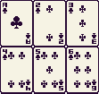
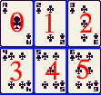
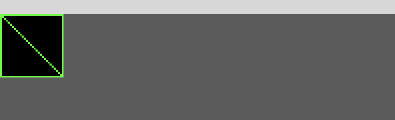
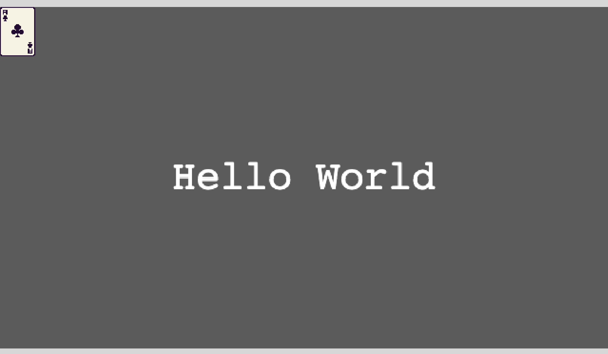
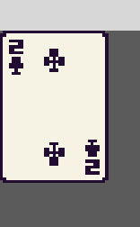
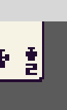

The game of Solitaire is a fun classic single player card game that involves strategy, patience, and sometimes a bit of luck. The card game involves arranging cards in a specific order based on suit and rank, and the goal is to move all the cards from the tableau (the main playing area) into a set of foundations (four piles), each starting with an Ace and building up in ascending order to a King.

**Note:** there are a variety of Solitaire type games, and these type of games are generally played with one or more standard 52 card packs. For this tutorial, we will be focusing on one instance of the game Solitaire that used a single deck of 52 cards.

## Tutorial Overview

In this tutorial series, we’ll be looking at how to recreate the game Solitaire using the Phaser 3 framework. Here’s an example of what the final game should look like:


The main steps for this tutorials series includes:

1. [Project Setup](/post/2024/08/solitaire-phaser-3-tutorial-1/)
2. [Game Layout](/post/2024/08/solitaire-phaser-3-tutorial-1/)
3. [Player Input](/post/2024/08/solitaire-phaser-3-tutorial-1/)
4. [Moving Cards](/post/2024/08/solitaire-phaser-3-tutorial-1/)
5. [Core Solitaire Logic](/post/2024/08/solitaire-phaser-3-tutorial-1/)
6. [Title Scene](/post/2024/08/solitaire-phaser-3-tutorial-1/)

## Game Mechanics & Rules

In the game of Solitaire, you start with a standard deck of 52 playing cards. The cards are shuffled and then dealt into seven columns, called the tableau. The first column has one card, the second has two cards, and so on, with only the top card of each column face-up. The remaining cards form a draw pile.

You can move cards around the tableau according to specific rules, such as placing a card of one color onto a card of the opposite color and in descending order (for example, a red 7 can be placed on a black 8). The objective is to expose hidden cards and eventually move them to the foundation piles.

The game is won when all cards are successfully moved to the foundation piles, organized by suit from Ace to King.

There are four types of card piles in the game:

* Tableau: Seven piles that make up the main table.
* Foundations: Four piles on which a whole suit or sequence must be built up. In most Solitaire games, the four aces are the bottom card or base of the foundations. The foundation piles are hearts, diamonds, spades, and clubs.
* The Stock (or “Hand”) Pile: If the entire pack is not laid out in a tableau at the beginning of a game, the remaining cards form the stock pile from which additional cards are brought into play according to the rules.
* The Talon (or “Waste”) Pile: Cards from the stock pile that have no place in the tableau or on foundations are laid face up in the waste pile.

## Project Requirements

In order to follow along with this tutorial, you will need to have [Node.js](https://nodejs.org/en) installed locally on your computer, or have access to a development environment that has Node.js installed. For this tutorial, you will need to have at least Node.js version 20 or later.

**Note:** earlier versions of Node.js may work, but this tutorial was written with Node.js 20 installed.

### Phaser 3 Library Version

This tutorial was written using the `3.80.0` version of [Phaser 3](https://phaser.io/). Earlier and later versions of the framework may work with the code that is written in this series, but if you run into any issues with the framework, it is recommended that you use the version of Phaser 3 mentioned here.

**Note:** the project files will have this version of Phaser 3 pinned in the `package.json` file.

## Why Solitaire For A Tutorial?

In order to create the game Solitaire with the Phaser 3 framework, I had to use a number of different game objects types and built in methods of the Phaser 3 framework that are not always used in many of the popular tutorials. Due to this, I thought that this would make a good learning project and wanted to share what I learnt.

While building the game of Solitaire, you will get to see how we can use the following features of Phaser 3 to create our game:

* Using the Zone game object for handling player interaction events
* Using drag events on game objects to move objects in the scene
* Using the Drop Zones for checking when game objects are dropped on Zones
* Using drop events on game objects to handle object overlaps without physics
* Using the data manager for storing and retrieving data on the game objects
* Using containers for grouping and positioning game objects
* Using built in scene transitions
* Loading sprite sheets, images, and displaying these as game objects in our game

## Project Setup

Before we start adding any code, we will need to setup our project, install the project dependencies, and see how we can run our game locally.

### Project Files

In order to follow along with this tutorial, you will need to download the initial project files that will be used. The initial project files include all of the assets that will be used in the game, the initial project structure for our Phaser 3 game, and the required files for install the project dependencies.

You can find the initial project files here on GitHub: [Solitaire Project Files](https://github.com/devshareacademy/phaser-3-solitaire-tutorial/releases/tag/solitaire_initial_project). Click [Direct Download](https://github.com/devshareacademy/phaser-3-solitaire-tutorial/archive/refs/tags/solitaire_initial_project.zip) to download the files.

You will find the following files in the zip file:

* **index.html** - the main web page that has the HTML Canvas were the game will be loaded at
* **public/assets/images** - this folder contains the 3 images that will be used in our game
* **src/main.ts** - the main entrypoint for our game code, creates the Phaser game instance
* **src/scenes/common.ts** - contains common code that is shared between our code files
* **src/scenes/game-scene.ts** - the main Phaser Scene class were our game logic will be added to
* **src/scenes/preload-scene.ts** - a Phaser Scene class that is responsible for loading the assets we use in our game
* **src/scenes/title-scene.ts** - a Phaser Scene class that will be used for rending out the title scene in our game

The remaining files in the project folder are configuration files for installing our project dependencies and for setting up the bundler that will be used for running our game locally and for bundling up our source code.

#### Why Multiple Phaser 3 Scenes?

The Phaser 3 framework uses the concept of Scenes to allow you break up your game into logical sections or states, and each Scene allows you to render out Game Objects to the HTML Canvas Element. For your Phaser 3 game instance, you will always have at least 1 Scene instance, but the framework allows for you to create as many as you want. By breaking our various game states into separate Phaser 3 Scenes, it will make it easier to maintain our code over time and to extend the functionality of our game.

### Installing Dependencies

In order to install the project dependencies, you will need to have [Node.js](https://nodejs.org/en) installed. To install the project dependencies, you will need to run the following command from your project directory:

```bash
npm ci
# or
npm install
```

This will create a new folder called `node_modules`, which will have all of the dependencies to run your project locally.

### Running The Project Locally

To run your game code locally, you need to run the following command from your project directory:

```bash
npm start
```

This will start the [Vite](https://vitejs.dev/) dev server, which will allow you to test your game locally. In your browser, if you navigate to [http://localhost:3000/](http://localhost:3000/), you should see your Phaser 3 game.


## Loading Assets

With our project now setup, we can now start coding! To get started, the first thing we will do is load in all of the assets that will be used in our game. To load assets in a Phaser 3 game, we need to tell the Phaser 3 Loader Plugin to load our files. To do this, we will add some code to our `PreloadScene` class in the `src/scenes/preload-scene.ts` file. In the class, update the `preload` method to have the following code:

```typescript
public preload(): void {
  this.load.image(ASSET_KEYS.TITLE, 'assets/images/title.png');
  this.load.image(ASSET_KEYS.CLICK_TO_START, 'assets/images/clickToStart.png');
  this.load.spritesheet(ASSET_KEYS.CARDS, 'assets/images/cards.png', {
    frameWidth: CARD_WIDTH,
    frameHeight: CARD_HEIGHT,
  });
}
```

and update the import statements at the top of the file to have the following code:

```typescript
import * as Phaser from 'phaser';
import { ASSET_KEYS, CARD_HEIGHT, CARD_WIDTH, SCENE_KEYS } from './common';
```

In the code above, we used `this.load` to reference the Phaser 3 Loader Plugin in our Phaser Scene. This plugin has a number of built in utility methods that will allow us to load a variety of files types: images, sprite sheets, json, audio files, and more! Anytime we load an asset using the Loader Plugin, we need to provide a `cache` key, which is a unique string that the Phaser 3 framework will use internally to cache the assets that are loaded. Later on in our code, we can then access those assets by using that same `cache` key. Besides the `cache` key, we also need to provide the URL for were the asset can be found, that way Phaser can load that file.

The `image` method on the plugin allows us to load images in our game. The `spritesheet` method on the plugin allows us to load a spritesheet image in our game, and when we use this method we can also provide an additional configuration that will tell Phaser how to slice the spritesheet into smaller frames, or images, that we can use in our game.

### Spritesheet

A Spritesheet is a single image that is made up of multiple smaller images, and in order to use one of these smaller images in our game and not display the whole image that was loaded, we need to tell Phaser how to cut out these smaller images, or frames. As an example, if we wanted to use the following spritesheet in our game, and only render out the first card:



we need to tell Phaser how to only use part of the image, and we do this by providing our spritesheet configuration when we use `this.load.spritesheet` to load the image. In the code above, we are setting the frame width and frame height, which is what Phaser will use to cut our image up into smaller images.



By providing this configuration, Phaser will create frames, which are just parts of the overall image. In the example above, the first card in the image will be frame `0` and the next card will be frame `1`. This will be repeated from left to right, and top to bottom until each part of the image is a frame. By doing this, later on we can use these frames to render out the smaller images in our game.

### Waiting Until Assets Are Loaded

For our game instance, we will need to make sure we wait until all of our assets are loaded before we try to use those assets in our game. Otherwise, if try to render out one of our images, we will see the following:



Luckily, since we loaded all of our assets in the `preload` method in our Phaser 3 Scene class, the Phaser framework will handle this for us. When you load your assets in the `preload` method, Phaser will wait until all of those assets have been loaded before calling the `create` method on your Phaser Scene instance. Due to this, we can use the `create` method to trigger the transition to our next Scene.

In the current game setup:

```typescript
public create(): void {
  this.scene.start(SCENE_KEYS.TITLE);
}
```

this means we will transition to the `TITLE` Scene after all of our assets are loaded in the `Preload` Scene, and with how the `Title` Scene is currently setup, this Scene will transition directly to the `Game` Scene.

### Testing Assets

To make sure our assets are being loaded properly, we will render out one of our images in our `Game` Scene. To do this, open up the `GameScene` class in the `src/scenes/game-scene.ts` file and add the following code to bottom of the `create` method:

```typescript
this.add.image(0, 0, ASSET_KEYS.CARDS, 0).setOrigin(0);
```

When our game instance refreshes in the browser, we should now see an Ace of clubs being rendered in our game.



In the code above, `this.add` references the Phaser Scene Game Object Factory, which is a plugin that allows you to quickly create Game Objects. This plugin has a variety of built in methods that allow you to create all kinds of game objects like: Images, Sprites, Shapes, and many more! When we use the `image` method on the factory, we are required to pass 3 arguments with the fourth argument being optional:

* **x**: the `x` position of the game object that will be added to the current Phaser Scene instance
* **y**: the `y` position of the game object that will be added to the current Phaser Scene instance
* **texture**: the key or Phaser Texture instance that will be used for this Image Game Object
* **frame**: the frame of the Phaser Texture instance that will be used for this Image Game Object, default of `0` is used if not provided

The `x` and `y` arguments are used for positioning our newly created Image Game Object in our Scene, and by modifying this values we can easily move our game object. The `texture` argument is used to set which Image or Spritesheet will be used for the game object. In the code above, we used the same `string` that we used when we loaded in our game assets, and by doing this, the Phaser framework will pull that image data from the internal cache and use that texture. Finally, the last argument, `frame` is used to tell Phaser which frame of the texture we would like to use. By default, all images we load will have 1 frame (with an index of 0), which is the whole image that is loaded. However, since we are referencing the spritesheet we loaded previously, this Texture has multiple frames, which were automatically created when Phaser loaded in our spritesheet.

If we change the frame from `0` to `1`, our game will be updated to show the 2 of clubs.



### Origin

The `origin` of a Game Object plays an important role in how game objects are placed within our Scene. By default, most game objects will have an `origin` of `0.5` for both the `x` and `y` value, which means that the origin of the game object will be the center of the game object. This is important because the Phaser framework will use the game objects `x` and `y` values to position the game object so that the these two values are were the `origin` of the game object is.

In the code above, we used the `setOrigin` method to set the `x` and `y` `origin` values to `0`, which means the origin of our game object will be in the top left hand corner. Due to this, since our game objects position is `0` for both `x` and `y`, this results in the image being drawn to the top left corner of our Scene.

If we change the value of `setOrigin` to be `0.5`, or remove this call, then this will result in the origin of the game object being in the center, which will result in the following when the image is rendered:



In the image above, our card is now cut off. This is due to the origin now being in the center of our Image Game Object, and so when Phaser positions the game object at `(0,0)`, the framework will make sure that the game object is positioned in our Scene so the origin lines up with that position.

## Summary

All right, with those last changes, that brings an end to this part of the tutorial. In this part of the tutorial, we reviewed the rules and game play of the game Solitaire and we setup our initial project structure and loading in the assets we will need for our game. Lastly, we reviewed some of the key concepts of Phaser 3.

You can find the completed source code for this article here on GitHub: [Part 1 Source Code](https://github.com/devshareacademy/phaser-3-solitaire-tutorial/tree/load_assets)

If you run into any issues, please reach out via [GitHub Discussions](https://github.com/devshareacademy/phaser-3-solitaire-tutorial/discussions), or leave a comment down below.

In [part 2](/post/2024/08/solitaire-phaser-3-tutorial-2/) of this series, we will start to build the layout for our game.
