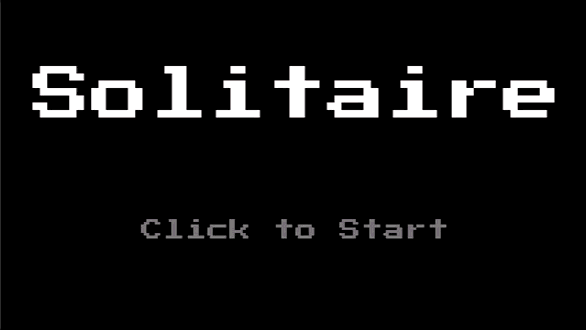
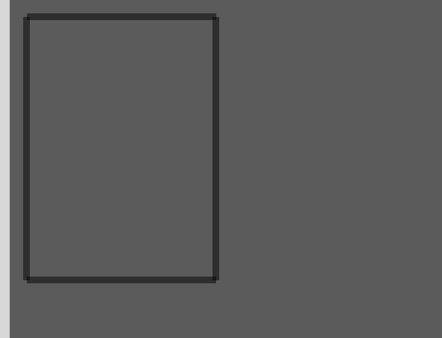
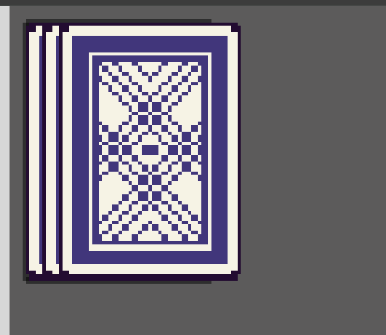
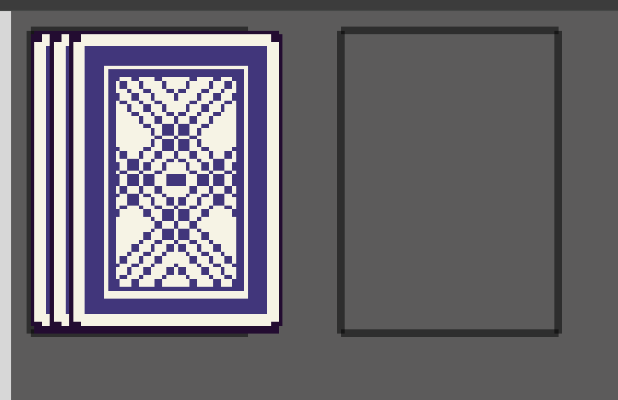
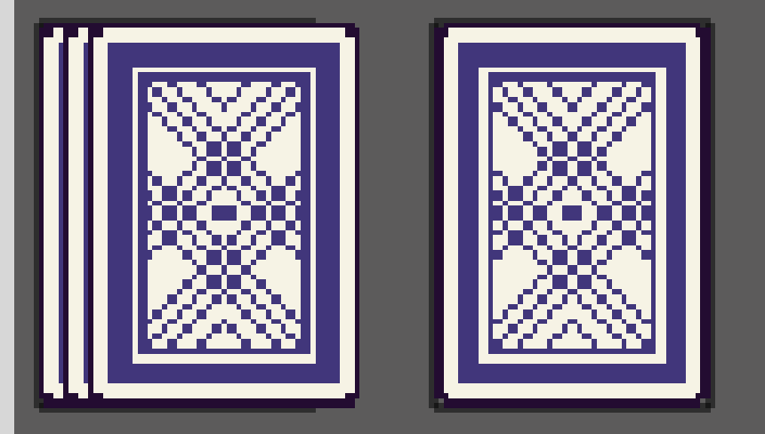
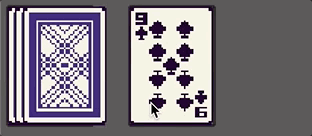
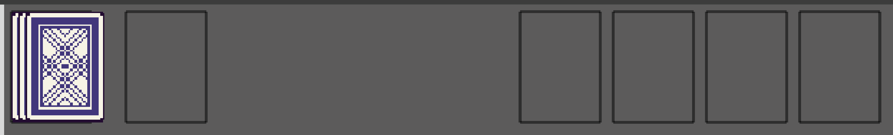
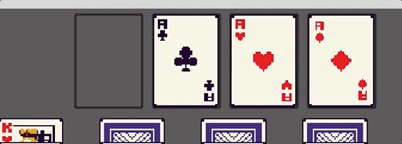
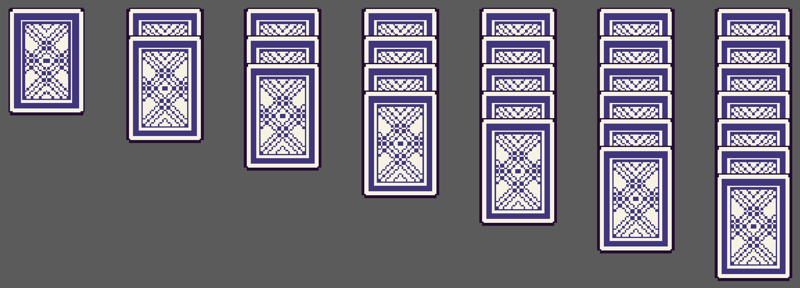
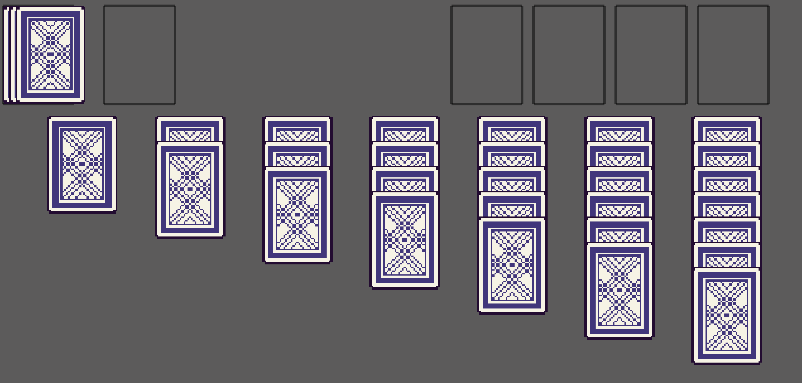

In this tutorial series, we’ll be looking at how to recreate the game Solitaire using the Phaser 3 framework. Here’s an example of what the final game should look like:



Previously, in [part 1](/post/2024/08/solitaire-phaser-3-tutorial-1/), we reviewed the rules and game play of the game Solitaire, setup our project files, and loaded in the assets we will need for our game.

In part 2 of this series, we are going to start building out the layout of our game.

## Create Draw Pile

So now that we have loaded in our assets we will use for our game, and we have seen how we can render out image game objects in our Phaser Scene, we are going to start building the four different card piles that make up our game area. To get started, we will focus on the draw pile.

For the card draw pile, this will be made up of two different game object types, a basic Rectangle game object and multiple Image game objects. The Rectangle game object is one of the basic shape game objects that is built in Phaser, and this can be used for quickly creating a rectangle in our game. For our card draw pile, we will be rendering out a simple rectangle to show were the card draw pile is placed in our game. When there is no cards in the card draw pile, this will be visible to the player and later on, the player will be able to click in that area to shuffle back in the discard cards. When there are cards in the draw card pile, these will be rendered on top of the rectangle.

To get started with the code changes, add the following code to the top of the `GameScene` class in the `src/scenes/game-scene.ts` file:

```typescript
// used for drawing out game objects for debugging our player input
const DEBUG = false;
// the scale factor that will be applied to our card image game objects
const SCALE = 1.5;
// the frame of the card spritesheet that represents the back of a card
const CARD_BACK_FRAME = 52;
// the x & y positions of were the foundation piles will be placed in our game area
const FOUNDATION_PILE_X_POSITIONS = [360, 425, 490, 555];
const FOUNDATION_PILE_Y_POSITION = 5;
// the x & y position of were the discard pile will be placed in our game area
const DISCARD_PILE_X_POSITION = 85;
const DISCARD_PILE_Y_POSITION = 5;
// the x & y position of were the draw pile will be placed in our game area
const DRAW_PILE_X_POSITION = 5;
const DRAW_PILE_Y_POSITION = 5;
// the x & y position of were the tableau pile will be placed in our game area
const TABLEAU_PILE_X_POSITION = 40;
const TABLEAU_PILE_Y_POSITION = 92;
// the starting frame of the card suit in the card spritesheet that represents the various cards
const SUIT_FRAMES = {
  HEART: 26,
  DIAMOND: 13,
  SPADE: 39,
  CLUB: 0,
};
```

In the code above, we are creating a number of constant variables that we will use in throughout our code. Please see the comments for how each variable will be used. Next, replace all of the code in the `create` method with the following code:

```typescript
public create(): void {
  // setup game objects based on solitaire game state
  this.#createDrawPile();
}
```

and then at the bottom of the `GameScene` class, add the following code:

```typescript
#createDrawPile(): void {
  // create outline for pile
  this.#drawCardLocationBox(DRAW_PILE_X_POSITION, DRAW_PILE_Y_POSITION);
}

#drawCardLocationBox(x: number, y: number): void {
  this.add.rectangle(x, y, 56, 78).setOrigin(0).setStrokeStyle(2, 0x000000, 0.5);
}
```

When your game refreshes in the browser, we should see a new black rectangle being rendered in our game:



In the code above, we created two new `private` methods `#createDrawPile` and `#drawCardLocationBox`. The `#drawCardLocationBox` method is responsible for creating the Rectangle game object, which is created by using the `.rectangle` on the Phaser Scene Game Object Factory, and in this method we can pass the following arguments:

* **x**: the `x` position of the game object that will be added to the current Phaser Scene instance
* **y**: the `y` position of the game object that will be added to the current Phaser Scene instance
* **width**: the width of the rectangle
* **height**: the height of the rectangle
* **fillColor**: the color the rectangle will be filled with
* **fillAlpha**: the alpha the rectangle will be filled with

In our code we are omitting the last two arguments, which allows us to draw our rectangle shape with no fill. Finally, we call the `setStrokeStyle` method to draw a border around our Rectangle game object. This method allows us to pass the `size` of the board, the color, and the alpha of the border line.

Next, we need to create the cards in our draw pile, and we will store a reference of these Image game objects in our class. To do this, add the following code at the top of our `GameScene` class above the `constructor`:

```typescript
// keeps track of the card game objects in our draw pile (will have 3 game objects)
#drawPileCards!: Phaser.GameObjects.Image[];
```

Then, add the following code to the bottom of the `#createDrawPile` method:

```typescript
// create initial draw pile game object cards
this.#drawPileCards = [];
for (let i = 0; i < 3; i += 1) {
  this.#drawPileCards.push(this.#createCard(DRAW_PILE_X_POSITION + i * 5, DRAW_PILE_Y_POSITION));
}
```

Finally, at the bottom of the `GameScene` class, add the following code:

```typescript
#createCard(x: number, y: number): Phaser.GameObjects.Image {
  return this.add.image(x, y, ASSET_KEYS.CARDS, CARD_BACK_FRAME).setOrigin(0).setScale(SCALE);
}
```

When your game refreshes in the browser, we should see the new cards in the draw pile location:



In the code above, we first created a new private property, `#drawPileCards`, which is an array that will be used to keep track of our Image game objects in the draw pile. For the time being, we won't be doing anything with this array besides adding the game objects, but we will reference these objects later in our code. We then created a new private method `#createCard`, which is used to create an Image game object. When we create the Image game object, we are using the `setScale` method to scale up the size of our game object. By default, game objects will have a scale of `1` for both the `x` and `y` values. When we call `setScale`, we have the option to pass two values, one for `x` and one for `y`, and if we only pass one value, this value will be used for both the `x` and `y` values.

Finally, in the `#createDrawPile` method, we create three new Image game objects by calling the new new `#createCard` method. By calling this method in the `for` loop, we can use the `index` of the loop to modify the `x` position of the game objects to get the effect of the cards being stacked on top of each other. For the draw card pile, we will only create a max of 3 Image game objects to represent our deck, and as we draw new cards in our game, we will update the card textures in our discard pile to reflect the cards that were just drawn. Later on, as we draw cards from our draw pile, once we get down to only 2, 1, or 0 cards, we will update our 3 Image game objects that were created here.

## Create Discard Pile

For the discard card pile, this will be very similar to the logic we added for the draw card pile. To get started we will create a private property to keep track of the Image game objects that will be created. At the top of the `GameScene` class, add the following code below the `#drawPileCards` property:

```typescript
// keeps track of the card game objects in our discard pile (will have 2 game objects)
#discardPileCards!: Phaser.GameObjects.Image[];
```

Next in the `create` method, add the following code to the bottom of the method:

```typescript
this.#createDiscardPile();
```

Now, add the following code to the `GameScene` class:

```typescript
#createDiscardPile(): void {
  // create outline for pile
  this.#drawCardLocationBox(DISCARD_PILE_X_POSITION, DISCARD_PILE_Y_POSITION);

  // create initial discard pile game object cards, we will only need two game objects, which will represent the two most recently drawn cards
  // at the start of the game, these will not be visible until the player draws a new card
  this.#discardPileCards = [];
  const bottomCard = this.#createCard(DISCARD_PILE_X_POSITION, DISCARD_PILE_Y_POSITION).setVisible(false);
  const topCard = this.#createCard(DISCARD_PILE_X_POSITION, DISCARD_PILE_Y_POSITION).setVisible(false);
  this.#discardPileCards.push(bottomCard, topCard);
}
```

When your game refreshes in the browser, we should see the new discard pile location:



In the code above, we first created another Rectangle game object that shows were the discard pile of cards will be placed in our game. By default, when there are no cards in this pile, the empty rectangle will be shown to the player. After this, we created two new Image game objects and stored these game objects in the `#discardPileCards` array. One new thing we are doing when creating these two game objects is that we are calling the `setVisible` method. This method allows us to control if a game object will be rendered in our scene. Since we are setting this value to `false`, that is why we cannot see our card images in our scene. If we toggle this value to be `true`, we should then see the card in the discard pile.



For the discard pile, even though there will be no cards in the pile when the game starts, we will still create our two Image game objects. By making these invisible when the game starts, we can re-use these game objects later. Now, for our discard pile, we will only end up showing up to two cards at a time in our game, the two most recently drawn cards. Due to this, we will end up re-using these two game objects by updating the textures on these objects and by setting the visibility on these game objects.

Here is an example of how we will be showing the two cards in our discard pile:



## Create Foundation Piles

For the foundation piles, the logic will be similar to the logic we have added so far. The main thing for the foundation piles is that we will need four unique piles in our game, one for each card suit. To get started we will create a private property to keep track of the Image game objects that will be created. At the top of the `GameScene` class, add the following code below the `#discardPileCards` property:

```typescript
// keeps track of the card game objects in each of the foundation piles (4 game objects)
#foundationPileCards!: Phaser.GameObjects.Image[];
```

Next in the `create` method, add the following code to the bottom of the method:

```typescript
this.#createFoundationPiles();
```

Now, add the following code to the `GameScene` class:

```typescript
#createFoundationPiles(): void {
  this.#foundationPileCards = [];

  // create outline for each foundation pile
  FOUNDATION_PILE_X_POSITIONS.forEach((x) => {
    this.#drawCardLocationBox(x, FOUNDATION_PILE_Y_POSITION);
    // create phaser game object for each pile, these will not be visible at game start
    // but once we add the ace to the pile, we will make this card visible
    const card = this.#createCard(x, FOUNDATION_PILE_Y_POSITION).setVisible(false);
    this.#foundationPileCards.push(card);
  });
}
```

When your game refreshes in the browser, we should see the new foundation piles:



In the code above, we created 4 new card piles, one for each card suit in our game. For each pile, we created an outline of were the pile will be placed in the game and we created a new Image game object at that location, which is hidden by default. For our foundation pile, we will only need 1 Image game object to represent our card pile, and as we add cards to the foundation pile, we will just update the Image game object texture to reflect the card that was just added to that pile.



## Create Tableau Piles

For the last part of our game layout, we need to create the 7 tableau card piles. For the tableau card piles, we need to build 7 card piles were the first pile has 1 card, the second pile has 2 cards, the 3rd pile has 3 cards, and so on until the final pile, which will have 7 cards. Now, for these piles, the player will be able to see how many cards are in each pile, and so we will be creating an Image game object to represent each of these cards. One last thing to note is that the last card in each pile will be visible to the player, however for the time being we will just show the back of the last card.

So to create our card piles, we will need to add the following code to our `GameScene` class. At the top of the `GameScene` class, add the following code below the `#foundationPileCards` property:

```typescript
// keeps track of the card game object containers for each tableau pile (7 game objects)
#tableauContainers!: Phaser.GameObjects.Container[];
```

Next in the `create` method, add the following code to the bottom of the method:

```typescript
this.#createTableauPiles();
```

Now, add the following code to the `GameScene` class:

```typescript
#createTableauPiles(): void {
  this.#tableauContainers = [];
  for (let i = 0; i < 7; i += 1) {
    const x = TABLEAU_PILE_X_POSITION + i * 85;
    const tableauContainer = this.add.container(x, TABLEAU_PILE_Y_POSITION, []);
    this.#tableauContainers.push(tableauContainer);
    for (let j = 0; j < i + 1; j += 1) {
      const cardGameObject = this.#createCard(0, j * 20);
      tableauContainer.add(cardGameObject);
    }
  }
}
```

When your game refreshes in the browser, we should see the new tableau piles:



In the code above, we created a new private property called `#tableauContainers`, which will be an array of Phaser Container game objects. In Phaser, a container is a special type of game object that allows you to place other game objects inside it, and then you can move all of those game objects around by moving the container game object itself. What is unique about a container is that when you place game objects inside the container, the are position relative to the container position. For example, if we placed a container game object at position `50,50`, and then we created a new Image game object at position `0,0`, and placed this game object within the container, then the Image game object would appear at the container game objects position. There is more you can do with Container game objects, but for now, we are just using our Container game objects to align our cards in our piles.

Next, we created a new private method called `#createTableauPiles`. In this method, we create 7 Container game objects and line these up on our game board by using the index of our `for` loop. We then created a nested `for` loop to allow us to create the number of cards that we need in each pile, and so as we go through each iteration of our loop, we will create more cards for each card pile. Finally, we place each of our card Image game objects in each of the `tableauContainer` game objects that were created.

With all of the code changes that we have made so far, our game should now look like this:



## Summary

All right, with those last changes, that brings an end to this part of the tutorial. In this part of the tutorial, we started to create Phaser game objects and created the main layout for our Solitaire game.

You can find the completed source code for this article here on GitHub: [Part 2 Source Code](https://github.com/devshareacademy/phaser-3-solitaire-tutorial/tree/game_layout)

If you run into any issues, please reach out via [GitHub Discussions](https://github.com/devshareacademy/phaser-3-solitaire-tutorial/discussions), or leave a comment down below.

In [part 3](/post/2024/08/solitaire-phaser-3-tutorial-3/) of this series, we will start to add support for handling player input in our game.
