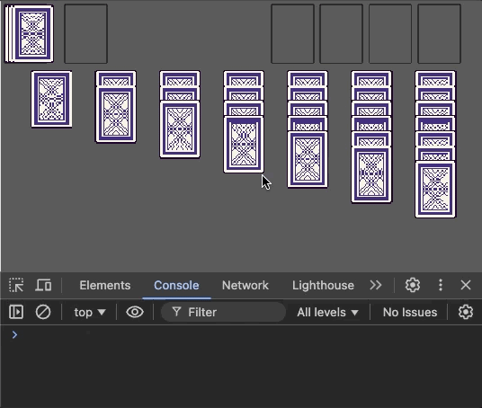
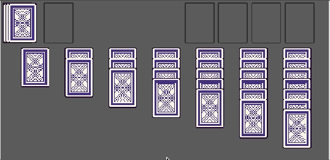
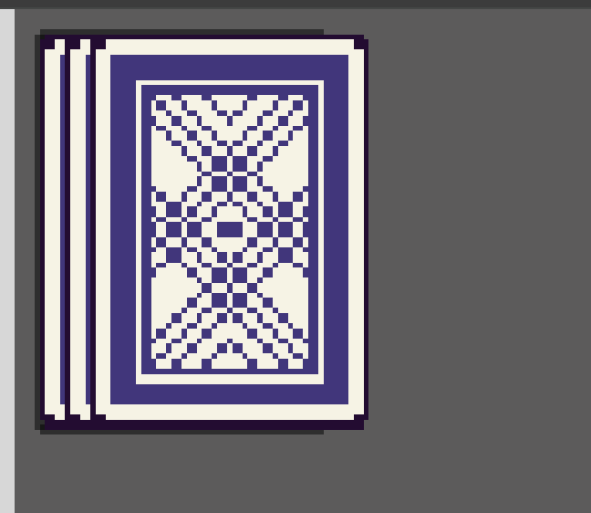
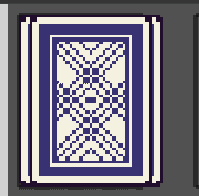
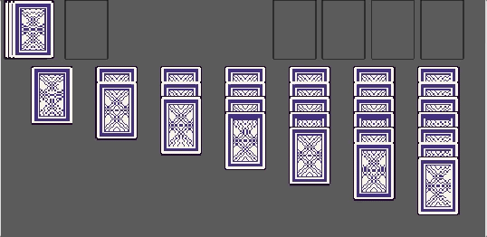
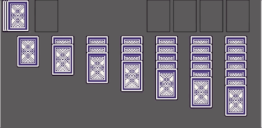
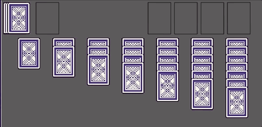
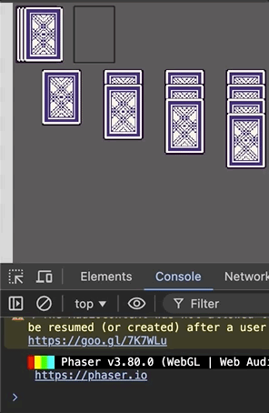
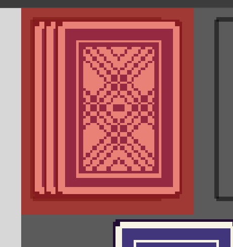
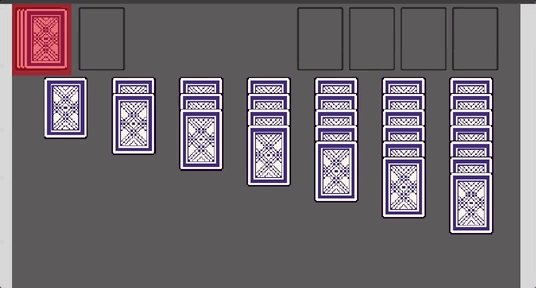

In this tutorial series, we’ll be looking at how to recreate the game Solitaire using the Phaser 3 framework. Here’s an example of what the final game should look like:


Previously, in [part 2](/post/2024/08/solitaire-phaser-3-tutorial-2/), we worked on creating the main layout for our game.

In part 3 of this series, we are going to start working on making our game interactive and we will add support for player input.

With our game layout completed, it is now time to start focusing on adding support for player input. For the input in our game, there will be two main items:

* dragging cards
* clicking on cards to draw them

In the game, the player will need to be able to click on the draw pile to draw a new card, which can then be played to the foundation or tableau piles. Besides this, the player will need to be able to click and hold a card to drag the card around our Phaser Scene, and with this, the player will be able to play cards from the various piles to the tableau or foundation. To get started, we will focus on making our card game objects draggable.

## Dragging Cards

In order to allow the player to click and drag our game objects in Phaser, the first thing we need to do is make them interactive, which allows us to listen for various built in input events, which we can then react to. To do this, we just need to use the `setInteractive` method.

To get started with the code changes, update the `#createCard` method in the `GameScene` class in the `src/scenes/game-scene.ts` file to match the following:

```typescript
#createCard(x: number, y: number, draggable: boolean): Phaser.GameObjects.Image {
  return this.add
    .image(x, y, ASSET_KEYS.CARDS, CARD_BACK_FRAME)
    .setOrigin(0)
    .setScale(SCALE)
    .setInteractive({ draggable: draggable });
}
```

In the code above, we did two things: first we added a new argument `draggable` which will be a `boolean` value to indicate if we want our Image game object to be draggable, and next we called the `setInteractive` method on the Image game object. When we call the `setInteractive` method, we have the option to pass additional configuration options, and in our case we passed the `draggable` field. When this field is set to `true`, this will tell Phaser to enable this game object for drag events and the framework will emit these events, along with our other input events. By default, this will be set to `false` for our game objects, and so we will need to enable this.

With the update to our `#createCard` method, we will need to update the rest of our code to pass the new argument. Update the following methods to pass the new argument:

* **createDrawPile**: update to pass `false`
* **createDiscardPile**: update to pass `true`
* **createFoundationPiles**: update to pass `false`
* **createTableauPiles**: update to pass `true`

So, for our `draw` and `foundation` piles, we will not want to allow dragging cards from these areas. Instead, for the draw pile we will only allow click events, and for the foundation pile, we will only allow cards to be placed there. For the `discard` and `tableau` piles, we want to allow cards to be dragged from these two areas.

Now, when the game refreshes, there will be no visible differences in our game. To actually make use of our new interactive game objects, we need to register event listeners to handle moving our game objects. To do this, add the following code to the bottom of the `create` method:

```typescript
// setup drop zones for interactions and events for drag
this.#createDragEvents();
```

Next, add the following code to the `GameScene` class:

```typescript
#createDragEvents(): void {
  this.#createDragStartEventListener();
  this.#createOnDragEventListener();
  this.#createDragEndEventListener();
}

#createDragStartEventListener(): void {
  // listen for the drag start event on a game object, this will be used to store the original position of the game
  // object, that way we can put the object back in the original position if an invalid move is made
  this.input.on(
    Phaser.Input.Events.DRAG_START,
    (pointer: Phaser.Input.Pointer, gameObject: Phaser.GameObjects.Image) => {
      console.log(gameObject.x, gameObject.y);

      // TODO: store object position
      // TODO: update depth on container or image game object, so when we drag the card it is visible above all other game objects
      // update card objects alpha so we know which card is actively being dragged
      gameObject.setAlpha(0.8);
    },
  );
}

#createOnDragEventListener(): void {
  // listen for the drag event on a game object, this will be used to move game objects along the mouse path
  // as we click and drag an object in our scene
  this.input.on(
    Phaser.Input.Events.DRAG,
    (pointer: Phaser.Input.Pointer, gameObject: Phaser.GameObjects.Image, dragX: number, dragY: number) => {
      gameObject.setPosition(dragX, dragY);

      // TODO: if card is part of the tableau, we need to move all cards that are stacked on top of this card
    },
  );
}

#createDragEndEventListener(): void {
  // listen for the drag end event on a game object, this will be used to check were the game object was placed
  // in our scene, and depending on were the object was placed we will check if that is a valid move in our game
  // otherwise, we will reset the objects position back to were the object was originally located at
  this.input.on(
    Phaser.Input.Events.DRAG_END,
    (pointer: Phaser.Input.Pointer, gameObject: Phaser.GameObjects.Image) => {
      console.log(gameObject.x, gameObject.y);

      // TODO: reset the depth on the container or image game object

      // TODO: check if game object overlaps with foundation
      // TODO: check if game object overlaps with tableau
      // TODO: check if game object overlaps with with multiple tableau piles and determine were to place game object
      // TODO: if game object was not destroyed, still active, we need to update that game objects data to match were the card was placed
      gameObject.setAlpha(1);
    },
  );
}
```

In the code above, we created four new private methods. The `#createDragEvents` method will be invoked when our Phaser Scene is created, and is used to initialize all of our drag event listeners, which is the code in the other three methods. In each of those methods, we ended up registering an event listener with Phaser for when there is an input event of a specific type. In the Phaser framework, there is an Event Emitter class that is used internally to emit a variety of events, and that same class allows you to register an event listener that will be called when that event is sent. What is really cool about Phaser is that this class is used internally on most resources, which means you can listen for events on your Game Objects, Scenes, Plugins, and much more! By default, on any object type that has a built in Event Emitter, you will be able to use the `on` method to register an event listener.

In the three methods above, we are listening for 3 different event types: `dragstart`, `drag`, and `dragend`. These three events are tied to the click and drag events, and by listening for these events on the Scene Input Plugin (`this.input`), we will invoke our event listener callback for any game object that is dragged in our Scene. To see an example, if you click and drag one of the cards in the Scene, you should see some information be logged to the developer console.



When we register our event listener, in the callback function that we provide, Phaser will send a number of arguments that are related to the event that we are listening for. In our case, Phaser will send two arguments:

* First is the Input Pointer, which has information about the input that took place, for example the `x` and `y` position of were the input is happening
* Second is the game object that the event is currently being dragged

At a high level, we did the following for each of the event types in the code above:

* In the `#createDragStartEventListener` method, we registered an event listener for the `dragstart` event, and when we get this event we are logging information about the game object and updating the alpha on the game object. This makes it easier for us to tell which game object is being moved in our Scene.
* In the `#createOnDragEventListener` method, we registered an event listener for the `drag` event, and when we get this event we are updating the game objects position to match the `x` and `y` value of the pointer object that was provided. This allows us to click and drag the game objects in our Scene.
* In the `#createDragEndEventListener` method, we registered an event listener for the `dragend` event, and when we get this event we are logging information about the game object and resetting the alpha on the game object back to the original value.

**Note:** in the code, there are a number of `TODO:` comments for code that we will need to add, and for the time being these can be ignored.

## Game Object Depth

While dragging the card Image game objects around our Scene, one of the things you might have noticed is that as we move cards around some of cards will appear in front of other cards, and some of the cards will appear behind other cards.



This is due to how `depth` and how Phaser renders our game objects in our Scene. By default, when we add game objects to our Phaser Scene, Phaser will render the game objects in the order that they are added to the Scene. A good example of this is how are cards are stacked in our draw pile.



When we add these cards to our Scene, Phaser is drawing them one by one onto our Canvas element, which gives us the appearance of depth in our game. Now, this is how Phaser will render objects by default, but the framework also always you to control this with a number of built in methods and with the `depth` property on the game objects that are created. By default, all game objects will have a `depth` of `0`, and Phaser will render out game objects with a higher depth on top of game objects of a lower depth. To see an example of this, if you add the following line of code to the bottom of the `#createDrawPile` method:

```typescript
this.#drawPileCards[1].setDepth(2);
```

This will have the effect of the middle card in our stack of 3 cards to be drawn on top of the two other cards.



So, to fix the issue of when we are dragging cards around our Scene, and having the card we are currently dragging appearing behind some of the card game objects, we can update the depth on our game object when the drag event starts, and reset it once the drag event is done. To do this, add the following line of code to our event listener in the `#createDragStartEventListener` method:

```typescript
gameObject.setDepth(2);
```

Then, in the `#createOnDragEventListener` method, add the following code to the bottom of our event listener:

```typescript
gameObject.setDepth(0);
```

Now, if we test our code, it looks like we still have the same issue. What is happening is, when we have a game object that is inside a container, even if we update the depth of that game object, the containers depth and display order will take precedence over our other game objects. So to address this issue, we will need to modify our code to update the depth on our container game object that a card belongs to. In order to keep track of this, we will need to store some data on our game object so we know which pile a card belongs to.

## Game Object Data

In order to store custom data on our Phaser Game Objects, one of the ways to do this is to use the built in Data Manager for a game object. The Data Manager is a custom class that allows us to store and retrieve data on a Game Object instance, and this works as a simple key/value storage system, were we can provide a key, a `string`, that has a unique name along with a value of any type, and Phaser will store this data on the Game Object. For example, if I wanted to give each object a unique id, I could store a field called `id` with a value of the id. A good way to think about the Data Manager, is to think of this as a basic `object`, where the `key` you add is one of the `keys` on your object and the `value` you set will be the value associated with that `key`. By using the built in Data Manager, we can store any type of data we want and we don't have to worry about creating a custom class to hold this information, or worry about overwriting one of the properties on the game object class we created.

Now, to actually use the built in Data Manager on a game object, we need to use the `setData` and `getData` methods. These two methods will create an instance of the Data Manager class on our Game Object instance if one does not exist, and then we can use these to set and retrieve values. To do this in our code, we will update the `#createCard` method to match the following code:

```typescript
#createCard(
  x: number,
  y: number,
  draggable: boolean,
  cardIndex?: number,
  pileIndex?: number,
): Phaser.GameObjects.Image {
  return this.add
    .image(x, y, ASSET_KEYS.CARDS, CARD_BACK_FRAME)
    .setOrigin(0)
    .setScale(SCALE)
    .setInteractive({ draggable: draggable })
    .setData({
      x,
      y,
      cardIndex,
      pileIndex,
    });
}
```

In the code above, we did two things:

* First, we added two optional arguments to our method, `cardIndex` and `pileIndex`, both of which are numbers.
* Next, we called the `setData` method on our Image game object to store data in the game objects data manager.

Now, when we call the `setData` method, there are two ways we can pass data. The first way is to pass data as two arguments like so: `setData('x', x)`. When we pass data this way, the first argument is the `key` that will be added to the data manager, and the second argument is the `value` that will be set. The other way to pass data is we can pass an object with the `keys` and `values` that we would like to store, and Phaser will capture all of these values in our data manager instance. In the example above, we are storing four values in our our data manager instance:

* **x**: the `x` position of were our game object was created at
* **y**: the `y` position of were our game object was created at
* **cardIndex**: set if the `cardIndex` argument is provided
* **pileIndex**: set if the `pileIndex` argument is provided

The `x` and `y` values will be used later so we can reset our card game objects position if an invalid move is made. Currently, our code allows the player to drag the cards anywhere on the game area, and ideally we only want to allow the player to drag a card to a valid position. By storing this information, we will be able to reset the game objects position later on, once we implement this. The `cardIndex` and `pileIndex` values will also be used during our drag event logic, and will be used for knowing if a card comes from the `tableau` pile, and if so, which card in the stack was moved. For the time being, this will be used to update our tableau container game objects depth when we move a game object.

So, to make use of these new properties, we need to update our code to pass these values. For the time being, we only need to make this change in our `#createTableauPiles` method. In the `#createTableauPiles` method, replace the following line of code:

```typescript
const cardGameObject = this.#createCard(0, j * 20, true);
```

with the following line of code:

```typescript
const cardGameObject = this.#createCard(0, j * 20, true, j, i);
```

Now that we are storing the cards index and pile index, we can update our drag event listeners to make use of the data in our data manager. First, in the `#createDragStartEventListener` method, update the following code in our event listener:

```typescript
console.log(gameObject.x, gameObject.y);
// TODO: store object position
// TODO: update depth on container or image game object, so when we drag the card it is visible above all other game objects
gameObject.setDepth(2);
// update card objects alpha so we know which card is actively being dragged
gameObject.setAlpha(0.8);
```

to be:

```typescript
// store objects position
gameObject.setData({ x: gameObject.x, y: gameObject.y });
// update depth on container or image game object, so when we drag the card it is visible above all other game objects
const tableauPileIndex = gameObject.getData('pileIndex') as number | undefined;
if (tableauPileIndex !== undefined) {
  this.#tableauContainers[tableauPileIndex].setDepth(2);
} else {
  gameObject.setDepth(2);
}
// update card objects alpha so we know which card is actively being dragged
gameObject.setAlpha(0.8);
```

In the code above, we did the following:

* First, we updated the `x` and `y` values that we are storing in the game objects data manager. This is being done since, as we move objects around our Scene, we will want to make sure we store the latest `x` and `y` value of the game object before we start moving it, that way we can reset back to the most recent position.
* Next, we used the `getData` method to lookup the `pileIndex` value from the data manager. If this `key` is found on the game objects data manager, then Phaser will return that value, otherwise `undefined` will be returned. If we find this value, then we use that index to update the `depth` of the `tableauContainer` container that the card game object belongs to. If not found, then we update the depth on the card game object directly. This will allow us to handle when we drag cards from our discard pile later.

With the changes done on our `dragstart` event listener, we need to do similar logic on the `enddrag` event listener. In the `#createDragEndEventListener` method, add the following code below the `TODO` line of code for resetting the game object depth:

```typescript
const tableauPileIndex = gameObject.getData('pileIndex') as number | undefined;
if (tableauPileIndex !== undefined) {
  this.#tableauContainers[tableauPileIndex].setDepth(0);
} else {
  gameObject.setDepth(0);
}

gameObject.setPosition(gameObject.getData('x') as number, gameObject.getData('y') as number);
```

In the code above, we first attempt to get the `pileIndex` property from the data manager, and if this value is found we update the `depth` of the `tableauContainer` that the card game object belongs to. If not found, then we update the `depth` of the game object directly. Lastly, we update the `position` of our game object by setting the position to the `x` and `y` values that we stored in the data manager. This will allow us to snap the game object back to the original position.

So now when the browser refreshes, we can test our new changes. If you try dragging one of the card game objects, it should always appear in front of all of the other game objects and once you are done dragging the game object, the card should snap back to the original position.


## Moving A Stack Of Cards

So now that we have the basic movement function handled, the next we need to do is add support for moving a stack of cards. In the game of Solitaire, when you pickup a face up card in one of the Tableau piles, and move that card, all of the cards on top of that card will also be moved. Currently, in our game, when we click on one of our cards with cards on top of it, we only move that 1 card.



In order to move all of the cards on top of that card at the same time, we will need to use our cards index to check if there are additional cards on top of that card, and if so, we will need to update those game objects positions as well. To figure out what cards we will need to move, we can make use of the `pileIndex` and `cardIndex` values that we stored on the data manager. First, we will use the `pileIndex` to lookup which container game object the card is associated with. Once we have the correct container game object, we can then check to see how many objects are stored in that container. This can be done by using the `.length` property on the `container` instance. We can then compare the total number of game objects in the container with the `cardIndex` value to know how many game objects are on top of card game object that we are dragging.

One important thing to note about Phaser Container game objects is that anytime we add a new game object to the container, Phaser preserves the order of how we added the game objects to the container. A good way to think of the containers order is like adding elements to an array, and anytime you call the `add` method on the container, this is like calling the `push` method on the array. Due to this, we can rely on this logic to find out which card game objects are on top of the card object we are dragging.

To do this, add the following code to the `GameScene` class:

```typescript
/**
 * Determines the number of cards that should also be moved with the current card game object that is being
 * dragged. Example, in a pile I have the cards 5 -> 4 -> 3, and I want to move the whole stack, when I drag the 5
 * card, cards 4 and 3 should also move. If I drag the 4 card, we should not move card 5, but card 3 should be
 * moved with card 4.
 */
#getNumberOfCardsToMoveAsPartOfStack(tableauPileIndex: number, cardIndex: number): number {
  if (tableauPileIndex !== undefined) {
    const lastCardIndex = this.#tableauContainers[tableauPileIndex].length - 1;
    if (lastCardIndex === cardIndex) {
      return 0;
    }

    return lastCardIndex - cardIndex;
  }
  return 0;
}
```

In the code above, we are using the provided `tableauPileIndex` value to refer to the container game object in our `#tableauContainers` array, and then we are using the `length` property on the container game object to count the number of game objects in the container. We then compare this value to the provided `cardIndex` to know how many elements in the container we need to move.

Next, we need to update the `#createOnDragEventListener` method to also update the `x` and `y` values of the card game objects in our stack. To do this, replace the `TODO` in our event listener with the following code:

```typescript
// if card is part of the tableau, we need to move all cards that are stacked on top of this card
const tableauPileIndex = gameObject.getData('pileIndex') as number | undefined;
const cardIndex = gameObject.getData('cardIndex') as number;
if (tableauPileIndex !== undefined) {
  const numberOfCardsToMove = this.#getNumberOfCardsToMoveAsPartOfStack(tableauPileIndex, cardIndex);
  for (let i = 1; i <= numberOfCardsToMove; i += 1) {
    this.#tableauContainers[tableauPileIndex]
      .getAt<Phaser.GameObjects.Image>(cardIndex + i)
      .setPosition(dragX, dragY + 20 * i);
  }
}
```

In the code above, we are grabbing the `pileIndex` and `cardIndex` values from the data manager, and then using these two values to call the `#getNumberOfCardsToMoveAsPartOfStack` method. Based on the return value of this method, we are then grabbing that number of cards from the relevant `#tableauContainer` by using the `getAt` method. This method allows us to get a game object in a container based on its index. Finally, we are updating the position of the game object that was found to have the same `x` value as the card that is being dragged, but then we are incrementing the `y` value a little bit so the card will be stacked on top of the card we are dragging.



Now, the last thing we need to do is we need to update the cards in the stack to snap back to their original position after we stop dragging the cards around. To do this, add the following code to the bottom of the event listener in the `#createDragEndEventListener` method:

```typescript
// if card is part of the tableau, we need to move all cards that are stacked on top of this card back to the original location as well
const cardIndex = gameObject.getData('cardIndex') as number;
if (tableauPileIndex !== undefined) {
  const numberOfCardsToMove = this.#getNumberOfCardsToMoveAsPartOfStack(tableauPileIndex, cardIndex);
  for (let i = 1; i <= numberOfCardsToMove; i += 1) {
    const cardToMove = this.#tableauContainers[tableauPileIndex].getAt<Phaser.GameObjects.Image>(cardIndex + i);
    cardToMove.setPosition(cardToMove.getData('x') as number, cardToMove.getData('y') as number);
  }
}
```

In the code above, we are doing similar logic as before, but when we update the position of the card game objects in the stack, we are setting the position of the objects to the original position of the card game objects.



## Drawing Cards

With our logic for dragging cards in place, the next type of input we need to handle is click events, which will be used to allow us to draw cards from the draw pile. Instead of listening for click events on the cards in our draw pile, we are going to use a different game object called a Zone. A Zone game object is a special type of game object that does not render out in our Phaser Scene. Instead, this type of game object is mainly used for creating drop zones, input hit areas, and object overlap checks. The Zone object also has some built in helper methods for these types of checks. The Zone game object is basically a Rectangle game object that is not visible to the player, and we will be using this game object for drawing cards and later on for checking if a valid move is made when we drag the cards the different card piles in our game.

Like any other game object in Phaser, we can make the Zone game object interactive, that way we can listen for input events on the game object. To create the Zone game object and listen for input, add the following code to the bottom of the `#createDrawPile` method:

```typescript
// create zone to listen for click events, which triggers the drawing card logic
const drawZone = this.add
  .zone(0, 0, CARD_WIDTH * SCALE + 20, CARD_HEIGHT * SCALE + 12)
  .setOrigin(0)
  .setInteractive();
drawZone.on(Phaser.Input.Events.POINTER_DOWN, () => {
  console.log('draw card');
});
```

and update the `import` statements at the top of the file to look like this:

```typescript
import * as Phaser from 'phaser';
import { ASSET_KEYS, CARD_HEIGHT, CARD_WIDTH, SCENE_KEYS } from './common';
```

In the code above, we created a new Zone game object by calling the `zone` method on the Phaser Scene Game Object Factory. Since the Zone game object is very similar to a Rectangle game object, when we create an instance of the Zone game object, we need to pass the `x` and `y` values for were we want the game object to be created in our Scene, and then we pass the `width` and `height` values for how large we want to the game object to be. Finally, we called the `setInteractive` method to enable input on the game object and then we used the `on` method to listen for the `pointerdown` event on the game object. For now, we just have the event listener for the `pointerdown` event logging out a message so we can make sure everything is working.

To test our changes, if you try clicking on the draw card pile in our game, you should see a message appear in the developer console. Then, if you try clicking somewhere else in the game, no message should appear.



To make it easier to work with Zone game objects, one thing that is helpful is to draw out a Rectangle game object in the same position as the Zone game object. This will allow us to see were the drop zone is in our game, and it can help while debugging and developing our game. To do this, add the following code at the bottom of the `#createDrawPile` method:

```typescript
if (DEBUG) {
  this.add.rectangle(drawZone.x, drawZone.y, drawZone.width, drawZone.height, 0xff0000, 0.5).setOrigin(0);
}
```

Then, at the top of the file, change the value of the `DEBUG` variable to be `true`. This will render out a red rectangle, which is the shape of the Zone game object that was created. If you click anywhere on the red rectangle, you should see the message in the developer console, and if you click anywhere else in the game, there should be no message.



So the last thing we are going to do with our draw pile for the time being, is we are going to update our click event listener to go ahead and "add" cards to our discard pile. In our game of Solitaire, as we draw new cards from the draw pile, they will be automatically placed on top of the discard pile, and from this pile the player will be able to play those cards to the foundation or tableau piles. As they play cards from the discard pile, they will be able to keep playing cards one after another, as long as they can play the top discard pile. For the time being, we will just update our draw card pile to make the two card objects we created earlier, visible.

To do this, replace the following line of code in the event listener on the draw card zone:

```typescript
console.log('draw card');
```

with the following code:

```typescript
// update the bottom card in the discard pile to reflect the top card
this.#discardPileCards[0].setFrame(this.#discardPileCards[1].frame).setVisible(this.#discardPileCards[1].visible);
// update the top card in the discard pile to reflect card we drew
this.#discardPileCards[1].setFrame(CARD_BACK_FRAME).setVisible(true);
```

In the code above, we are doing two things:

* First we are updating the bottom card game object in our discard pile to match the top card of our discard pile, and we are doing this by updating the `frame` of the image and by making the card visible based on the other card. The reason we are doing this is, as we add a new card to the discard pile, we will want this card displayed on top of all of the other cards, and so to create this effect we will have the bottom card mirror the top card.
* Next, we are updating the top card to be visible and and we are updating the frame of the image game object. For the time being, we are just setting the card to the card back frame, but once we start adding in the actual cards, this will be updated to match the frame of the card that was just drawn.

In the browser, if you click on the draw card pile, you should see the top card become visible in the discard pile, and if you try moving the card we will see that there are no cards below that card. Next, if you draw one more card and then move the top card on the discard pile, you will see now there is another card below that card.



## Summary

All right, with those last changes for drawing cards, that brings an end to this part of the tutorial. In this part of the tutorial, we continued working on our Solitaire game and we focused on making the game interactive and adding support for player input.

You can find the completed source code for this article here on GitHub: [Part 3 Source Code](https://github.com/devshareacademy/phaser-3-solitaire-tutorial/tree/player_input)

If you run into any issues, please reach out via [GitHub Discussions](https://github.com/devshareacademy/phaser-3-solitaire-tutorial/discussions), or leave a comment down below.

In [part 4](/post/2024/08/solitaire-phaser-3-tutorial-4/) of this series, we will start to add logic to allow us to move cards between the various card piles in our game.
