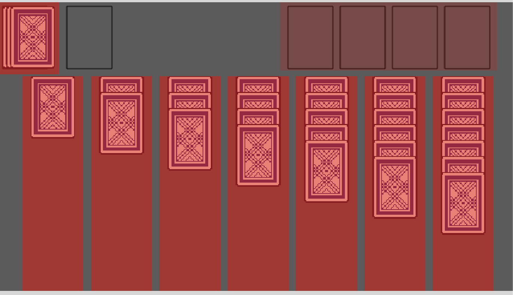
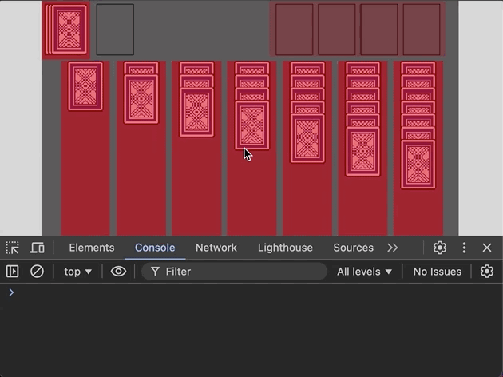
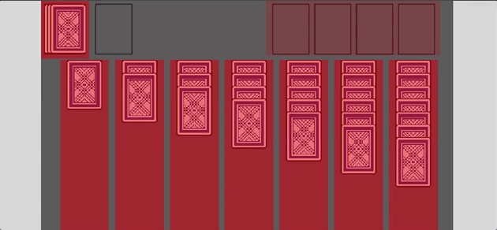

In this tutorial series, we’ll be looking at how to recreate the game Solitaire using the Phaser 3 framework. Here’s an example of what the final game should look like:


Previously, in [part 3](/post/2024/08/solitaire-phaser-3-tutorial-3/), we focused on adding support for player input by listening for click and drag events in our game.

In part 4 of this series, we are going to start working on adding support for moving cards between the various card piles in our game.

With our basic input handling implemented, the next thing we are going to do is start to add support for moving cards between our various piles in our game, and this will include:

* moving cards from the discard pile to tableau piles
* moving cards from the discard pile to the foundation piles
* moving cards from one tableau pile to another
* moving cards from the tableau pile to the foundation piles

In order to add this functionality, we will be adding in new Zone game objects, which we will be using for detecting where a card was dropped in our game.

## Adding Drop Zones

Previously, we added a Zone game object to our draw card pile to allow us to have 1 game object that we can check for click events when we need to draw a card. Not only can Zone game objects be used for detecting click events, we can also use those game objects to see if another game object was dropped on the Zone game object. To do this, we can use the built in helper methods to create a drop zone area and then listen for the `drop` event. To do this, lets go ahead and add the following code to the bottom of the `create` method in the `GameScene` class in the `src/scenes/game-scene.ts` file:

```typescript
this.#createDropZones();
```

and then add the following code to the `GameScene` class:

```typescript
#createDropZones(): void {
  // create drop zone for foundation piles, in the game we will have 1 drop zone and then automatically place the card in the pile it belongs
  // for each drop zone, we add custom data so when the `drag` event listener is invoked, we can run specific logic to that zone type
  let zone = this.add.zone(350, 0, 270, 85).setOrigin(0).setRectangleDropZone(270, 85).setData({
    zoneType: ZONE_TYPE.FOUNDATION,
  });
  if (DEBUG) {
    this.add.rectangle(350, 0, zone.width, zone.height, 0xff0000, 0.2).setOrigin(0);
  }

  // drop zone for each tableau pile in the game (the 7 main piles)
  for (let i = 0; i < 7; i += 1) {
    zone = this.add
      .zone(30 + i * 85, 92, 75.5, 585)
      .setOrigin(0)
      .setRectangleDropZone(75.5, 585)
      .setData({
        zoneType: ZONE_TYPE.TABLEAU,
        tableauIndex: i,
      })
      .setDepth(-1);
    if (DEBUG) {
      this.add.rectangle(30 + i * 85, 92, zone.width, zone.height, 0xff0000, 0.5).setOrigin(0);
    }
  }
}
```

Finally, add the following code to the top of the file with the other variables:

```typescript
type ZoneType = keyof typeof ZONE_TYPE;
// the different type of drop zones, or areas players can drop cards in the game
const ZONE_TYPE = {
  FOUNDATION: 'FOUNDATION',
  TABLEAU: 'TABLEAU',
} as const;
```

In the code above, we did the following:

* First, we created a new variable called `ZONE_TYPE`, and we created a TypeScript type to represent this `type` as well. This new variable is used when we create our new drop zones, and we store this in the data manager on the Zone game objects. This will be used when we listen for the `drop` event, so that way we know which type of drop zone the player dropped the card on.
* Next, we created 8 new Zone game objects in the `#createDropZones` method, 1 Zone for the foundation piles and 7 for each of the Tableau piles. In our game, we will just have the 1 drop zone for the foundation piles and we will have logic to automatically place the card on the correct pile.
* When we created each Zone game object, we called a new method called `setRectangleDropZone`. When we call this method, we need to specify the size of the Rectangle shape that we would like to create for the Drop Zone, and in our code we are using the same size as the Zone game object. When we call this method, this will setup the Zone game object to be enabled for `drop` input, which will allow us to listen for `drop` events. For the time being, we are not doing this and will add this code next.
* Finally, on each Zone game object we are storing some data in the data manager. The first is the `zoneType`, which is how we will know which type of Zone the card game object was added to, and then we set the `tableauIndex`, which will also be used to know which card pile the player was trying to add a card to. We also set the `depth` of each of our drop zones to be `-1`, that way they will be under all of the other game objects we create in our Scene. This is important since if they are placed on top of our other game objects, this can block some of the events from being triggered on those game objects.

If you save your code changes and view the changes in the browser, you should now see 8 new red rectangles that represent the various drop zones in our game.



With the new drop zones created, we now need to listen for events on these game objects. To do this, we need to register a new event listener, so in the `#createDragEvents` method, add the following code to the bottom of the method:

```typescript
this.#createDropEventListener();
```

Next, add the following code to the `GameScene` class:

```typescript
#createDropEventListener(): void {
  // listen for drop events on a game object, this will be used for knowing which card pile a player is trying to add a card game object to
  // which will then trigger validation logic to check if a valid move was maded
  this.input.on(
    Phaser.Input.Events.DROP,
    (pointer: Phaser.Input.Pointer, gameObject: Phaser.GameObjects.Image, dropZone: Phaser.GameObjects.Zone) => {
      const zoneType = dropZone.getData('zoneType') as ZoneType;
      if (zoneType === ZONE_TYPE.FOUNDATION) {
        this.#handleMoveCardToFoundation(gameObject);
        return;
      }
      const tableauIndex = dropZone.getData('tableauIndex') as number;
      this.#handleMoveCardTableau(gameObject, tableauIndex);
    },
  );
}

#handleMoveCardToFoundation(gameObject: Phaser.GameObjects.Image): void {
  console.log('placed card on foundation');
}

#handleMoveCardTableau(gameObject: Phaser.GameObjects.Image, targetTableauPileIndex: number): void {
  console.log('placed card on tableau pile', targetTableauPileIndex);
}
```

In the code above, we created a new private method `#createDropEventListener`, which is were we register a new event listener on the Phaser Scene Input Plugin Manager for the `drop` event. This event listener will be triggered any time a game object is dropped onto one of our drop zones. When this event listener is triggered, we will receive details regarding pointer, the game object that was dropped, and the drop zone the game object was dropped onto. As we process the event, we first check to see what `zoneType` the card game object was dropped onto, and then call a new method associated with that card pile type, and for now we just log a message so we can test.

Now, back in your browser if you try to drag the various card game objects around and drop them on the various drop zones, you should see a message appear in the developer console with details of were the card was dropped.



## Placing Cards

With the new drop zone game objects in place, the next thing we will do is work on adding logic to validate and leave cards in the new locations if a valid move was made. For the time being, part of this logic will be hard coded, but we will have the structure in place for when we have our actual Solitaire game logic. To get started, we will focus on playing cards from the discard pile to the tableau and foundation card piles. When a card from the discard pile is placed onto the foundation pile, or tableau piles, if the move is not valid we will want the card to be placed back on top of the discard pile. If the move is valid, we will need to add that card to the correct pile, and then update the cards displayed in the discard pile.

To get started with this logic, the first thing we will do is create a new class to represent the core Solitaire game logic. By creating the class now, we can define the interface for how we will interact with this class, and hard card values that will be returned. This will allow us to create the logic we need in our `GameScene` class and come back to this new `Solitaire` class later to add the actual logic. In this new class, we will have methods that will be called for validating each of our possible move types. These methods will be responsible for returning a `boolean` value to indicate if a valid move was made.

To do this, we will create a new folder under the `src` folder called `lib`, and in this new folder create a new file called `solitaire.ts`. Next, in the `src/lib/solitaire.ts` file, add the following code:

```typescript
export class Solitaire {
  public newGame(): void {
    //
  }

  public drawCard(): boolean {
    return true;
  }

  public shuffleDiscardPile(): boolean {
    return true;
  }

  public playDiscardPileCardToFoundation(): boolean {
    return true;
  }

  public playDiscardPileCardToTableau(targetTableauIndex: number): boolean {
    return true;
  }

  public flipTopTableauCard(tableauIndex: number): boolean {
    return true;
  }

  public moveTableauCardsToAnotherTableau(
    initialTableauIndex: number,
    cardIndex: number,
    targetTableauIndex: number,
  ): boolean {
    return true;
  }

  public moveTableauCardToFoundation(tableauIndex: number): boolean {
    return true;
  }
}
```

In the code above, we have defined the methods that we will call from `GameScene` class, when one of the card game objects are dropped into drop zone, and for the time being, each of these methods will return `true`. We also added the other `public` methods that will be called, but for the time being we can ignore these. Next, we will need to create an instance of our new class in our `GameScene` class. To do this, we will need to add the following code at the top of the file:

```typescript
import { Solitaire } from '../lib/solitaire';
```

Then, at the top of the `GameScene` class, we will need to create a new private property, which will be an instance of our `Solitaire` class:

```typescript
// contains the core Solitaire game logic and has the actual game state
#solitaire!: Solitaire;
```

Finally, we need to create an instance of our class at the top of our `create` method:

```typescript
// create solitaire game instance
this.#solitaire = new Solitaire();
this.#solitaire.newGame();
```

So now that we have our new `Solitaire` instance, we will start working on adding in the logic to handle when a player drops cards from the discard pile onto the foundation piles. In the `#handleMoveCardToFoundation` method, we will need to check to see if the card that was dropped came from the discard pile, or from a tableau pile. To do this, we will check the data manager on the game object to see if the `pileIndex` field is set, and if so, then we know the card came from a tableau card pile. To do this, update the logic in the `#handleMoveCardToFoundation` method to be:

```typescript
let isValidMove = false;
let isCardFromDiscardPile = false;

// check if card is from discard pile or tableau pile based on the pileIndex in the data manager
const tableauPileIndex = gameObject.getData('pileIndex') as number | undefined;
if (tableauPileIndex === undefined) {
  isValidMove = this.#solitaire.playDiscardPileCardToFoundation();
  isCardFromDiscardPile = true;
} else {
  isValidMove = this.#solitaire.moveTableauCardToFoundation(tableauPileIndex);
}

// if this is not a valid move, we don't need to update anything on the card since the `dragend` event handler will
// move the card back to the original location
if (!isValidMove) {
  return;
}

// update discard pile cards, or flip over tableau cards if needed
if (isCardFromDiscardPile) {
  this.#updateCardGameObjectsInDiscardPile();
} else {
  this.#handleRevealingNewTableauCards(tableauPileIndex as number);
}

// only destroy card from tableau, since we need to reuse the card from the discard pile
if (!isCardFromDiscardPile) {
  gameObject.destroy();
}
// update our phaser game objects
this.#updateFoundationPiles();
```

Then, add the following code to the `GameScene` class:

```typescript
/**
 * Updates the top and bottom cards in the discard pile to reflect the state from the Solitaire
 * game instance.
 */
#updateCardGameObjectsInDiscardPile(): void {
  // update the top card in the discard pile to reflect the card below it
  this.#discardPileCards[1].setFrame(this.#discardPileCards[0].frame).setVisible(this.#discardPileCards[0].visible);
  // update the bottom card in the discard pile to have the correct value based on the solitaire game state
  this.#discardPileCards[0].setVisible(false);

  // TODO: grab card state from Solitaire instance and update bottom card frame based on state
}

/**
 * Checks the tableau pile that the played card came from to see if we now need to flip the next
 * card in the stack.
 */
#handleRevealingNewTableauCards(tableauPileIndex: number): void {
  // TODO
}

/**
 * Updates each card in the foundation piles to have the latest card frame after a card is dropped in the
 * foundation zone. Will make the card visible if an Ace is played.
 */
#updateFoundationPiles(): void {
  // TODO
}
```

In the code above, we attempt to grab the `pileIndex` field from the card game objects data manager, and if this is found, we call the `moveTableauCardToFoundation` method on our Solitaire game instance. If the `pileIndex` is not found, we call the `playDiscardPileCardToFoundation` method on the Solitaire game instance. In both cases, these methods will return a `boolean` value indicating if this was a valid move. If the move is not valid, then we will return early from the method and rely on the `dragend` event listener to place the game object back in the original position.

If the move is valid, then we call the new methods that we added. For the time being, these methods will do nothing. Finally, if the card was from the `tableau` card piles, then we call the `destroy` method on the game object to remove that game object from our game. The reason we are destroying the game object is, in our foundation card piles we have 4 card game objects that are used for displaying the current card, and so we can remove the card game object that was placed up there.

In the `#updateCardGameObjectsInDiscardPile` method, this logic is similar to the `pointerdown` event listener logic that we added to the draw pile. In this case, we are updating the top card to match the bottom card that was below it, and we are doing this by updating the `frame` and the `visibility` of the game object. We then update the bottom card to not be visible. For the time being, this will work, but we will need to update this later to match the state of the Solitaire game instance.

Now, back in the browser if you drag cards from one tableau pile onto the foundation drop zone, those cards will be removed from the game. If you draw cards and add those cards to the foundation pile, eventually the discard pile will appear empty.


So now that we are destroying some of our card game objects, we will need to modify the logic in our `dragend` event listener to make sure the game object is still active before we attempt to modify the game object. This is needed because once we call `destroy` on the game objects, Phaser will start to cleanup these objects from our game internally, and if we try to do things like update the texture, or modify the data in the data manager, we will get an error. When the game object is being destroyed, Phaser will update the `active` property on the game object to be set to `false`, and so we can check for this value in our event listener. To do this, we can remove the following code from the event listener in the `#createDragEndEventListener` method:

```typescript
// TODO: check if game object overlaps with foundation
// TODO: check if game object overlaps with tableau
// TODO: check if game object overlaps with with multiple tableau piles and determine were to place game object
// TODO: if game object was not destroyed, still active, we need to update that game objects data to match were the card was placed
```

and we can add then wrap the remaining logic in an `if` statement like so:

```typescript
// if game object was not destroyed, still active, we need to update that game objects data to match were the card was placed
if (gameObject.active) {
  gameObject.setPosition(gameObject.getData('x') as number, gameObject.getData('y') as number);
  // reset card game objects alpha since we are done moving the object
  gameObject.setAlpha(1);

  // if card is part of the tableau, we need to move all cards that are stacked on top of this card back to the original location as well
  const cardIndex = gameObject.getData('cardIndex') as number;
  if (tableauPileIndex !== undefined) {
    const numberOfCardsToMove = this.#getNumberOfCardsToMoveAsPartOfStack(tableauPileIndex, cardIndex);
    for (let i = 1; i <= numberOfCardsToMove; i += 1) {
      const cardToMove = this.#tableauContainers[tableauPileIndex].getAt<Phaser.GameObjects.Image>(
        cardIndex + i,
      );
      cardToMove.setPosition(cardToMove.getData('x') as number, cardToMove.getData('y') as number);
    }
  }
}
```

The reason we are removing the other `TODO`s is because we are now handling those checks in the `drop` event listener.

## Adding Cards To Tableau

So now that we have the base logic in place for placing cards on the foundation piles, we need to add similar logic for placing cards on the tableau piles, and we will do this logic in the `#handleMoveCardTableau` method. For this logic, we first need to check if the card being added to a tableau pile is from the discard pile, or from another tableau pile. Once this is determined, we will check if the card movement was valid, then we will move the card, or cards, to the correct tableau stack. To do this, we will need to add the following logic to the `#handleMoveCardTableau` method:

```typescript
  let isValidMove = false;
  let isCardFromDiscardPile = false;

  // store reference to the original size of the tableau pile so we know were to place game object
  const originalTargetPileSize = this.#tableauContainers[targetTableauPileIndex].length;

  // check if card is from discard pile or tableau pile based on the pileIndex in the data manager
  const tableauPileIndex = gameObject.getData('pileIndex') as number | undefined;
  const tableauCardIndex = gameObject.getData('cardIndex') as number;
  if (tableauPileIndex === undefined) {
    isValidMove = this.#solitaire.playDiscardPileCardToTableau(targetTableauPileIndex);
    isCardFromDiscardPile = true;
  } else {
    isValidMove = this.#solitaire.moveTableauCardsToAnotherTableau(
      tableauPileIndex,
      tableauCardIndex,
      targetTableauPileIndex,
    );
  }

  // if this is not a valid move, we don't need to update anything on the card(s) since the `dragend` event handler will
  // move the card(s) back to the original location
  if (!isValidMove) {
    return;
  }

  // add single discard pile card to tableau as a new game object
  if (isCardFromDiscardPile) {
    const card = this.#createCard(
      0,
      originalTargetPileSize * 20,
      true,
      originalTargetPileSize,
      targetTableauPileIndex,
    );
    card.setFrame(gameObject.frame);
    this.#tableauContainers[targetTableauPileIndex].add(card);
    // update the remaining cards in discard pile
    this.#updateCardGameObjectsInDiscardPile();
    return;
  }

  // for each card in the current stack that is being moved, we need to remove the card from
  // the existing container and add to the target tableau container
  const numberOfCardsToMove = this.#getNumberOfCardsToMoveAsPartOfStack(tableauPileIndex as number, tableauCardIndex);
  for (let i = 0; i <= numberOfCardsToMove; i += 1) {
    const cardGameObject =
      this.#tableauContainers[tableauPileIndex as number].getAt<Phaser.GameObjects.Image>(tableauCardIndex);
    this.#tableauContainers[tableauPileIndex as number].removeAt(tableauCardIndex);
    this.#tableauContainers[targetTableauPileIndex].add(cardGameObject);

    // update phaser game object data to match the new values for tableau and card index
    const cardIndex = originalTargetPileSize + i;
    cardGameObject.setData({
      x: 0,
      y: cardIndex * 20,
      cardIndex,
      pileIndex: targetTableauPileIndex,
    });
  }

  // update depth on container to be the original value
  this.#tableauContainers[tableauPileIndex as number].setDepth(0);

  // get the cards tableau pile and check to see if the new card at the bottom of the stack should be flipped over
  this.#handleRevealingNewTableauCards(tableauPileIndex as number);
```

In the code above we did logic very similar to what we did in the `#handleMoveCardToFoundation` method. First, we checked if the card that was played came from the discard pile, or from another tableau pile. Based on this check, we then call the relevant method in our `Solitaire` class to make sure the move is valid, and if the move is not valid we return early. If the move is valid, then we do the following logic based on were the card, or cards came from:

* If the card came from the discard pile, then we create a brand new Card Image game object and update the frame on this game object to match the card that was played. We then add this card to the target tableau card pile and position the game object to appear as the bottom card on the stack. Finally, we call the method to update our cards in our discard pile to show that we played the last card.
* If the card came from another tableau pile, then the first thing we check to see how many cards are being moved. For each card that is being moved, we grab those Image game objects from the original `tableauContainer` the card is in and remove that game object from that container. We then add that card to the `tableauContainer` that is tied to the tableau pile we are moving the card to. Finally, we update the data in the data manager to match the new location for the card, and we call the `#handleRevealingNewTableauCards` method, which will be responsible for flipping over the next card in a tableau pile if needed.

Now, back in the browser if you drag cards from one tableau pile onto another tableau pile, those cards will be moved to the other pile. If you draw cards and add those cards to a tableau pile, those cards will show up as new cards on the tableau pile and eventually the discard pile will appear empty.



Now, if you want to test the logic for invalid moves, if you open the `Solitaire` class, and update all of the methods to return `false`, if you do the same tests as before, you will see all of the cards will snap back to the original locations.


## Summary

All right, with those last changes that brings an end to this part of the tutorial. In this part of the tutorial, we continued working on our Solitaire game and we focused on adding logic to move cards between the various piles in our game and we started to stub out the class that will be used for the core Solitaire game logic.

You can find the completed source code for this article here on GitHub: [Part 4 Source Code](https://github.com/devshareacademy/phaser-3-solitaire-tutorial/tree/moving_cards)

If you run into any issues, please reach out via [GitHub Discussions](https://github.com/devshareacademy/phaser-3-solitaire-tutorial/discussions), or leave a comment down below.

In [part 5](/post/2024/08/solitaire-phaser-3-tutorial-5/) of this series, we work on adding the core game logic to our `Solitaire` class and connect this logic to our `GameScene`.
