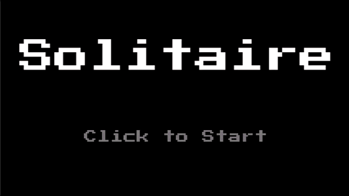

In this tutorial series, we’ll be looking at how to recreate the game Solitaire using the Phaser 3 framework. Here’s an example of what the final game should look like:

Previously, in [part 3](/post/2024/08/solitaire-phaser-3-tutorial-3/), we focused on adding support for player input by listening for click and drag events in our game.

In part 4 of this series, we are going to start working on adding support for moving cards between the various card piles in our game.

With our basic input handling implemented, the next thing we are going to do is start to add support for moving cards between our various piles in our game, and this will include:

* moving cards from the discard pile to tableau piles
* moving cards from the discard pile to the foundation piles
* moving cards from one tableau pile to another
* moving cards from the tableau pile to the foundation piles

In order to add this functionality, we will be adding in new Zone game objects, which we will be using for detecting where a card was dropped in our game.

## Adding Drop Zones

TODO

## Summary

All right, with those last changes for drawing cards, that brings an end to this part of the tutorial. In this part of the tutorial, we continued working on our Solitaire game and we focused on making the game interactive and adding support for player input.

You can find the completed source code for this article here on GitHub: [Part 3 Source Code](https://github.com/devshareacademy/phaser-3-solitaire-tutorial/tree/player_input)

If you run into any issues, please reach out via [GitHub Discussions](https://github.com/devshareacademy/phaser-3-solitaire-tutorial/discussions), or leave a comment down below.

In [part 4](/post/2024/08/solitaire-phaser-3-tutorial-4/) of this series, we will start to add logic to allow us to move cards between the various card piles in our game.
