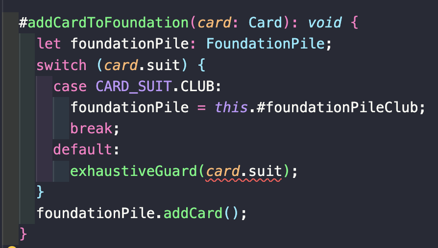
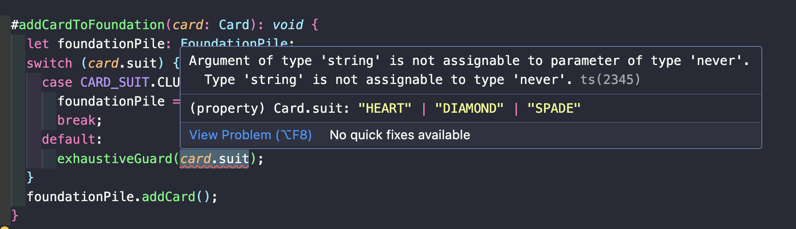
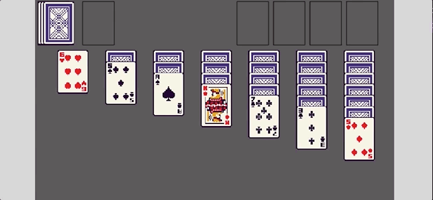

In this tutorial series, we’ll be looking at how to recreate the game Solitaire using the Phaser 3 framework. Here’s an example of what the final game should look like:


Previously, in [part 4](/post/2024/08/solitaire-phaser-3-tutorial-4/), we focused on adding support for moving cards between the various card piles in our game, and we started to stub out the `Solitaire` class that will have the core logic for our Solitaire game.

In part 5 of this series, we are going to start working on building out the `Solitaire` class and adding the actual logic for our game. We will then work on connecting this logic to our Phaser game instance.

## Deck Of Cards

To get us started with building out the core game logic for our Solitaire game, the first thing we will handle is creating types and data models to represent our deck of cards. In the game of Solitaire, we use a standard deck of 52 cards, which has the following attributes:

* There are two card colors: red and black.
* There are four card suites: spades, clubs, diamonds, and hearts.
* All cards that are in the hearts or diamonds suits, will be the color red.
* All cards that are in the spades or clubs suits, will be the color black.
* Each suit will have 13 cards, the ace, the numbers 2 through 10, a jack, a queen, and a king.
  * To make it easier to work with the various cards, we will assign each card a value, and we will represent the card as a number 1 through 13.
  * The ace will be 1, numbers 2 through 10 will be numbers 2 through 10, the jack is 11, queen is 12, and king is 13.
* Each card in the game will be in one of two states, either face up or face down.
  * When the card is face down, we will show the player the card back frame, and the player cannot drag these cards.
  * When the card is face up, we will show the player the correct card frame and the player can drag these cards if it is not in the foundation pile.

To get started with modeling the deck of cards in our code, the first thing we will do is create a new file to contain all of the common code for our deck of cards. In the `src/lib` folder create a new file called `common.ts`, and add the following code to the file:

```typescript
export type CardSuit = keyof typeof CARD_SUIT;

export const CARD_SUIT = {
  HEART: 'HEART',
  DIAMOND: 'DIAMOND',
  SPADE: 'SPADE',
  CLUB: 'CLUB',
} as const;

export type CardValue = 1 | 2 | 3 | 4 | 5 | 6 | 7 | 8 | 9 | 10 | 11 | 12 | 13;

export type CardSuitColor = keyof typeof CARD_SUIT_COLOR;

export const CARD_SUIT_COLOR = {
  RED: 'RED',
  BLACK: 'BLACK',
} as const;

export const CARD_SUIT_TO_COLOR = {
  [CARD_SUIT.CLUB]: CARD_SUIT_COLOR.BLACK,
  [CARD_SUIT.SPADE]: CARD_SUIT_COLOR.BLACK,
  [CARD_SUIT.DIAMOND]: CARD_SUIT_COLOR.RED,
  [CARD_SUIT.HEART]: CARD_SUIT_COLOR.RED,
} as const;
```

In the code above, we create new variables and types to represent the attributes of our deck of cards. Next, we will create a class to represent the Card object in our deck of cards. To do this, create a new file in the `src/lib` folder called `card.ts`, and add the following code:

```typescript
import { CARD_SUIT_TO_COLOR, CardSuit, CardSuitColor, CardValue } from './common';

export class Card {
  #suit: CardSuit;
  #value: CardValue;
  #faceUp: boolean;

  constructor(suit: CardSuit, value: CardValue, isFaceUp = false) {
    this.#suit = suit;
    this.#value = value;
    this.#faceUp = isFaceUp;
  }

  get suit(): CardSuit {
    return this.#suit;
  }

  get value(): CardValue {
    return this.#value;
  }

  get isFaceUp(): boolean {
    return this.#faceUp;
  }

  get color(): CardSuitColor {
    return CARD_SUIT_TO_COLOR[this.#suit];
  }

  public flip(): void {
    this.#faceUp = !this.#faceUp;
  }
}
```

For the `Card` class, we added three properties to keep track of the suit, the value of the card, and if the card is face up or not. Besides this, we added a few getters to get these properties, and one special getter to get the cards color based on the suit of the card. Finally, we added a public method to flip the card over.

Now that we have defined the object to represent our cards, the next thing we need to do is create a class to represent the full deck of cards. For our deck of cards, we will need the following functionality:

* Ability to construct a deck with 52 unique cards (13 cards in each suit).
* Have a discard and draw pile.
* Ability to draw a card from the draw pile.
* Have ability to shuffle the deck of cards, and to re-add the cards from the discard pile back into our draw pile.

So, in order to create this functionality, we need to create a new file under the `src/lib` folder called `deck.ts`, and in this file place the following code:

```typescript
import { Card } from './card';
import { CARD_SUIT, CardValue } from './common';
import { shuffleArray } from './utils';

export class Deck {
  #cards: Card[];
  #drawPile: Card[];
  #discardPile: Card[];

  constructor() {
    this.#cards = [];
    this.#drawPile = [];
    this.#discardPile = [];
    this.#createDeck();
    this.reset();
  }

  get cards(): Card[] {
    return this.#cards;
  }

  get drawPile(): Card[] {
    return this.#drawPile;
  }

  get discardPile(): Card[] {
    return this.#discardPile;
  }

  public draw(): Card | undefined {
    return this.#drawPile.shift();
  }

  public shuffle(): void {
    shuffleArray(this.#drawPile);
  }

  public shuffleInDiscardPile(): void {
    this.#discardPile.forEach((card) => {
      card.flip();
      this.#drawPile.push(card);
    });
    this.#discardPile = [];
  }

  public reset(): void {
    this.#discardPile = [];
    this.#drawPile = [...this.#cards];
    this.shuffle();
  }

  #createDeck(): void {
    Object.values(CARD_SUIT).forEach((suit) => {
      for (let i = 1; i < 14; i += 1) {
        this.#cards.push(new Card(suit, i as CardValue));
      }
    });
  }
}
```

In the code above, we created a new class that has three private properties for tracking the cards in our deck. We then added getters to return the values of these properties, and we added in public methods to allow us to: draw cards, shuffle the deck, and to re-shuffle back in the discard cards back into the draw pile. For the `shuffleInDiscardPile` method, one of the things in Solitaire is when you add the discard pile of cards back into the draw pile, you don't actually shuffle the cards, instead you just flip the card pile over and start drawing cards again. To recreate this, we just loop through pile of cards and add those cards in that order to the draw pile array. This is because when we draw cards, we are taking them from end of the array. Finally, in the `#createDeck` method, to create the deck of cards, we are looping through each of our card suits, and for each of these we are looping through the values of 1 through 13, and creating a card instance for each of these.

For the `shuffle` method, this is referring to a utility function that we have not created yet. To shuffle the cards, we will use a common algorithm called [Fisher Yates Shuffle](https://en.wikipedia.org/wiki/Fisher%E2%80%93Yates_shuffle), which is an in place shuffle algorithm. At a high level, we loop through the array we want to shuffle in reverse, and then choose a random index to switch elements in the array around. To create this function, create a new file in the `src/lib` folder called `utils.ts` and add the following code:

```typescript
export function shuffleArray<T>(array: T[]): void {
  for (let i = array.length - 1; i > 0; i -= 1) {
    const j = Math.floor(Math.random() * i);
    const temp = array[i];
    array[i] = array[j];
    array[j] = temp;
  }
}

/**
 * Utility function to ensure we handle the full possible range of types when checking a variable for a possible
 * type in a union.
 *
 * A good example of this is when we check for all of the possible values in a `switch` statement, and we want
 * to ensure we check for all possible values in an enum type object.
 */
export function exhaustiveGuard(_value: never): never {
  throw new Error(`Error! Reached forbidden guard function with unexpected value: ${JSON.stringify(_value)}`);
}
```

In the code above, we also introduced a new utility function called `exhaustiveGuard`. This function has not been used yet, and will be used in our `Solitaire` class. This is a special function that can be used as a guard to make sure we handle the full range of options when checking a variable, and if we don't, our editor will warn us of the cases that we did not cover in our code. Once we get to this in our code, we will see an example of this, and for the time being we can ignore this function.

So one last thing we are going to do before we jump into our `Solitaire` class, is we are going to create a class to model one of our foundation piles. For the foundation piles, we will need to be able to support the following functionality:

* Have properties to keep track of the card suit that goes on that pile, and the current value of the pile.
* Have methods to reset the initial value of the foundation pile, and to add a new card to the foundation pile.

To do this, create a new file in the `src/lib` folder called `foundation-pile.ts`, and add the following code to the file:

```typescript
import { CardSuit, CardValue } from './common';

export class FoundationPile {
  #suit: CardSuit;
  #currentValue: CardValue | 0;

  constructor(suit: CardSuit) {
    this.#suit = suit;
    this.#currentValue = 0;
  }

  get suit(): CardSuit {
    return this.#suit;
  }

  get value(): CardValue | 0 {
    return this.#currentValue;
  }

  public addCard(): void {
    if (this.#currentValue === 13) {
      return;
    }

    this.#currentValue += 1;
  }

  public reset(): void {
    this.#currentValue = 0;
  }
}
```

With the `FoundationPile` class created, that wraps up the classes and models we need to represent our deck of cards and other types needed for the game of Solitaire. So with these finished, we can now switch to working on adding the core logic we need in our `Solitaire` class.

## Core Solitaire Logic

For the game of Solitaire, we will need to add support for the following: the deck of cards, draw pile, discard pile, the four foundation piles, and the seven tableau piles. For these properties, we will need to be able to retrieve the details of them from our `GameScene` class, that way we can have our Phaser Game state match the actual Solitaire game state. To do all of this, open the `Solitaire` class and add the following code:

```typescript
#deck: Deck;
#foundationPileSpade: FoundationPile;
#foundationPileClub: FoundationPile;
#foundationPileHeart: FoundationPile;
#foundationPileDiamond: FoundationPile;
#tableauPiles: Card[][];

constructor() {
  this.#deck = new Deck();
  this.#foundationPileClub = new FoundationPile(CARD_SUIT.CLUB);
  this.#foundationPileSpade = new FoundationPile(CARD_SUIT.SPADE);
  this.#foundationPileHeart = new FoundationPile(CARD_SUIT.HEART);
  this.#foundationPileDiamond = new FoundationPile(CARD_SUIT.DIAMOND);
  this.#tableauPiles = [[], [], [], [], [], [], []];
}

get drawPile(): Card[] {
  return this.#deck.drawPile;
}

get discardPile(): Card[] {
  return this.#deck.discardPile;
}

get tableauPiles(): Card[][] {
  return this.#tableauPiles;
}

get foundationPiles(): FoundationPile[] {
  return [
    this.#foundationPileSpade,
    this.#foundationPileClub,
    this.#foundationPileHeart,
    this.#foundationPileDiamond,
  ];
}

get wonGame(): boolean {
  return (
    this.#foundationPileClub.value === 13 &&
    this.#foundationPileDiamond.value === 13 &&
    this.#foundationPileHeart.value === 13 &&
    this.#foundationPileSpade.value === 13
  );
}
```

Next, add the following `import` statements to the top of our `Solitaire` class file:

```typescript
import { Card } from './card';
import { CARD_SUIT } from './common';
import { Deck } from './deck';
import { FoundationPile } from './foundation-pile';
import { exhaustiveGuard } from './utils';
```

In the code above, we created new private properties to track our various card piles in our game, and in our `constructor`, we created new instances of our `Deck` and `FoundationPile` classes. For the foundation piles, we created an instance of the `FoundationPile` class for each card suit, and for the tableau piles, this will be a 2D array that will contain `Card` instances. We then created getters to return these private properties, and we created two custom getters: `foundationPiles` and `wonGame`. The `foundationPiles` getter will return an array of all of our foundation piles, and the `wonGame` getter will return a boolean value if we have managed to add all of the cards to the foundation piles.

### New Game Logic

With the basic structure of our `Solitaire` class in place, we can now start working on building the actual logic for our class. To get started, we will focus on the `newGame` method. For the `newGame` method, this method will be responsible for setting up our card piles in our game. To do this, we will reset our game state so that all of our card piles are empty, and our deck of cards will be shuffled. Once we do this, we will need to deal out cards to our 7 tableau card piles to match how our tableau piles are laid out in the `GameScene` class (1st pile has 1 card, 2nd pile has 2 cards, 3rd pile has 3 cards, and so on until we have 7 piles).

To do this, update the `newGame` method to match the following code:

```typescript
/**
 * Resets the solitaire game state and setups up the game state for a new game by building the tableau piles that are needed.
 */
public newGame(): void {
  /**
   * Rules for game setup:
   *
   * To form the tableau, seven piles need to be created. Starting from left to right, place the first card face up to make the first pile,
   * deal one card face down for the next six piles. Starting again from left to right, place one card face up on the second pile and deal
   * one card face down on piles three through seven. Starting again from left to right, place one card face up on the third pile and deal
   * one card face down on piles four through seven. Continue this pattern until pile seven has one card facing up on top of a pile of six
   * cards facing down.
   *
   * The remaining cards form the stock (or “hand”) pile and are placed above the tableau.
   *
   * When starting out, the foundations and waste pile do not have any cards.
   */
  this.#deck.reset();
  this.#tableauPiles = [[], [], [], [], [], [], []];
  this.#foundationPileClub.reset();
  this.#foundationPileDiamond.reset();
  this.#foundationPileHeart.reset();
  this.#foundationPileSpade.reset();

  for (let i = 0; i < 7; i += 1) {
    for (let j = i; j < 7; j += 1) {
      const card = this.#deck.draw() as Card;
      if (j === i) {
        card.flip();
      }
      this.#tableauPiles[j].push(card);
    }
  }
}
```

At this point, if we called the `newGame` method, our game state would look like the following:

* The draw pile would have 24 cards, and the discard pile would have 0 cards.
* The foundation piles would have 0 cards.
* The seven tableau piles would have 28 cards like so: [1, 2, 3, 4, 5, 6, 7].

### Draw Card Logic

For the `drawCard` method, when we draw a new card from the draw pile, we will want to flip this card over and add that card to the top of the discard pile. Besides this, we will return a boolean value indicating if we drew a new card or not. To do this, update the `drawCard` method to match the following code:

```typescript
public drawCard(): boolean {
  const card = this.#deck.draw();
  if (card === undefined) {
    return false;
  }
  card.flip();
  this.#deck.discardPile.push(card);
  return true;
}
```

### Shuffle Discard Pile Logic

For the `shuffleDiscardPile` method, we just need to call the `shuffleInDiscardPile` method on our `deck` instance. Besides this, we will also add a check to make sure that our draw card pile is empty, and then return a `boolean` value if we actually shuffled our cards. To do this, update the `shuffleDiscardPile` method to match the following code:

```typescript
public shuffleDiscardPile(): boolean {
  if (this.#deck.drawPile.length !== 0) {
    return false;
  }

  this.#deck.shuffleInDiscardPile();
  return true;
}
```

### Play Discard Cards

For playing our discard cards, there are two possible moves: the card was played to a foundation pile, or the card was played to a tableau pile. For both of these scenarios, we will want to validate if the card that was played is valid, and if so, then we add the `Card` instance to that location. For these changes, we will focus on the `playDiscardPileCardToFoundation` method first. When we play a card from the discard pile to the foundation pile, we will want do the following:

* First, get a reference to the top card in the discard pile. If there are no cards in the discard pile, we can return `false` since this is not a valid move.
* Next, for the card that is being added, we will check the appropriate foundation pile and make sure this is the next card in the sequence. As an example, if I am trying to play the four of spades to the foundation pile, I will check the `#foundationPileSpade` property, and see if the current value is `3`. If the current value is not `3`, then we would return `false`.
* If the move is valid, then we just need to call the `addCard` method on our `FoundationPile` instance, and then we can remove this card from the discard pile array.

To do this logic, update the `playDiscardPileCardToFoundation` method to match the following code:

```typescript
public playDiscardPileCardToFoundation(): boolean {
  // get the top card of the discard pile (last element in array)
  const card = this.#deck.discardPile[this.#deck.discardPile.length - 1];
  if (card === undefined) {
    return false;
  }

  // based on the suit, check the correct foundation pile for the current value to make sure this is the next card
  if (!this.#isValidMoveToAddCardToFoundation(card)) {
    return false;
  }

  // play card to the foundation pile and remove from the discard pile
  this.#addCardToFoundation(card);
  this.#deck.discardPile.pop();

  return true;
}
```

Next, add the following code to the `Solitaire` class:

```typescript
#addCardToFoundation(card: Card): void {
  let foundationPile: FoundationPile;
  switch (card.suit) {
    case CARD_SUIT.CLUB:
      foundationPile = this.#foundationPileClub;
      break;
    case CARD_SUIT.SPADE:
      foundationPile = this.#foundationPileSpade;
      break;
    case CARD_SUIT.HEART:
      foundationPile = this.#foundationPileHeart;
      break;
    case CARD_SUIT.DIAMOND:
      foundationPile = this.#foundationPileDiamond;
      break;
    default:
      exhaustiveGuard(card.suit);
  }
  foundationPile.addCard();
}

#isValidMoveToAddCardToFoundation(card: Card): boolean {
  let foundationPile: FoundationPile;
  switch (card.suit) {
    case CARD_SUIT.CLUB:
      foundationPile = this.#foundationPileClub;
      break;
    case CARD_SUIT.SPADE:
      foundationPile = this.#foundationPileSpade;
      break;
    case CARD_SUIT.HEART:
      foundationPile = this.#foundationPileHeart;
      break;
    case CARD_SUIT.DIAMOND:
      foundationPile = this.#foundationPileDiamond;
      break;
    default:
      exhaustiveGuard(card.suit);
  }
  return card.value === foundationPile.value + 1;
}
```

In the code above, we used the `suit` of the card being played to select the appropriate foundation card pile, and we used a `switch` statement to do this. One thing to note is, in the `default` block of the `switch` statement, we are using the `exhaustiveGuard` function we created before to make sure we cover each type of `CARD_SUIT` we have defined. Right now, since we have covered each possible case, there are no warnings in our IDE related to our code. If we modified our code so we did not include each `CARD_SUIT` variation, like so:



Then in our IDE, we would see a warning since we did not cover each possible value, like so:



So now, for the `playDiscardPileCardToTableau` method, when we play a card from the discard pile to a tableau pile, we will need to do the following:

* First, get a reference to the top card in the discard pile. If there are no cards in the discard pile, we can return `false` since this is not a valid move.
* Next, for the card that is being added, we will check the appropriate tableau pile and make sure this is a valid card in the sequence. As an example, if the tableau pile had a `5` of `diamonds` face up, I would be able to play either the `4` of `spades` or `4` of `clubs`. For the next card in the sequence, the card has to be the opposite color, and the next number when counting down. If a valid move is not made, we would return `false`.
* If the move is valid, then we just need to push this card into the tableau array, for the pile we are adding the card to, and then we can remove this card from the discard pile array.
* If the tableau pile is empty, then the only card that can be played is a king, and this can be any suit.

To do this logic, update the `playDiscardPileCardToTableau` method to match the following code:

```typescript
public playDiscardPileCardToTableau(targetTableauIndex: number): boolean {
  // get the top card of the discard pile (last element in array)
  const card = this.#deck.discardPile[this.#deck.discardPile.length - 1];
  if (card === undefined) {
    return false;
  }

  const targetTableauPile = this.#tableauPiles[targetTableauIndex];
  if (targetTableauPile === undefined) {
    return false;
  }

  // based on the card suit color and card number, check that this card is allowed as the next card in the target tableau
  if (!this.#isValidMoveToAddCardToTableau(card, targetTableauPile)) {
    return false;
  }

  // play card to the tableau pile and remove from the discard pile
  this.#tableauPiles[targetTableauIndex].push(card);
  this.#deck.discardPile.pop();

  return true;
}
```

Next, add the following code to the `Solitaire` class:

```typescript
#isValidMoveToAddCardToTableau(card: Card, tableauPile: Card[]): boolean {
  // if tableau is empty, only allow king (13) to be placed
  if (tableauPile.length === 0) {
    return card.value === 13;
  }

  // get reference to the last card in the tableau pile
  const lastTableauCard = tableauPile[tableauPile.length - 1];

  // if last card in tableau is an ace (1), no cards can be added
  if (lastTableauCard.value === 1) {
    return false;
  }

  // validate next card in a tableau is the opposite color and next card in sequence, example red 8 -> black 7
  if (lastTableauCard.color === card.color) {
    return false;
  }
  if (lastTableauCard.value !== card.value + 1) {
    return false;
  }

  return true;
}
```

In the code above, to check if a card can be played to a tableau pile, the first thing we do is check if the pile is empty. If there are no cards, then the only card that can be played is a king, or a card with a value of `13`. If the pile is not empty, then we get a reference to the last card in the stack, and then make sure that the card we are adding is the opposite color, and the next number in sequence, counting down. Finally, we return `true`, if the move is valid.

### Moving Tableau Cards

For moving the tableau cards around, there are two main things we can do: move one card from a tableau pile to a foundation pile, or move one or more cards from a tableau pile to another pile. For these changes, we will focus on the `moveTableauCardToFoundation` method first. When we play a card from a tableau pile to a foundation pile, we need to do the following steps:

* First, get a reference to the last card in the tableau pile. If there are no cards in the tableau pile, we can return `false` since this is not a valid move.
* Next, for the card that is being added, we will check the appropriate foundation pile and make sure this is the next card in the sequence.
* If the move is valid, then we just need to call the `addCard` method on our `FoundationPile` instance, and then we can remove this card from the tableau pile array.

To do this logic, update the `playDiscardPileCardToFoundation` method to match the following code:

```typescript
public moveTableauCardToFoundation(tableauIndex: number): boolean {
  // get the last card in the tableau pile that was provided (last element in the pile array)
  const tableauPile = this.#tableauPiles[tableauIndex];
  if (tableauPile === undefined) {
    return false;
  }
  const card = tableauPile[tableauPile.length - 1];
  if (card === undefined) {
    return false;
  }

  // based on the card suit, check the correct foundation pile for the current value to make sure this is the next card
  if (!this.#isValidMoveToAddCardToFoundation(card)) {
    return false;
  }

  // play card to the foundation pile and remove from the tableau pile
  this.#addCardToFoundation(card);
  tableauPile.pop();

  return true;
}
```

In the code above, this is very similar to the logic in our `playDiscardPileCardToFoundation` method. The main difference is we are just adding a safeguard to make sure a valid `tableauIndex` was provided.

Next, for moving cards from one tableau pile to another, we need to do the following steps:

* For the provided tableau pile and card index, we need to make sure the provide card is currently face up (visible to the player). If the card is not visible, then we can return early.
* Next, for the card that is being added, we will check the appropriate tableau pile and make sure this is a valid card in the sequence.
* If the move is valid, than for each card that was part of the stack that was being moved, we need to add those cards to the new tableau pile array, and remove those cards from the previous tableau pile array.

To do this logic, update the `moveTableauCardsToAnotherTableau` method to match the following code:

```typescript
public moveTableauCardsToAnotherTableau(
  initialTableauIndex: number,
  cardIndex: number,
  targetTableauIndex: number,
): boolean {
  const initialTableauPile = this.#tableauPiles[initialTableauIndex];
  const targetTableauPile = this.#tableauPiles[targetTableauIndex];
  if (initialTableauPile === undefined || targetTableauPile === undefined) {
    return false;
  }

  // get the starting card from the first tableau pile
  const card = initialTableauPile[cardIndex];
  if (card === undefined) {
    return false;
  }

  // validate that the card is visible to the player
  if (!card.isFaceUp) {
    return false;
  }

  // based on the suit color and card number, check that this card is allowed as the next card in the target tableau
  if (!this.#isValidMoveToAddCardToTableau(card, targetTableauPile)) {
    return false;
  }

  // move the cards to the target tableau pile and remove from the initial tableau pile
  const cardsToMove = initialTableauPile.splice(cardIndex);
  cardsToMove.forEach((card) => targetTableauPile.push(card));

  return true;
}
```

In the code above, this is similar to the logic we added in the `playDiscardPileCardToTableau` method. The main differences are that we added a few safeguards to make sure the provided tableau indexes and card index values are valid, and that the card is visible to the player. Lastly, since we can move a stack of cards, instead of a single card, we need to make sure we move each card to the correct tableau pile array.

### Flip Tableau Card

The last piece of logic we need to add to our `Solitaire` class, is the logic for the `flipTopTableauCard` method. In this method, we will be using this to check if we need to flip the last card in a tableau pile over, and we return a `boolean` value indicating if we flipped the card over or not. This will be used after we move the last visible card in a tableau pile to another tableau pile, or the foundation pile.

To do this logic, update the `flipTopTableauCard` method to match the following code:

```typescript
public flipTopTableauCard(tableauIndex: number): boolean {
  // get the last card in the tableau pile that was provided (last element in the pile array)
  const tableauPile = this.#tableauPiles[tableauIndex];
  if (tableauPile === undefined) {
    return false;
  }
  const card = tableauPile[tableauPile.length - 1];
  if (card === undefined) {
    return false;
  }

  if (card.isFaceUp) {
    return false;
  }

  card.flip();
  return true;
}
```

In the code above, we added a few safeguards to make sure the provided tableau pile is valid, and we make sure the pile is not empty. We then grab a reference to the last card in the array and check to see if the card is already face up. If not, then we call the `flip` method on the `Card` instance.

With those last changes in place, we now have our core logic in place for our `Solitaire` class, and we should be able to play a full game of Solitaire using this class.

## Update Game Scene

Now that we have the core logic for `Solitaire` ready to go, we need to update our Phaser game instance to use this logic, and to have the game objects match the state in our `solitaire` game instance. To get started with the changes, we will first start with our `#createDrawPile` method.

### Update Create Draw Pile Logic

Currently, in the event listener for the `pointerdown` event, we are just updating the frames on our discard pile to match our card back frame. Instead, we will now want do the following logic when we attempt to draw a card:

* First, add a safeguard for if we have no cards in either the draw or discard piles, then we don't need to do anything with the click event. Eventually, we can get to this state after moving all cards from the discard pile to the tableau or foundation piles.
* Next, if our draw pile is empty, then we need to add the cards from the discard pile back into our draw pile, and update the discard pile cards to not be visible.
* Lastly, if we draw a new card, then we need to update the card in our discard pile to match the card that drawn from the draw pile.

To make these changes, in the `#createDrawPile` method of our `GameScene` class in the `src/scenes/game-scene.ts` file, replace the following code:

```typescript
drawZone.on(Phaser.Input.Events.POINTER_DOWN, () => {
  // update the bottom card in the discard pile to reflect the top card
  this.#discardPileCards[0].setFrame(this.#discardPileCards[1].frame).setVisible(this.#discardPileCards[1].visible);
  // update the top card in the discard pile to reflect card we drew
  this.#discardPileCards[1].setFrame(CARD_BACK_FRAME).setVisible(true);
});
```

with:

```typescript
drawZone.on(Phaser.Input.Events.POINTER_DOWN, () => {
  // if no cards in either pile, we don't need to do anything in the ui
  if (this.#solitaire.drawPile.length === 0 && this.#solitaire.discardPile.length === 0) {
    return;
  }

  // if no cards in draw pile, we need to shuffle in discard pile
  if (this.#solitaire.drawPile.length === 0) {
    // shuffle in discard pile
    this.#solitaire.shuffleDiscardPile();
    // show no cards in discard pile
    this.#discardPileCards.forEach((card) => card.setVisible(false));
    // show cards in draw pile based on number of cards in pile
    this.#showCardsInDrawPile();
    return;
  }

  // reaching here means we have cards in the draw pile, so we need to draw a card
  this.#solitaire.drawCard();
  // update the shown cards in the draw pile to be based on number of cards in pile
  this.#showCardsInDrawPile();
  // update the bottom card in the discard pile to reflect the top card
  this.#discardPileCards[0].setFrame(this.#discardPileCards[1].frame).setVisible(this.#discardPileCards[1].visible);
  // update the top card in the discard pile to reflect card we drew
  const card = this.#solitaire.discardPile[this.#solitaire.discardPile.length - 1];
  this.#discardPileCards[1].setFrame(this.#getCardFrame(card)).setVisible(true);
});
```

In the code above, we referenced a few private methods that do not exist in our code yet, so we will need to add these methods now. In the `GameScene` class, add the following code:

```typescript
#showCardsInDrawPile(): void {
  const numberOfCardsToShow = Math.min(this.#solitaire.drawPile.length, 3);
  this.#drawPileCards.forEach((card, cardIndex) => {
    const showCard = cardIndex < numberOfCardsToShow;
    card.setVisible(showCard);
  });
}

#getCardFrame(data: Card | FoundationPile): number {
  return SUIT_FRAMES[data.suit] + data.value - 1;
}
```

and at the top of the file, add the following `import` statements:

```typescript
import { Card } from '../lib/card';
import { FoundationPile } from '../lib/foundation-pile';
```

In the `#showCardsInDrawPile` method, we added logic to modify the number of cards that we are displaying in the draw pile. With this change, once we get down to two or one cards in the draw pile, the draw pile in our Scene will only show that number of cards. In the `#getCardFrame` method, we are using the `SUIT_FRAMES` variable to figure out what is the frame we need to use for the card we are showing to the player. In our spritesheet, the cards are organized by card suit, and they are ordered in sequential order, and so we can use the starting frame combined with the card value we want to show to find the correct frame. Besides these changes, the rest of the code implements the logic we outlined above and calls the appropriate methods on our `Solitaire` class instance.

If you save your code changes and view the game in the browser, if you click on the draw pile, you should see the cards start to appear in the discard pile. If we cycle through the draw card pile, you should see that the draw pile updates to only show 1 or 2 cards once we start to run of cards, and finally once the pile is empty, the discard pile should be added back to the draw pile.


### Update Create Tableau Pile Logic

Currently, in the `#createTableauPiles` method, we are manually creating each of our Card Image game objects, and we are setting each frame of the Image game objects to be the card back frame, and we are making each card enabled to be draggable. Instead, we will want to update this method to use the `tableauPiles` property on our `Solitaire` game instance, and then update each Card Image game object to have the correct frame based on the actual game state. Finally, we will only want cards that are face up to be draggable. To make these changes, we will replace all of the code in the `#createTableauPiles` method with the following code:

```typescript
this.#tableauContainers = [];

this.#solitaire.tableauPiles.forEach((pile, pileIndex) => {
  const x = TABLEAU_PILE_X_POSITION + pileIndex * 85;
  const tableauContainer = this.add.container(x, TABLEAU_PILE_Y_POSITION, []);
  this.#tableauContainers.push(tableauContainer);
  pile.forEach((card, cardIndex) => {
    const cardGameObject = this.#createCard(0, cardIndex * 20, false, cardIndex, pileIndex);
    tableauContainer.add(cardGameObject);
    if (card.isFaceUp) {
      cardGameObject.setFrame(this.#getCardFrame(card));
      this.input.setDraggable(cardGameObject);
    }
  });
});
```

If you save your code changes and view the game in the browser, you should see that the last card in each tableau pile is now face up, and if you try to move the face up cards, you can drag them, but if you try to drag face down cards, they will not be movable.


### More Game Scene Updates

For our next change, we have a `TODO` in the `#updateCardGameObjectsInDiscardPile` method that we need to address. In this method, we need to add logic to update bottom card Image game object to have the correct state based on the game state in the `Solitaire` game instance. To do this, replace the logic in the `#updateCardGameObjectsInDiscardPile` method with the following code:

```typescript
// update the top card in the discard pile to reflect the card below it
this.#discardPileCards[1].setFrame(this.#discardPileCards[0].frame).setVisible(this.#discardPileCards[0].visible);
// update the bottom card in the discard pile to have the correct value based on the solitaire game state
const discardPileCard = this.#solitaire.discardPile[this.#solitaire.discardPile.length - 2];
if (discardPileCard === undefined) {
  this.#discardPileCards[0].setVisible(false);
} else {
  this.#discardPileCards[0].setFrame(this.#getCardFrame(discardPileCard)).setVisible(true);
}
```

In the code above, we grab the 2nd to last card from the `discardPile` in our `Solitaire` game state. If there is no card, we update the bottom discard pile Card Image game object to not be visible, and if a card is found, we then update the `frame` to show the correct card texture.

If you save your code changes and view the game in the browser, if we fill up the cards in the discard pile and play cards from the discard pile, you should see that the bottom card is updated to have the correct card image.


Next, we need to update the `#updateFoundationPiles` method to update each of the Card Image game objects that represent our foundation piles to have the correct `frame` based on the state in our `Solitaire` game instance. To do this, replace the logic in the `#updateFoundationPiles` method with the following code:

```typescript
this.#solitaire.foundationPiles.forEach((pile: FoundationPile, pileIndex: number) => {
  if (pile.value === 0) {
    return;
  }

  this.#foundationPileCards[pileIndex].setVisible(true).setFrame(this.#getCardFrame(pile));
});
```

In the code above, we are looping through each of the foundation piles in our `Solitaire` game instance, and as long as the `value` on the pile is not `0`, which means the pile is empty, we then update the Card Image game object to be visible and to have the correct `frame`.

If you save your code changes and view the game in the browser, if you add a valid card to the foundation pile, you should see that the texture on the foundation pile is updated.



Finally, one last change we need to make is we need to add the logic to the `#handleRevealingNewTableauCards` method. In this method, we need to update the `depth` on our tableau container game object to be `0`, that way our depth is reset properly. Then, we need to check and see if we need to flip over the next card in the tableau pile that a card was just moved from. To do this check, we will call the `flipTopTableauCard` method on our `Solitaire` class, and if a card is flipped over, then we update the relevant Card Image game object to have the correct texture and update that game object to be draggable. To make these code changes, replace the code in the `#handleRevealingNewTableauCards` method with the following code:

```typescript
// update tableau container depth
this.#tableauContainers[tableauPileIndex].setDepth(0);
// check to see if the tableau pile card at the bottom of the sack needs to be flipped over
const flipTableauCard = this.#solitaire.flipTopTableauCard(tableauPileIndex);
if (flipTableauCard) {
  const tableauPile = this.#solitaire.tableauPiles[tableauPileIndex];
  const tableauCard = tableauPile[tableauPile.length - 1];
  const cardGameObject = this.#tableauContainers[tableauPileIndex].getAt<Phaser.GameObjects.Image>(
    tableauPile.length - 1,
  );
  cardGameObject.setFrame(this.#getCardFrame(tableauCard));
  this.input.setDraggable(cardGameObject);
}
```

If you save your code changes and view the game in the browser, if you move a card from the tableau pile to another pile, which results in the last card in that stack not being flipped over, the game logic should now flip that card.


With those last changes, we have now completed our Solitaire game, and you should be able to play a whole game!

## Summary

All right, with those last changes that brings an end to this part of the tutorial. In this part of the tutorial, we added in the core logic for our Solitaire game and we connected this logic to our Phaser game instance.

You can find the completed source code for this article here on GitHub: [Part 5 Source Code](https://github.com/devshareacademy/phaser-3-solitaire-tutorial/tree/solitaire_core)

If you run into any issues, please reach out via [GitHub Discussions](https://github.com/devshareacademy/phaser-3-solitaire-tutorial/discussions), or leave a comment down below.

 In [part 6](/post/2024/08/solitaire-phaser-3-tutorial-6/) of this series, we will wrap up our game by adding in a new Title Scene with a nice scene transition.
