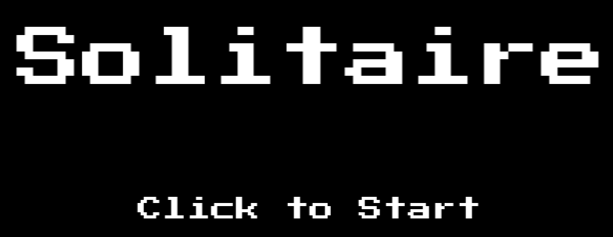
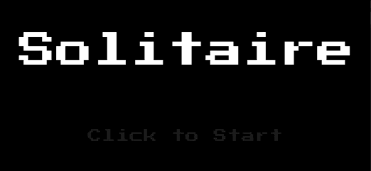
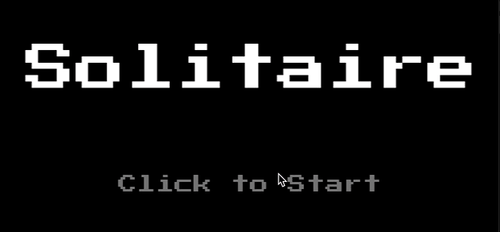
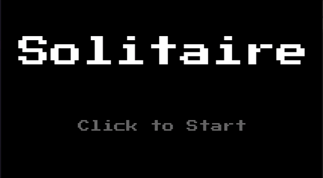
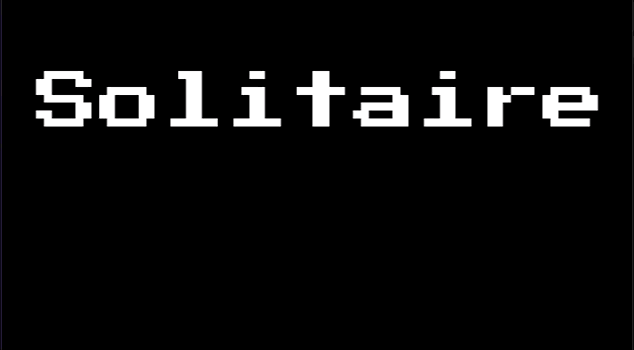
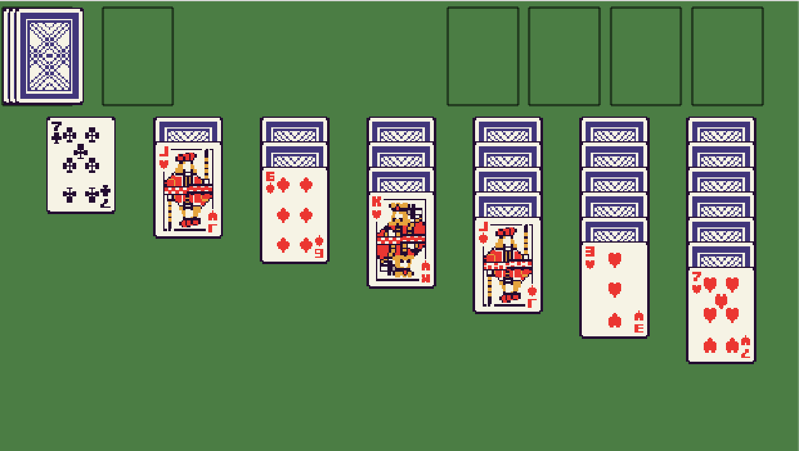

In this tutorial series, we’ll be looking at how to recreate the game Solitaire using the Phaser 3 framework. Here’s an example of what the final game should look like:


Previously, in [part 5](/post/2024/08/solitaire-phaser-3-tutorial-5/), we focused on adding in the core logic for the `Solitaire` class and we connected this logic to our `GameScene` to finish creating the Solitaire game instance.

In this last part of the series, we are going to work on creating a new Title Scene and add in a few scene transitions to our game.

## Title Scene

For our title scene in our game, we will create a very simple UI consisting of a few images, the first will be an image with the name of the game, and the second will be the text `click to start`. To go ahead and add these images to our game, open up the `src/scenes/title-scene.ts` file, and replace the code in the`create` method with the following code:

```typescript
this.add.rectangle(0, 0, this.scale.width, this.scale.height, 0x000000, 1).setOrigin(0);
this.add.image(this.scale.width / 2, 100, ASSET_KEYS.TITLE, 0);
const clickToStartImage = this.add.image(this.scale.width / 2, 250, ASSET_KEYS.CLICK_TO_START, 0);
// this.scene.start(SCENE_KEYS.GAME);
```

In the code above, we created two new Image game objects, and we commented out the code to start the `GameScene`. This will allow us to test our `TitleScene`, otherwise when we run our game it will keep switching to the `GameScene` after the `TitleScene` is created. We also added a Rectangle game object to the scene, which is used as a background for our scene.

To test the changes, you will also need to update the `import` statements at the top of the file to match the following code:

```typescript
import * as Phaser from 'phaser';
import { ASSET_KEYS, SCENE_KEYS } from './common';
```

If you save your code changes and view the game in the browser, you should see the title scene with the images.



To make the title scene a little less static, we can add a simple animation to have the `click to start` image flash slowly. To create simple animations like this, we can create what is called a Tween in Phaser. A Tween in Phaser allows you manipulate properties on your game object to be any value, based on a duration and a type of ease, and these are created via the Tween Manager in Phaser. One example is if we wanted to animate a game object across our Scene in Phaser, we could use a Tween in Phaser to update the `x` value on game object, and we could control this animation by setting things like a `duration` (how long the animation will last), `delay` (how long to wait before the animation starts), and many more properties.

To do this, add the following code to the bottom of the `create` method:

```typescript
this.tweens.add({
  targets: clickToStartImage,
  alpha: {
    start: 1,
    from: 1,
    to: 0,
  },
  duration: 1000,
  repeat: -1,
  yoyo: true,
});
```

In the code above, we are creating a new Tween by using the `add` method on the Tween Manager instance `this.tweens` on our Phaser Scene. When we call this method, we need to provide a Tween Configuration object that has the details of what we want to animate. In the configuration above, we are setting the following properties:

* **targets**: This is the target game object that will have the properties modified. You can have 1 or more game objects that you want to apply the tween to.
* **alpha**: This is the property that we want to modify. For each property you want to modify, you need to add that property as a key on this configuration. For example, if we wanted to modify the `y` value, we would need to add that to this object. When you specify these properties, you need to provide the starting value and the ending value we want for the animations.
* **duration**: How many milliseconds the animation will last for.
* **repeat**: The number of times the animation will repeat. If you set this value to `-1`, then the animation will repeat indefinitely.
* **yoyo**: When this is set to `true`, then when the animation is complete, the tween will animate back in reverse. By default, this is set to `false`. This is useful for animating back and forth between two values, for example from `0` to `1` and then from `1` back to `0`, instead of just animating from `0` to `1`, and then having the property reset back to `0` instantly.

If you save your code changes and view the game in the browser, you should see the new animation playing.



Finally, in order to allow our players to view the Title Scene in our game, and to then actually play the game, we will need a way to transition to the Game Scene. To do this, we will update our scene to only transition to the game scene once a player interacts with our game by clicking on the title scene. To do this, we need to replace the `this.scene.start(SCENE_KEYS.GAME);` code in our `create` method with the following code:

```typescript
this.input.once(Phaser.Input.Events.POINTER_DOWN, () => {
  this.scene.start(SCENE_KEYS.GAME);
});
```

In the code above, we are registering an event listener on the Scene Input Plugin Manager for the `pointerdown` event, and when this event triggered we now start the `GameScene`. One thing that is different between this event listener and the other event listeners we have used, is that we are using the `once` method to register the event listener. The `once` method allows us to register a one time event listener, which will only trigger one time in our game. This is useful for when you only want to react to an event one time.

If you save your code changes and view the game in the browser, now if you click anywhere on the Title Scene, this should transition the game over to the Game Scene.



## Scene Transitions

One last change we are going to make to our game is, we are going to introduce a simple animation for our scene transition. Currently, when the player clicks on the title scene, we instantly start the next scene, and this is a little jarring. To make this transition a little more smooth, we are going to use some of the built in methods of Phaser to create a simple fade in and out effect for our scenes. To do this, replace the following code in the `create` method:

```typescript
this.input.once(Phaser.Input.Events.POINTER_DOWN, () => {
  this.scene.start(SCENE_KEYS.GAME);
});
```

with the following code:

```typescript
this.input.once(Phaser.Input.Events.POINTER_DOWN, () => {
  this.cameras.main.fadeOut(1000, 0, 0, 0, (camera, progress: number) => {
    if (progress !== 1) {
      return;
    }
    this.scene.start(SCENE_KEYS.GAME);
  });
});
```

In the code above, we are referencing the `main` camera in our Phaser Scene, and this is done by accessing the Scene Camera Manager by using `this.cameras`. In Phaser, each Scene has at least 1 camera, and this is usually the `main` camera. The camera is the way in which all things are rendered in Phaser. After we reference the main camera, we are calling the `fadeout` method, which allows us to create a nice fade out animation. On the camera instances, there are a number of built in methods that can be used to create fade effects. When we use the `fadeOut` method, we are providing the following arguments:

* **duration**: The number of milliseconds that the fade out animation will last for.
* **red**: The amount to fade the red channel towards. A value between 0 and 255. Default 0.
* **green**: The amount to fade the green channel towards. A value between 0 and 255. Default 0.
* **blue**: The amount to fade the blue channel towards. A value between 0 and 255. Default 0.
* **callback**: This callback will be invoked every frame for the duration of the effect.
  * It is sent two arguments: A reference to the camera and a progress amount between 0 and 1 indicating how complete the effect is.

When we call the `fadeOut` method, we can control what call the Phaser Scene will fade to by setting the `red`, `green`, and `blue` values. In the code above, since we are setting each to `0`, this will result in our Scene fading to black.

If you save your code changes and view the game in the browser, if you click in the Scene, you should now see the fade out animation.



One thing you might have noticed is that after the scene fades out, the game scene still appears immediately. In order to fix this, we can add a scene fade in effect on our `GameScene` class to complete our scene transition effect. To do this, in the `src/scenes/game-scene.ts` file, at the top of the `create` method add the following code:

```typescript
this.cameras.main.fadeIn(1000);
```

The `fadeIn` method is very similar to the `fadeOut` method, and this method allows you to pass the same arguments, and if they are not provided, Phaser will use the default values. With this code, when our Scene starts, the scene will look black and will slowly fade in to show our game.

If you save your code changes and view the game in the browser, if you click in the Scene, you should now see the complete fade out and fade in animation.



## Game Background Color

With our scene transitions in place, the last thing we are going to do is update the background color for our game. Currently, our background color is a light grey color, and we are going to change this to a nice green color. To do this change, open the `src/main.ts` file and update the following line of code:

```typescript
backgroundColor: '#5c5b5b',
```

to be:

```typescript
backgroundColor: '#387F3C',
```

Now, if you save your code changes and view the Game Scene, you should see the new background.



## Summary

All right, with those last changes that brings an end to this tutorial. In this part of the tutorial, we created a new Title Scene for our game and we added in a few simple scene transitions to polish our game.

You can find the completed source code for this article here on GitHub: [Part 6 Source Code](https://github.com/devshareacademy/phaser-3-solitaire-tutorial/tree/title_scene)

If you run into any issues, please reach out via [GitHub Discussions](https://github.com/devshareacademy/phaser-3-solitaire-tutorial/discussions), or leave a comment down below.
