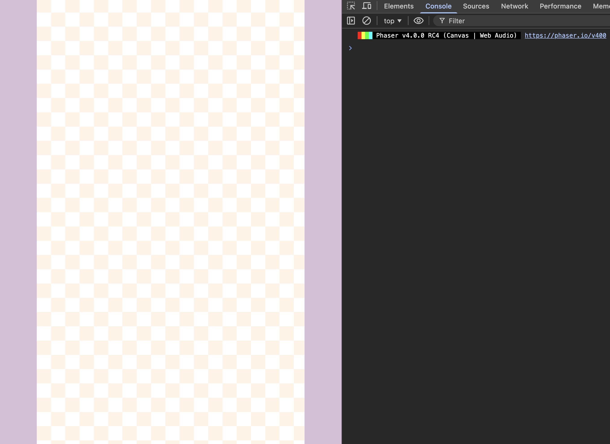
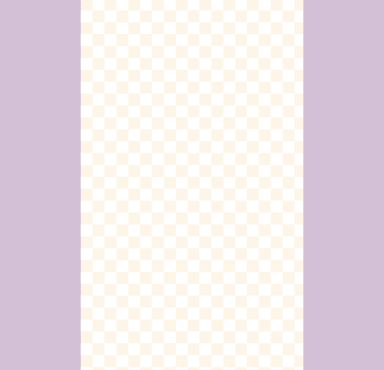

In this tutorial series, we will build a physics-based merge game inspired by *Suika Game* using **Phaser** and its built-in physics engine, **Matter.js**.

This type of game looks simple on the surface, but it is an excellent vehicle for teaching several important game development concepts, including data-driven design, physics-based gameplay, collision-driven mechanics, and clean scene architecture.

In this first post, we will focus on these foundational goals:

- Understanding the overall game concept.
- Designing a data-driven system for our fruits.
- Setting up the project structure and loading assets.
- Preparing our main `GameScene` for the gameplay systems to come.

At this stage, we will not implement physics or player interaction. The goal is to build a strong, data-centric foundation before we add the complexity of physics and gameplay.

---

## The Game We Are Building

At its core, the game loop is simple and engaging:

1.  The player controls a "dropper" at the top of the screen and releases fruits into a container.
2.  Fruits fall and stack according to realistic physics.
3.  When two identical fruits touch, they merge into a single, larger fruit.
4.  Merging fruits increases the player’s score.
5.  If the stack of fruit grows too high and touches a "game over" line, the game ends.

Everything else—visual effects, scoring logic, and UI—exists to support and enhance this core loop.

---

## Project Setup

This tutorial assumes you are starting with a basic Phaser project boilerplate. The key is that you have Phaser installed and a place to write your game code. We will be working almost exclusively in one file: `src/scenes/game-scene.js`.

## Project Setup

Before we start adding any code, we will need to setup our project, and see how we can run our game locally.

### Project Files

In order to follow along with this tutorial, you will need to download the initial project files that will be used. The initial project files include all of the assets that will be used in the game, and the initial project structure for our Phaser 4 game.

TODO: 

You can find the initial project files here on GitHub: [Initial Project Files](https://github.com/devshareacademy/phaser-4-suika-game/tree/0_initial_project). Click [Direct Download](https://github.com/devshareacademy/phaser-4-suika-game/archive/refs/tags/0_initial_project.zip) to download the files.

You will find the following files in the zip file:

* **index.html** - the main web page that has the HTML Canvas were the game will be loaded at
* **public/assets/images** - this folder contains the 3 images that will be used in our game
* **src/main.ts** - the main entrypoint for our game code, creates the Phaser game instance
* **src/scenes/common.ts** - contains common code that is shared between our code files
* **src/scenes/game-scene.ts** - the main Phaser Scene class were our game logic will be added to
* **src/scenes/preload-scene.ts** - a Phaser Scene class that is responsible for loading the assets we use in our game

### Running Locally

In order to test and run your game locally, you will need a local web server. There are a number of options available for this, but a few of the common ones are:

* python - if you have `python 3` installed, you can use the built in `http.server` to run a local web server. From the root of the project run: `python3 -m http.server 8080` and this will start a local web server on port `8080`, and if you visit `http://localhost:8080/` in your browser, you should see the phaser game running.
* node.js - if you have `node.js` installed, you can you use the `http-server` npm package to run a local web server. From the root of the project run: `npx http-server` and this will start a local web server on port `8080`, and if you visit `http://localhost:8080/` in your browser, you should see the phaser game running.
* VS Code Extension - if you use VS Code, you can add an extension that will run a local web server. Visit <a href="https://marketplace.visualstudio.com/items?itemName=ritwickdey.LiveServer" target="_blank">Live Server</a> for details on how to install the extension.

After you start your local web server, and view your game in the browser, you should see our game background.



### Loading Assets

In the initial project, the system for loading assets is already set up for you. Let's review how it works so you understand the process and can easily add your own assets later.

Our loading system is split into two main parts:
1.  **A Data File (`src/common/assets.js`):** This file acts as a manifest, where we declare all assets our game needs.
2.  **A Loader Scene (`src/scenes/preload-scene.js`):** This scene is responsible for reading the manifest and telling Phaser to load the files.

#### The Asset Manifest (`assets.js`)

This file defines the assets we need. By keeping these definitions in one place, we make our game easier to manage. It exports constants for asset keys and lists of assets to load.

```javascript
// src/common/assets.js

export const ASSET_KEYS = Object.freeze({
  BACKGROUND: 'BACKGROUND',
  DASHED_LINE: 'DASHED_LINE',
  FRUITS: 'FRUITS',
  // ... other keys
});

export const IMAGE_ASSETS = [
  {
    assetKey: ASSET_KEYS.BACKGROUND,
    path: 'assets/images/bg.png',
  },
  // ... other images
];

export const TEXTURE_ATLAS_ASSETS = [
  {
    assetKey: ASSET_KEYS.FRUITS,
    textureURL: 'assets/images/fruits.png',
    atlasURL: 'assets/images/fruits.json',
  },
];
```

#### The Preload Scene (`preload-scene.js`)

This scene's `preload()` method is where the magic happens. It imports the asset lists from `assets.js` and uses a loop to load everything automatically.

```javascript
// src/scenes/preload-scene.js

import { IMAGE_ASSETS, TEXTURE_ATLAS_ASSETS } from '../common/assets.js';

export class PreloadScene extends Phaser.Scene {
  // ...
  preload() {
    // Loop through texture atlases and load them
    TEXTURE_ATLAS_ASSETS.forEach((asset) => {
      this.load.atlas(asset.assetKey, asset.textureURL, asset.atlasURL);
    });
    // Loop through images and load them
    IMAGE_ASSETS.forEach((asset) => {
      this.load.image(asset.assetKey, asset.path);
    });
  }
  // ...
}
```
This setup is powerful because to add new assets, you only need to update the manifest file (`assets.js`); the loading code in `PreloadScene` never has to change!

### How to Add a New Asset

Let's walk through an example. Imagine you want to add a new "Play" button icon to the game.

**Step 1: Add the Image File**

First, place your new image file (e.g., `play_icon.png`) into the `public/assets/images/` directory.

**Step 2: Update the Asset Manifest (`src/common/assets.js`)**

Next, open `src/common/assets.js` and make two small additions:

1.  **Add a new key** to the `ASSET_KEYS` object. This gives you a reusable constant and helps prevent typos.

    ```javascript
    export const ASSET_KEYS = Object.freeze({
      BACKGROUND: 'BACKGROUND',
      DASHED_LINE: 'DASHED_LINE',
      FRUITS: 'FRUITS',
      PLAY_ICON: 'PLAY_ICON', // <-- Add this line
    });
    ```

2.  **Add a new entry** to the `IMAGE_ASSETS` array, telling the game where to find the file and what key to associate it with.

    ```javascript
    export const IMAGE_ASSETS = [
      // ... existing assets
      {
        assetKey: ASSET_KEYS.BACKGROUND,
        path: 'assets/images/bg.png',
      },
      {
        assetKey: ASSET_KEYS.DASHED_LINE,
        path: 'assets/images/dashed_line.png',
      },
      { // <-- Add this new object
        assetKey: ASSET_KEYS.PLAY_ICON,
        path: 'public/assets/images/play_icon.png',
      },
    ];
    ```

**Step 3: You're Done!**

That's it! Because our `PreloadScene` automatically loops through the `IMAGE_ASSETS` array, it will find your new entry and load the `play_icon.png` file. You can now use this asset in any scene with `this.add.image(x, y, ASSET_KEYS.PLAY_ICON)`.

---

## Defining the Fruit Data Model

Before writing any Phaser-specific code, we will define the most important system in our game: the fruit progression model. Instead of hardcoding the game's logic with `if/else` or `switch` statements, we will let our data define how the game behaves.

We start by defining a `const` array that holds all our fruit data. This array is the single source of truth for our game's core mechanic. In the `src/scenes/game-scene.js` file, add the following code at the top of the file below our import statements:

```javascript
/** @type {readonly Fruit[]} */
const FRUITS = Object.freeze([
  { frame: 'fruit_1.png', radius: 30 },
  { frame: 'fruit_2.png', radius: 35 },
  { frame: 'fruit_3.png', radius: 40 },
  { frame: 'fruit_4.png', radius: 50 },
  { frame: 'fruit_5.png', radius: 65 },
  { frame: 'fruit_6.png', radius: 70 },
  { frame: 'fruit_7.png', radius: 80 },
  { frame: 'fruit_8.png', radius: 90 },
  { frame: 'fruit_9.png', radius: 100 },
  { frame: 'fruit_10.png', radius: 110 },
]);
```

Each object in the array represents a type of fruit with two key properties:
- `frame`: The name of the image file in our texture atlas (e.g., `fruit_1.png`). This is its unique identifier.
- `radius`: The size of the fruit, used for both rendering and its physics body.

The **order** of this array is critical. A fruit's index in the `FRUITS` array determines its size and progression level. When two identical fruits collide, we will:

1.  Find the colliding fruit's definition in the `FRUITS` array.
2.  Get its index.
3.  Destroy both colliding fruits.
4.  Spawn a new fruit from the definition at `index + 1`.

This data-driven approach makes the game incredibly easy to balance, modify, and extend. Want to add a new fruit? Just add a new object to the array and a corresponding image.

---

## Creating the Main Scene

We will manage the entire game from a single Phaser Scene, `GameScene`. Let's update the class skeleton to have the properties we'll need to manage the game's state. In the `src/scenes/game-scene.js` file, add the following code to our `GameScene` class:


```javascript
export class GameScene extends Phaser.Scene {
  // Start of new code to add
  /** @type {number} */
  #score = 0;
  /** @type {Phaser.GameObjects.Group} */
  #fruitGroup;
  /** @type {Phaser.Types.Physics.Matter.MatterBody} */
  #ceiling;
  /** @type {Phaser.GameObjects.Image} */
  #dropper;
  /** @type {boolean} */
  #isGameOver;
  // End of new code to add

  constructor() {
    super({
      key: SCENE_KEYS.GAME_SCENE,
    });
  }
}
```
We use modern JavaScript private fields (the `#` prefix) to keep our state encapsulated within the scene.
- `#score`: Tracks the player’s score.
- `#fruitGroup`: A Phaser Group to manage all active fruit objects for efficiency.
- `#ceiling`: An invisible physics sensor used to detect the game-over condition.
- `#dropper`: A preview image showing the player which fruit will drop next and where.
- `#isGameOver`: A flag to block input when the game has ended.

---

## Creating the Scene Skeleton

Now, let's update the `create` method to set up the initial state of our scene when it starts. Replace the current `create` method code with the following:

```javascript
// Inside the GameScene class
create() {
  if (!this.input.keyboard) {
    return;
  }
  
  this.#isGameOver = false;

  // add background - tilesprite so it takes full width/height and repeats
  this.add.tileSprite(0, 0, this.scale.width, this.scale.height, ASSET_KEYS.BACKGROUND).setOrigin(0, 0);

  // create group for re-using fruit objects
  this.#fruitGroup = this.add.group();

  console.log('Scene is ready!');
}
```

For now, all we're doing is setting the `isGameOver` flag and adding the background. We also initialize our group, which will be essential for managing fruit objects later.



---

## Why Start This Way?

This first post doesn't result in a playable game, and that is intentional. We have laid a critical foundation that will make the next steps much cleaner and easier to manage.

We have:
- Defined the game’s core rules and progression using a data array.
- Established a clean and understandable state management structure within our `GameScene`.
- Set up a foundation for loading assets that aligns with our data model.

In the next post, we will bring the game to life by enabling the Matter.js physics engine, adding world boundaries, and making our fruits fall, bounce, and stack.

## Summary

All right, with those last changes, that brings an end to this part of the tutorial. In this part, we set up our initial project structure, learned how to load assets, and defined the core data model for our Suika-style game.

You can find the completed source code for this article here on GitHub: [Part 1 Source Code](https://github.com/devshareacademy/phaser-4-suika-game/tree/1_project_setup)

If you run into any issues, please reach out via [GitHub Discussions](https://github.com/devshareacademy/phaser-4-suika-game/discussions), or leave a comment down below.

<!-- In [part 2](/post/2026/03/building-a-suika-style-merge-game-with-phaser-4-part-2/) of this series, we will start to bring our game to life by adding physics. -->
In part 2 of this series, we will start to bring our game to life by adding physics.
