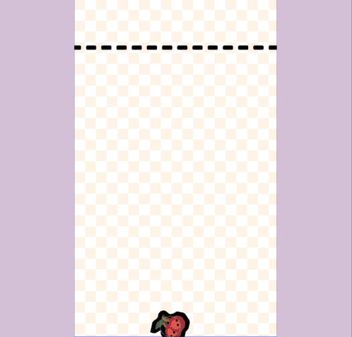

In [part 1](/post/2026/03/building-a-suika-style-merge-game-with-phaser-4-part-1/), we set up our project, established a data-driven model for our fruits, and prepared the main `GameScene`. However, our scene is currently static. In this part, we’ll bring it to life by adding physics.

We will integrate **Matter.js**, one of Phaser's advanced physics engine, to make our fruits fall, bounce, and stack realistically.

By the end of this post, you will have:
- A world with gravity.
- A container with walls and a floor to hold the fruit.
- Fruits that are created as circular physics bodies.
- A way to drop fruits into the container to test our physics setup.


## Why Matter.js?

Phaser offers multiple physics engines, but Matter.js is the perfect choice for a Suika-style game. Its key advantages are:
- **Realistic Stacking:** It has a robust collision and stacking algorithm, which is crucial for making the game feel stable and predictable.
- **True Circular Bodies:** Unlike Arcade physics, Matter.js supports true, perfectly round collision shapes, which is exactly what we need for our fruits.
- **Fine-Grained Control:** It gives us detailed control over properties like friction, bounce, and mass, allowing us to tune the game's "feel" precisely.


## Enabling Matter.js in Your Project

First, you need to tell Phaser to use Matter.js as the default physics engine. You do this in your main game configuration object (often found in `main.js` or a similar entry file).

Find your `Phaser.Game` config and add the `physics` property:

```javascript
const gameConfig = {
  // ... existing configuration
  // Add the physics config below
  physics: {
    default: 'matter',
    matter: {
      debug: true, // Set to true to see physics bodies and colliders
    },
  },
};
// ... your scene configuration
```
We set `matter` as the default engine and rely on the default settings for the physics engine. Setting `debug: true` is incredibly helpful for development, as it draws all the physics shapes and boundaries, letting you see exactly what the engine is doing.


## Creating the World Bounds

Now that we have a physics world, we need to define its boundaries. Without walls and a floor, our fruits would fall into an endless void.

In `game-scene.js`, let's add to our `create()` method.

```javascript
// Inside the create() method of GameScene
create() {
  // ... (previous setup code)

  // create boundary line
  this.add.image(-10, 150, ASSET_KEYS.DASHED_LINE).setOrigin(0).setAngle(-90).setScale(1, 1.25);

  // setup physics world
  this.matter.world.setBounds(0, 0, this.scale.width, this.scale.height - 1);

  // ...
}
```
`this.matter.world.setBounds()` creates invisible static bodies around the edges of our screen. This single line creates a floor and walls on the left and right, effectively creating our container. We also add a visual "dashed line" to show the player where the game over zone will be.


## Creating a Physics-Enabled Fruit

This is the core of Part 2. We need a function that can take a fruit definition from our `FRUITS` array and spawn a corresponding physics object in our world.

Let's add a new private method, `#addFruit`, to our `GameScene`.

```javascript
// Inside the GameScene class

/**
 * Creates a new fruit game object with a physics body at the given position.
 * @param {number} x The x-coordinate for the new fruit.
 * @param {number} y The y-coordinate for the new fruit.
 * @param {Fruit} fruit The fruit configuration object.
 * @returns {Phaser.Physics.Matter.Image} The created fruit game object.
 */
#addFruit(x, y, fruit) {
  const gameObject = this.matter.add.image(x, y, ASSET_KEYS.FRUITS, fruit.frame);

  // Set the display size to match the radius for this fruit
  gameObject.setDisplaySize(fruit.radius * 2, fruit.radius * 2);

  // Set the fruit to be a circle, which is more realistic for fruit
  gameObject.setCircle(fruit.radius);

  // Set physics properties
  gameObject
    .setFriction(0.005)
    .setBounce(0.2);

  // This is a safety check to ensure the position is set correctly after `setCircle`
  gameObject.setPosition(x, y);

  return gameObject;
}
```
Let's break down this powerful little function:
1.  `this.matter.add.image()`: This is the Matter.js equivalent of `this.add.image()`. It creates a sprite that is immediately tied to the physics simulation.
2.  `.setCircle(fruit.radius)`: This is the most important step. It tells Matter.js to treat this object as a circle for collision purposes, using the `radius` from our data model.
3.  `.setFriction()` and `.setBounce()`: These methods let us tune how the fruit behaves. We want a little bounce to make interactions feel dynamic, and low friction so fruits can slide past each other into tight spaces.
4.  `.setPosition(x, y)`: A crucial step! Calling `setCircle` can sometimes reset an object's position in Matter.js. Explicitly setting the position *after* defining the shape ensures it spawns exactly where you intend.


## Dropping Fruit for a Test Run

We don't have player controls yet, but we can add some temporary code to `create()` to see our physics in action. Let's drop a fruit from the top of the screen a second after the scene starts.

```javascript
// Inside the create() method of GameScene
create() {
  // ... (all the setup from before)

  // Temporary code to test fruit dropping
  this.time.delayedCall(1000, () => {
    this.#addFruit(this.scale.width / 2, 50, FRUITS[0]);
  });
}
```
Run your game now. You should see a single, small fruit appear at the top, fall to the bottom, and rest gently on the floor.



Try adding a few more with different positions and delays to see how they stack!


## Checkpoint

At this point, your game has a solid foundation for physics-based gameplay:
- A world with gravity is enabled.
- Fruits are contained within the play area.
- Fruits are created as proper circular physics bodies based on our data model.
- They fall, bounce, and stack on each other.

If you've set the `debug` flag to `true`, you'll see the circular colliders and the world bounds, which is a great way to verify everything is working as expected.


## Next Up

**Part 3: Player Controls and Merging Mechanics**

<!-- In [part 3](/post/2026/03/building-a-suika-style-merge-game-with-phaser-4-part-3/), we'll tackle the core gameplay loop. We'll add player controls to let the user decide where to drop fruits, and then implement the most important mechanic: detecting collisions between identical fruits and merging them into the next fruit in the chain. This is where it really starts to feel like a game!
-->
In part 3, we'll tackle the core gameplay loop. We'll add player controls to let the user decide where to drop fruits, and then implement the most important mechanic: detecting collisions between identical fruits and merging them into the next fruit in the chain. This is where it really starts to feel like a game!

You can find the completed source code for this article here on GitHub: [Part 2 Source Code](https://github.com/devshareacademy/phaser-4-suika-game/tree/2_physics)

If you run into any issues, please reach out via [GitHub Discussions](https://github.com/devshareacademy/phaser-4-suika-game/discussions), or leave a comment down below.
