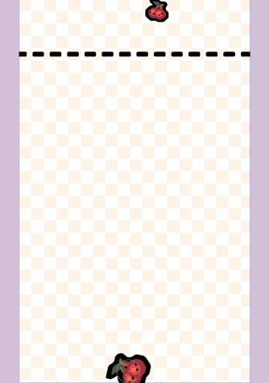
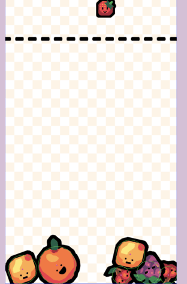
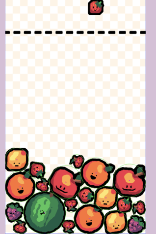

In [part 2](/post/2026/03/building-a-suika-style-merge-game-with-phaser-4-part-2/), we brought our game to life with a physics simulation. We have fruits that can fall and stack in a container, but it's not much of a game without player interaction and a core mechanic.

In Part 3, we're going to implement the heart of our Suika-style game. We will:

- Create a "dropper" so the player can see what fruit is next.
- Implement player controls to move the dropper and release fruit.
- Detect collisions between identical fruits.
- Implement the merging logic to combine fruits into the next one in the series.

By the end of this post, the core game loop will be fully playable!


## Creating the Fruit Dropper

First, we need to give the player a way to see which fruit they are about to drop and where it will fall. We'll create a preview image, the "dropper," that follows the player's mouse or finger.

Let's add a new property to `GameScene` and initialize it in the `create()` method.

```javascript
// Inside the create() method of GameScene
create() {
  // ... (previous setup code)

  // create fruit dropper to show where fruit will fall from
  this.#dropper = this.add.image(0, 0, ASSET_KEYS.FRUITS, FRUITS[0].frame);
  this.#updateDropperGameObject(FRUITS[0]);

  // ...
}
```

We also need a helper method to handle updating the dropper's texture and size. This keeps our `create` method cleaner.

```javascript
// Inside the GameScene class

/**
 * Updates the dropper game object to match the provided fruit configuration.
 * @param {Fruit} fruit The fruit configuration object.
 */
#updateDropperGameObject(fruit) {
  this.#dropper
    .setTexture(ASSET_KEYS.FRUITS, fruit.frame)
    .setDisplaySize(fruit.radius * 2, fruit.radius * 2)
    .setY(fruit.radius); // Position it just below the top edge
  this.#updateDropperXPosition(this.input.activePointer.x);
}
```
This method sets the texture, scales the image to match the fruit's radius, and sets its initial position.


## Handling Player Input

Now, let's make the dropper follow the player's input. We need two things: moving the dropper left and right, and dropping the fruit when the player clicks or taps.

We'll set up our event listeners in a new `#setupEventListeners()` method, which we'll call from `create()`.

### Moving the Dropper

We listen for the `POINTER_MOVE` event to track the cursor.

```javascript
// Inside the create() method of GameScene
create() {
  // ... (previous setup code)
  this.#setupEventListeners();
  // ...
}
```

```javascript
// Inside GameScene class
#setupEventListeners() {
  this.input.on(Phaser.Input.Events.POINTER_MOVE, (pointer) => {
    this.#updateDropperXPosition(pointer.x);
  });
}

/**
 * Updates the dropper's X position, clamping it within the screen bounds.
 * @param {number} x The target x coordinate.
 */
#updateDropperXPosition(x) {
  const padding = 10;
  const radius = this.#dropper.displayWidth / 2;
  // Clamp the position to keep the dropper fully on-screen
  if (x < radius + padding) {
    x = radius + padding;
  } else if (x > this.scale.width - radius - padding) {
    x = this.scale.width - radius - padding;
  }
  this.#dropper.setX(x);
}
```
The `#updateDropperXPosition` method is important because it prevents the dropper from going off-screen, ensuring the player can always see it.



### Dropping the Fruit

When the player releases the mouse button (`POINTER_UP`), we'll drop the fruit.

```javascript
// Inside #setupEventListeners()
#setupEventListeners() {
  // ... previous code

  this.input.on(Phaser.Input.Events.POINTER_UP, () => {
    // Hide the dropper for a moment for feedback and to prevent spam
    this.#dropper.setVisible(false);
    this.time.delayedCall(500, () => this.#dropper.setVisible(true));

    // Get the current fruit from the dropper and add it to the physics world
    const currentFruit = FRUITS.find((fruit) => fruit.frame === this.#dropper.frame.name);
    this.#addFruit(this.#dropper.x, this.#dropper.y, currentFruit);

    // Generate the next fruit for the dropper
    // For now, we only allow the first 5 smallest fruits to be dropped
    const nextFruit = FRUITS[Math.floor(Math.random() * 5)];
    this.#updateDropperGameObject(nextFruit);
  });
}
```
The logic is straightforward:
1. Hide the dropper for 500ms as a simple cooldown.
2. Use `#addFruit` to create a physics-enabled fruit at the dropper's location.
3. Choose a new random fruit (from the first 5 in our `FRUITS` array) to be the next one.
4. Update the dropper visuals with the new fruit.

Now, if you click on the game, you should see a new fruit spawn.




## The Merge Mechanic: Handling Collisions

This is the magic moment. We need to listen for when two fruits collide and check if they are of the same type.

We'll use Matter's `COLLISION_START` event, which fires once when two bodies first touch.

```javascript
// Inside #setupEventListeners()
this.matter.world.on(Phaser.Physics.Matter.Events.COLLISION_START, (/** @type {Phaser.Physics.Matter.Events.CollisionStartEvent} */ event) => {
  // Loop through all pairs of colliding bodies
  for (const pair of event.pairs) {
    const objectA = /** @type {Phaser.Physics.Matter.Image} */ (pair.bodyA.gameObject);
    const objectB = /** @type {Phaser.Physics.Matter.Image} */ (pair.bodyB.gameObject);

    // Check if the two colliding objects are fruits of the same type
    if (objectA && objectB && objectA.frame.name === objectB.frame.name) {
      const fruitIndex = FRUITS.findIndex((fruit) => fruit.frame === objectA.frame.name);

      // If it's a valid fruit and not the largest one
      if (fruitIndex < FRUITS.length - 1) {
        // Deactivate the two old fruits
        objectA.destroy();
        objectB.destroy();

        // Get the definition for the next fruit in the progression
        const newFruit = FRUITS[fruitIndex + 1];

        // Add the new, larger fruit at the collision point
        this.#addFruit(pair.bodyB.position.x, pair.bodyB.position.y, newFruit);

        // We handled this pair, so we can stop checking
        return;
      }
    }
  }
});
```

Let's unpack the merge logic:
1.  We get the `gameObject` associated with each physics body in the collision `pair`.
2.  We check if both exist and if their `frame.name` (our fruit identifier) are identical.
3.  We find the `fruitIndex` in our `FRUITS` array. This is where our data-driven design shines!
4.  We make sure it's not the largest fruit (which can't be merged).
5.  We `destroy()` the two smaller fruits to remove them from the scene and physics simulation.
6.  We grab the definition of the `newFruit` from `FRUITS` at `index + 1`.
7.  We call `#addFruit` to spawn the new, larger fruit right at the point of collision (`pair.collision.supports[0]`).




## Checkpoint

Go ahead and run the game now! You should be able to:
- Move the fruit dropper with your mouse.
- Click to drop fruits into the container.
- Watch as two identical fruits collide, disappear, and are replaced by a larger fruit.

You have now implemented the complete core gameplay loop of a Suika-style game!


## Next Up

**Part 4: Scoring and Game Over**

<!--Our game is playable, but it has no objective or challenge. In [part 4](/post/2026/03/building-a-suika-style-merge-game-with-phaser-4-part-4/), we'll add a scoring system to reward players for merging fruit and implement the game-over condition to create a proper challenge loop.-->
Our game is playable, but it has no objective or challenge. In part 4, we'll add a scoring system to reward players for merging fruit and implement the game-over condition to create a proper challenge loop.

You can find the completed source code for this article here on GitHub: [Part 3 Source Code](https://github.com/devshareacademy/phaser-4-suika-game/tree/3_controls)

If you run into any issues, please reach out via [GitHub Discussions](https://github.com/devshareacademy/phaser-4-suika-game/discussions), or leave a comment down below.
