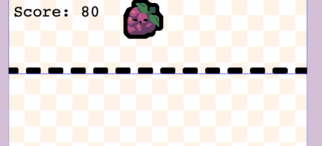
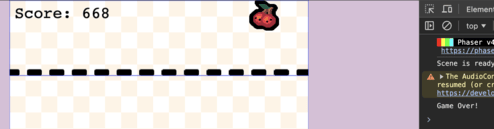

In [part 3](/post/2026/03/building-a-suika-style-merge-game-with-phaser-4-part-3/), we implemented the core interaction of our Suika-style game: players can drop fruits, and identical fruits merge into larger ones. Our game is now playable, but it lacks two crucial elements for any complete game: a way to track the player's performance and a condition for the game to end.

In this part, we will add:

- A scoring system that rewards players for merging fruits.
- A clear game-over condition when fruits stack too high.
- The necessary UI elements to display the score.


## Tracking and Displaying the Score

We already have a private `#score` property in our `GameScene` class. Let's start by initializing it and creating a text object to display it.

```javascript
// Inside GameScene class, add a property for our score text
/** @type {Phaser.GameObjects.Text} */
#scoreText;

// ...

// Inside the create() method of GameScene, after other initializations
create() {
  // ... (previous setup code)

  this.#score = 0; // Initialize score
  // Add score text
  this.#scoreText = this.add.text(10, 10, `Score: ${this.#score}`, {
    fontSize: '32px',
    color: '#000000',
  });

  // ...
}
```

Now, we need to update the score whenever fruits merge. We'll revisit our `COLLISION_START` event handler from Part 3.

```javascript
// Inside the COLLISION_START event handler, within the merge logic
if (objectA && objectB && objectA.frame.name === objectB.frame.name) {
  const fruitIndex = FRUITS.findIndex((fruit) => fruit.frame === objectA.frame.name);

  // ... (destroying old fruits, spawning new one)

  // Update the score!
  this.#score += (fruitIndex + 1) * 2;
  this.#scoreText.setText(`Score: ${this.#score}`); // Update display

  // ...
}
```
We simply add the score for the merged fruits (larger fruits yield more points) and update our `#scoreText` object.




## Implementing the Game Over Condition

The classic Suika Game ending occurs when fruits pile up and cross a designated "game over" line. We'll implement this using a Matter.js sensor and careful timing.

### The Ceiling Sensor

In Part 2, we created the physics world bounds. Now, let's look at the "ceiling" sensor in our `create()` method:

```javascript
// Inside the create() method of GameScene
create() {
  // ... (previous setup code)

  // setup boundary for objects to not leave current view
  this.#ceiling = this.matter.add.rectangle(this.scale.width / 2, 50, this.scale.width, 200);
  this.#ceiling.isStatic = true;
  this.#ceiling.isSensor = true;

  // ...
}
```
`this.#ceiling` is a static (immovable) rectangle that spans the top of our game area. Setting `isSensor = true` means it will detect collisions but won't cause physical reactions (like bouncing fruits off it).

### Detecting Persistent Ceiling Hits

A tricky part of game over is distinguishing between a fruit *momentarily* bouncing into the ceiling and a fruit *settling* above the line. We only want game over if a fruit is truly stuck above the line.

Our `#addFruit` method handles this with some clever logic:

```javascript
// Inside the GameScene class, within the #addFruit method
// ...
gameObject.setData('isDropping', true); // Mark fruit as currently dropping

gameObject.setOnCollideEnd((event) => {
  // If the fruit stops colliding with the ceiling, it's no longer 'dropping' from that contact
  if (event.bodyA === this.#ceiling || event.bodyB === this.#ceiling) {
    gameObject.setData('isDropping', false);
  }
});

const dropTimer = this.time.delayedCall(1000, () => {
  gameObject.setData('dropTimer', undefined);
  // After 1 second, if the fruit is still marked as 'dropping' and overlaps the ceiling,
  // it means it has settled there.
  if (gameObject.active && gameObject.getData('isDropping')) {
    gameObject.setData('isDropping', false);
    if (this.matter.overlap(gameObject, [this.#ceiling])) {
      this.events.emit(CUSTOM_EVENTS.CEILING_HIT);
    }
  }
});
gameObject.setData('dropTimer', dropTimer); // Store timer to potentially clear if fruit moves

gameObject.setOnCollideWith(this.#ceiling, () => {
  // If a fruit collides with the ceiling *after* its initial drop phase
  if (!gameObject.getData('isDropping')) {
    this.events.emit(CUSTOM_EVENTS.CEILING_HIT);
  }
});
```
This might look complex, but here's the breakdown:
1.  **`isDropping` Flag:** When a new fruit is added, it's marked `isDropping: true`.
2.  **`setOnCollideEnd`:** If a fruit just brushes the ceiling and then falls away, `isDropping` is set to `false`, preventing a game over from a simple bounce.
3.  **`delayedCall`:** After 1 second, if the fruit is still `active` and `isDropping` is still `true` (meaning it hasn't stopped colliding with the ceiling), and it's *still* overlapping the ceiling, then it has officially "settled" above the line, and `CUSTOM_EVENTS.CEILING_HIT` is emitted.
4.  **`setOnCollideWith`:** This is for fruits that might collide with the ceiling later, after their initial drop phase, and then settle there. If `isDropping` is `false` (meaning it's not its initial fall) and it hits the ceiling, it's game over.

### Handling the Game Over Event

Finally, we set up an event listener in `#setupEventListeners()` to react when `CUSTOM_EVENTS.CEILING_HIT` is emitted:

```javascript
// at the top of our game-scene.js file, with the FRUITS object
// Custom event for game over
const CUSTOM_EVENTS = Object.freeze({
  CEILING_HIT: 'CEILING_HIT',
});
```

```javascript
// Inside #setupEventListeners()
// ...
// end the game once the fruits reach the top of the ceiling
this.events.once(CUSTOM_EVENTS.CEILING_HIT, () => {
  if (this.#isGameOver) {
    return; // Don't restart if game is already over
  }
  console.log('Game Over!'); // For debugging
  this.#isGameOver = true;
  this.#dropper.setVisible(false); // Hide the dropper
  // TODO: Display Game Over screen, restart option, etc.
});
```

```javascript
// Inside #setupEventListeners()
// ...
// Also, prevent dropping new fruits if game is over
this.input.on(Phaser.Input.Events.POINTER_UP, () => {
  if (!this.#dropper.visible || this.#isGameOver) {
    return; // Don't drop if game is over or dropper is hidden
  }
  // ... (rest of dropping logic)
});
```

When the `CEILING_HIT` event fires, we set `#isGameOver` to `true` and hide the dropper, effectively stopping gameplay. The `POINTER_UP` listener is also updated to check this flag.




## Cleanup

Finally, lets cleanup our temporary code in the `create` method tied to spawning our first object:

```javascript
// inside the create method, remove this block of code
// Temporary code to test fruit dropping
this.time.delayedCall(1000, () => {
  this.#addFruit(this.scale.width / 2, 50, FRUITS[0]);
});
```


## Checkpoint

You now have a fully functional Suika-style game with:
- A scoring system that updates as fruits merge.
- A robust game-over condition that triggers when fruits stack too high.
- The game state (`#isGameOver`) correctly managed to stop input.

While we're just logging "Game Over!" to the console for now, the foundation is solid for adding a proper game-over screen and restart functionality.


## Next Up

**Part 5: Polishing the Experience**

With the core mechanics complete, the next step is to make our game feel more responsive and delightful. In Part 5, we'll explore improving the performance of our game by implementing an object pool.

<!--With the core mechanics complete, the next step is to make our game feel more responsive and delightful. In [part 5](/post/2026/03/building-a-suika-style-merge-game-with-phaser-4-part-5/), we'll explore improving the performance of our game by implementing an object pool.-->

You can find the completed source code for this article here on GitHub: [Part 4 Source Code](https://github.com/devshareacademy/phaser-4-suika-game/tree/4_score)

If you run into any issues, please reach out via [GitHub Discussions](https://github.com/devshareacademy/phaser-4-suika-game/discussions), or leave a comment down below.
