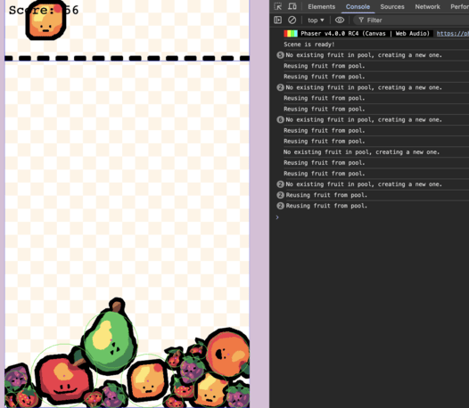

In the [part 5](/post/2026/03/building-a-suika-style-merge-game-with-phaser-4-part-5/), we optimized our game's performance using object pooling. Now that our game is efficient and has a clear game-over condition, the final piece for a fully playable and re-engaging experience is a way for players to restart.

In this part, we will:
- Add UI elements for a "Game Over" message and a "Restart" button.
- Modify our game over logic to display these elements.
- Implement a `restartGame()` method to reset the game state.

By the end of this post, our game will have a complete play loop, allowing players to jump back into the action after a game over!


## UI Elements for Game Over

First, we need to declare properties in our `GameScene` to hold our "Game Over" text and "Restart" button.

```javascript
// Inside the GameScene class
export class GameScene extends Phaser.Scene {
  // ... (existing properties)
  /** @type {Phaser.GameObjects.Text} */
  #gameOverText;
  /** @type {Phaser.GameObjects.Text} */
  #restartGameText;

  // ...
}
```

Next, we'll initialize these elements in our `create()` method. They should be created but initially invisible, appearing only when the game ends. We also need to make the button interactive.

```javascript
// Inside the create() method of GameScene, after this.#setupEventListeners();
create() {
  // ... (previous setup code)
  this.#setupEventListeners();

  // Initialize Game Over UI elements (initially hidden)
  this.#gameOverText = this.add
    .text(this.scale.width / 2, this.scale.height / 2 - 50, 'GAME OVER', {
    fontSize: '64px',
    color: '#000000',
    fontStyle: 'bold',
    })
    .setOrigin(0.5)
    .setDepth(2)
    .setVisible(false);

  this.#restartGameText = this.add
    .text(this.scale.width / 2, this.scale.height / 2 + 50, 'Click to play again!', {
    fontSize: '32px',
    color: '#000000',
    fontStyle: 'bold',
    })
    .setOrigin(0.5)
    .setDepth(2)
    .setVisible(false);
}
```


## Displaying the Game Over UI

Now, we need to modify our game over logic to display these new UI elements. When `CUSTOM_EVENTS.CEILING_HIT` is emitted, we'll make the text and button visible.

```javascript
// Inside #setupEventListeners(), update the CUSTOM_EVENTS.CEILING_HIT handler:
this.events.on(CUSTOM_EVENTS.CEILING_HIT, () => {
  console.log('game over'); // For debugging purposes
  this.#isGameOver = true;
  this.#dropper.setVisible(false); // Hide the dropper

  // Display game over UI
  this.#gameOverText.setVisible(true);
  this.#restartGameText.setVisible(true);
  this.input.once(Phaser.Input.Events.POINTER_DOWN, this.#restartGame, this);
});
```
Now, when the game ends, players will clearly see the "Game Over" message and have an option to restart.


## The `restartGame()` Method

This is the core of our restart system. We need a method that will reset all the necessary game state variables and clear the playing field.

Add the following `#restartGame()` method to your `GameScene` class, after the `create()` method:

```javascript
// Inside the GameScene class
/**
 * Resets the game state and starts a new game.
 */
#restartGame() {
  // Reset game flags and score
  this.#isGameOver = false;
  this.#score = 0;
  this.#scoreText.setText(`Score: ${this.#score}`); // Update the score display

  // Hide game over UI
  this.#gameOverText.setVisible(false);
  this.#restartGameText.setVisible(false);

  // Clear all existing fruits from the screen and return them to the object pool
  this.#fruitGroup.getChildren().forEach((fruit) => {
    // Ensure it's a Matter.Image before trying to access Matter properties
    if (fruit instanceof Phaser.Physics.Matter.Image) {
      fruit.setActive(false).setVisible(false); // Make it inactive and invisible
      fruit.setStatic(true); // Set it to static to prevent physics interactions
      // Safely remove the physics body from the Matter world if it still has one
      if (fruit.body) {
        this.matter.world.remove(fruit.body);
      }
    }
  });

  // Reset the dropper to its initial state
  const initialFruit = FRUITS[0];
  this.#updateDropperGameObject(initialFruit);
  this.#dropper.setVisible(true); // Make the dropper visible again

  // If you had any other timers, game-specific variables, or temporary effects,
  // this is where you would reset or clear them.
}
```

Let's break down what this method does:
1.  **Resets Game State:** It sets `#isGameOver` to `false` and `#score` back to 0, updating the `#scoreText` display.
2.  **Hides Game Over UI:** The `#gameOverText` and `#restartButton` are made invisible again.
3.  **Clears Fruits:** It iterates through all children in `this.#fruitGroup`. For each active fruit, it deactivates it, hides it, sets it as static, and removes its physics body from the active Matter.js world. This effectively "returns" all fruits to our object pool, ready for reuse.
4.  **Resets Dropper:** The dropper is reset to show the initial fruit, and made visible again.




## Conclusion & Checkpoint

You've now implemented a full restart system! After a game over, players can click the restart button and immediately begin a new round. This completes the core gameplay loop, offering a much more satisfying and endless experience.

Our Suika-style game now has:
- A data-driven fruit progression.
- Robust Matter.js physics for falling, stacking, and merging.
- Player controls for dropping fruits.
- A score system.
- A game-over condition.
- An efficient object pooling system.
- A complete game restart mechanism.


## Next Steps

With the core mechanics and a full game loop in place, your Suika-style game is functionally complete. From here, you can explore many enhancements:
-   **Visual Polish:** Adding particle effects for merging, glow effects, or improved UI animations.
-   **Sound Effects and Music:** Bringing the game to life with audio feedback.
-   **Scoreboard/High Scores:** Tracking and saving player scores.
-   **Level Design/Challenges:** Introducing variations or specific objectives.
-   **More Fruit Types:** Expanding the `FRUITS` array and adding more assets.

Congratulations on building a complete physics-based merge game in Phaser!

You can find the completed source code for this article here on GitHub: [Part 6 Source Code](https://github.com/devshareacademy/phaser-4-suika-game/tree/6_restart_game)

If you run into any issues, please reach out via [GitHub Discussions](https://github.com/devshareacademy/phaser-4-suika-game/discussions), or leave a comment down below.
